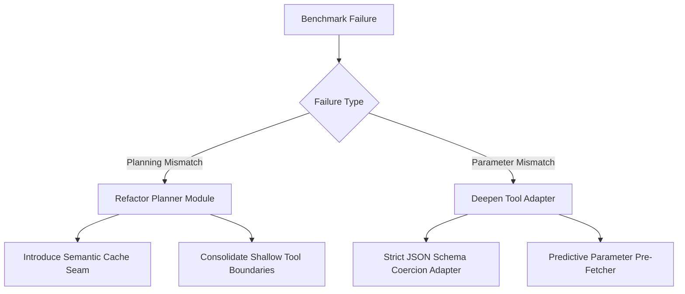

# Reference Manual: Benchmark Analysis Heuristics

This reference guide provides deep background context, diagnostic taxonomies, mathematical formulations, and standard architectural remedies to be used alongside the `analyze-benchmark-run` skill.

---

## 1. Metric Formulations

When evaluating cooperative local-cloud executions, use these standardized mathematical definitions:

### Stratified Pass Rate

Measures the success rate per specific dataset slice:
$$\text{Pass Rate}_{\text{dataset}} = \left( \frac{N_{\text{passed, dataset}}}{N_{\text{total, dataset}}} \right) \times 100$$
Analyzing stratified rates helps pinpoint if the planning engine degrades on specific benchmarks (e.g., multi-turn long context vs. simple single-turn API calling).

### Token Efficiency Ratio

Local-first cooperative models aim to maximize local execution to preserve privacy and minimize cloud token costs.
$$\text{Token Ratio}_{\text{local}} = \left( \frac{\text{Tokens}_{\text{local}}}{\text{Tokens}_{\text{local}} + \text{Tokens}_{\text{cloud}}} \right) \times 100$$

- **High Ratio (> 50%)**: Great local utilization. Sidecar handles planning and tool arguments.
- **Low Ratio (< 10%)**: Leaky planning loop. The system is relying heavily on the cloud coordinator for trivial sub-tasks.

### Latency Percentiles (p50, p90, p99)

- **p50 (Median)**: Represents typical task completion duration.
- **p90 / p99 (Tail Latency)**: Flags worst-case scheduling delays. High tail latency indicates sidecar spin-up overhead, large KV-cache synchronization blocking, or network timeouts on cloud fallback.

---

## 2. Failure Mode Diagnostic Taxonomy

When triaging failures, use this standard taxonomy to classify bugs:

### A. Planning Mismatch

Occurs when the agent constructs an invalid directed acyclic graph (DAG) or selects tools that deviate from the ground truth.

- **Root Cause 1: Ambiguity in Tool Registry**. Multiple shallow tools with overlapping names (e.g. `get_weather` vs `weather.fetch_current`) confuse the planner.
- **Root Cause 2: Context Length Overload**. The sidecar's KV cache is saturated, leading to loss of historical multi-turn instructions (known as "lost in the middle").
- **Root Cause 3: Compiler Failures**. The Kahn compile phase fails to schedule tool calls due to circular dependencies or unresolvable arguments between tasks.

### B. Parameter Mismatch

The agent successfully chose the correct tool but extracted incorrect or empty arguments.

- **Root Cause 1: Empty Extraction**. The parameter extraction model outputs empty inputs `""` or `{}` because the prompt schema fails to coerce natural language into strict JSON types.
- **Root Cause 2: Type Coercion Error**. Passing stringified numbers `"123"` instead of integers `123`, or incorrect date/time formatting.
- **Root Cause 3: Dynamic Argument Dependency**. A downstream tool's argument depends on the exact return value of an upstream tool, but the value is lost or incorrectly formatted in the thread workspace.

---

## 3. Standard Architectural Remedies

Apply these high-leverage refactorings using `improve-codebase-architecture` and `trend-architect`:

### Remedy 1: The Deep Schema-Coercion Adapter (Seam Deepening)

If parameter mismatches dominate, avoid adding inline custom regex/string parsing inside tools. Instead:

1. Locate the seam where tool arguments are unmarshaled.
2. Build a **Deep Adapter** that uses standard JSON-schema reflection to coerce types (e.g., mapping `"true"` to `true`, parsing ISO timestamps, injecting defaults).
3. The interface of the tool remains simple; the complexity is cleanly localized in the unmarshal adapter.

### Remedy 2: Tool Boundary Consolidation (Deletion Test)

If planning mismatches dominate due to tool confusion:

1. Apply the **deletion test** to adjacent shallow tools.
2. Merge them into a single **Deep Tool** with a small, expressive interface.
3. _Example_: Instead of having 5 distinct tools (`get_user_name`, `get_user_email`, `get_user_phone`, etc.), combine them into a single `get_user_profile` tool that takes a mask. This drastically reduces the planner's registry search space.

### Remedy 3: Sidecar KV-Cache Slot Pinning (Trend Architecture)

If latency is high during multi-turn scenarios:

1. Check the local sidecar `llama-server` KV configuration.
2. Pin the slot KV allocation size exactly to the benchmark's parallel thread count.
3. Pre-load standard tool-definition schemas into the sidecar's KV-cache so they never need to be re-evaluated, reducing turn-0 latency.
