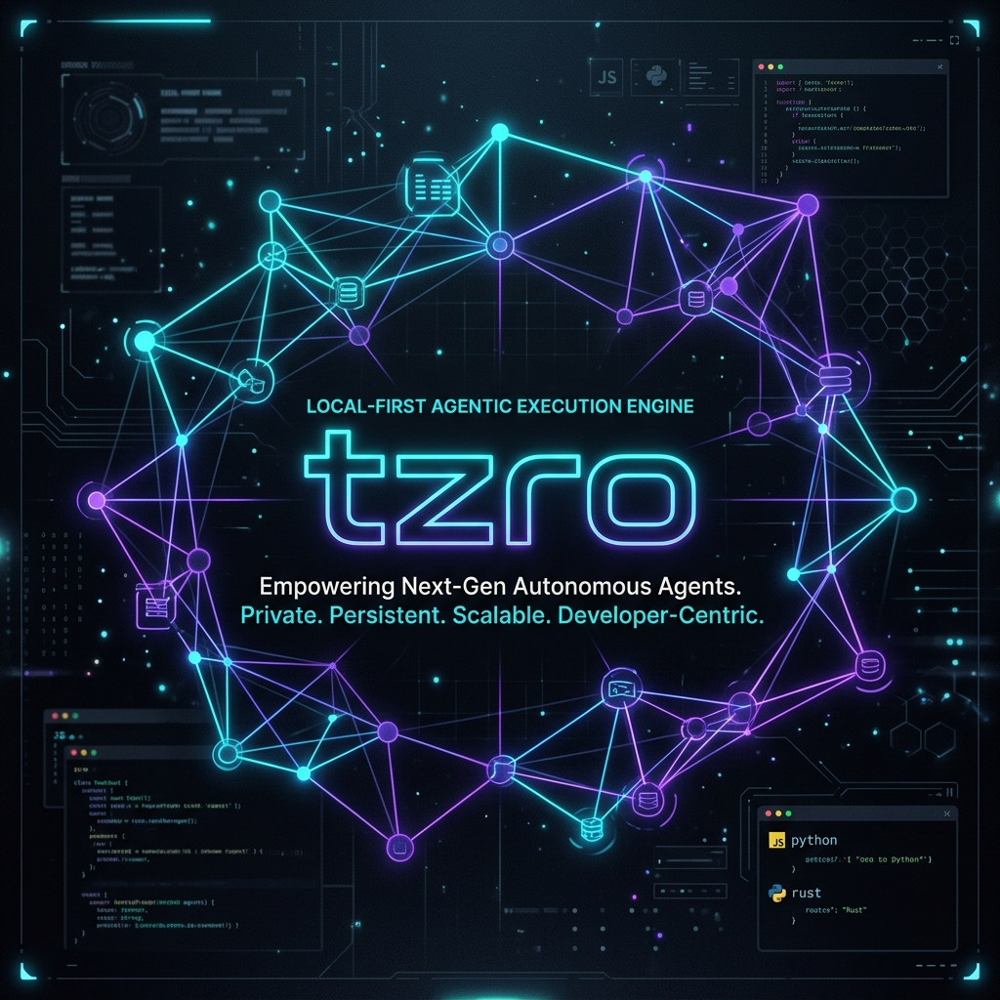
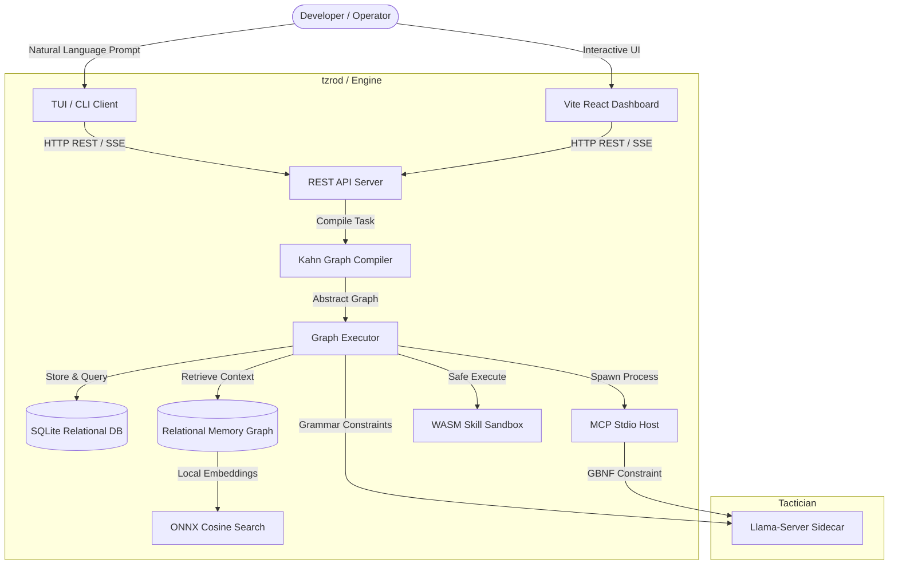

# tzro (T0) — Durable Local-First Agentic Engine



> **tzro** is a durable, local-first agentic execution engine designed to coordinate complex multi-system automations securely on resource-constrained hardware. It combines topological task compilation, hybrid relational memory, dynamic Model Context Protocol (MCP) integrations, and sandboxed WASM execution, packaged with a premium Bubble Tea terminal console (TUI) and a real-time Server-Sent Events (SSE) web dashboard.

---

## 🛠 Tech Stack & Badges


---

## 🚀 Key Subsystems

### 1. Durable Execution Engine
Coordinates long-running, multi-step operations (Tasks and Workflows) persisting operational nodes and state edges to a local SQLite database, allowing recovery and resuming across server reboots.

### 2. Kahn Graph Compiler
Compiles natural language prompt intents into sequential, cycle-free abstract dependency graphs (Abstract Graphs) using Kahn's topological sort algorithm to execute independent steps in parallel layers.

### 3. Relational Knowledge Graph Memory
Retrieves entities, relationships, and neighborhood hops via a local graph memory system using Hybrid Vector Search (combining initial keyword candidate filtering and ONNX cosine similarity matching).

### 4. Sandboxed WebAssembly Micro-Skills
Runs custom procedurally generated micro-skills inside isolated, resource-constrained WebAssembly execution sandboxes, keeping the host system completely secure.

### 5. Stdio-based MCP Host Integration
Spawns third-party tool servers dynamically over standard I/O (stdio) with GBNF logit grammar constraints to guarantee 100% syntactically valid JSON tool parameters and delegated runtime secret injection.

### 6. Client Control Center (TUI & Web)
- **TUI Client**: A gorgeous Bubble Tea fullscreen dashboard for inspect-and-query CLI database navigation and active daemon control.
- **Web Dashboard**: A beautiful, modern SPA built using React 19, Vite, and TailwindCSS that streams live task steps, telemetry data, and interactive node-edge neighborhood networks over Server-Sent Events (SSE).

---

## 📐 System Architecture



---

## 📥 Quickstart Setup

### 1. Bootstrap the Engine Boundary
Execute the single-line installer to provision directories, link the default static `llama-server` sidecar, and bootstrap the SQLite schema:

```bash
./install.sh
```

### 2. Add Binaries to PATH
To run `tzro` globally, add the installation directory to your shell configuration (`~/.zshrc` or `~/.bashrc`):

```bash
export PATH="$PATH:$HOME/.tzro/bin"
source ~/.zshrc
```

### 3. Run the CLI / TUI Console
Simply type the command to start the fullscreen bubble tea developer dashboard:

```bash
tzro
```

For direct offline database navigation (read-only SQLite inspection mode), run:

```bash
tzro --offline
```

### 4. Launch the Web Control Center
To run the server daemon and the React Vite development server, execute:

```bash
# Start backend server daemon
go run cmd/tzrod/main.go

# Start Vite React server (in web folder)
cd web
npm install
npm run dev
```

The Web Dashboard will be live at `http://localhost:8000`.

---

## 🛠 Developer Testing & Formatting

Keep the repository clean, structured, and formatted using the following developer scripts:

### Go Subsystems Testing
```bash
# Run all Go unit and integration tests
go test ./...

# Format Go source files
go fmt ./...
```

### React Web Dashboard Verification
```bash
# Run ESLint validation
npm --prefix web run lint

# Build production bundle cleanly
npm --prefix web run build
```

---

## 📦 Releases

Version **v0.1.0** represents the initial stable compilation of the local-first engine and dashboards. Check [docs/release-notes/v0.1.0.md](docs/release-notes/v0.1.0.md) for full release details.
