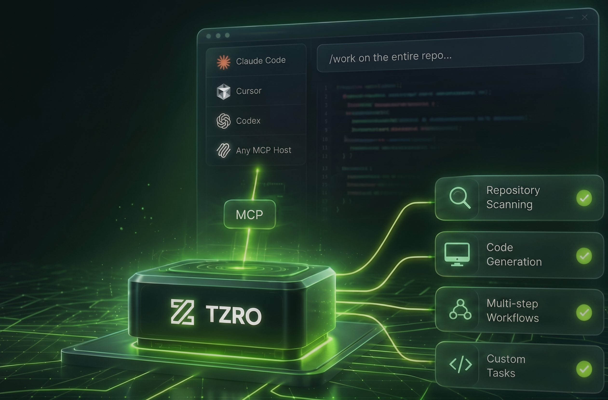

# TZRO.ai: The Go-Native, Local MCP Offloader

<p align="center">
  
</p>

[](https://opensource.org/licenses/Apache-2.0)
[](https://goreportcard.com/report/github.com/The18thWarrior/tzro)

> **Keep the Cloud for Strategy. Offload the Execution to Local Compute. Slash your agentic API token bills by 90%+.**

Traditional coding assistants and CLI agent loops (like *Claude Code*, *Cursor*, or *VS Code Copilot*) are prone to **"Token-Maxing."** Every time an agent recursively scans your directory, parses an Abstract Syntax Tree (AST), or formats massive datasets, it re-submits raw codebase contexts to expensive cloud APIs. This results in linear cost escalation, reaching $50 to $150 per day in API fees for a single active developer workspace.

**TZRO.ai fixes the economics of agentic development.** By utilizing the open standard Model Context Protocol (MCP), TZRO sits transparently beneath your favorite coding client. Your cloud frontier model (e.g., Claude 3.5 Sonnet) handles high-level strategy planning **exactly once**, compiling instructions into an abstract execution graph. It then dynamically delegates all token-heavy file operations, string transformations, and data-shuffling to TZRO's lightweight, hardware-pinned local engine running an optimized local model — **at zero marginal cost.**

---

## ⚡ Quickstart

Run this in your terminal:

```bash
curl -fsSL https://get.tzro.ai | sh
```

The installer detects your platform, builds from source if Go is available (or fetches pre-compiled release binaries), downloads the default GGUF model, and provisions MCP configurations for supported AI editors (Claude Desktop, Cursor, Gemini CLI).

---

## 🛠️ Dynamic Client-Side Delegation Architecture

TZRO relies on a strict decoupling of cognitive scheduling and local execution.

```
                  DYNAMIC CLIENT-SIDE DELEGATION FLOW

   +-----------------------+                    +-----------------------+
   |   MCP Client (Cloud)  |                    |   TZRO Server (Local) |
   |  (e.g., Claude Code)  |                    | (Task Offloader / OS) |
   +-----------------------+                    +-----------------------+
               |                                            |
               | ---- (1) Initialization Handshake -------->|
               | <--- (2) Exposes 15 MCP tools -------------|
               |                                            |
               |   =====================================    |
               |   User requests a token-heavy task:        |
               |   "Document this entire 100MB repository"  |
               |   =====================================    |
               |                                            |
               | ---- (3) Calls "tzro_run" ---------------->| (Delegates execution)
               |          with compiled task steps          |
               |                                            | (Kahn DAG compilation)
               |                                            | (GBNF logit constraints)
               |                                            | (5-Layer Compaction)
               |                                            | (SQLite persistence)
               |                                            |
               | <--- (4) Returns clean Markdown summary ---| (Context footprint < 1KB)
               |                                            |
```

- **Kahn Graph Engine:** The Go engine ingests the client's payload, maps file dependencies via abstract syntax trees (ASTs), and applies Kahn's Topological Sort Algorithm to compile operations into a concurrent, parallelizable Directed Acyclic Graph (DAG).
- **GBNF Logit Constraints:** Small local models frequently hallucinate formats. TZRO injects Backus-Naur Form (GBNF) grammars directly into the local model's token decoding logits at execution time, mathematically guaranteeing a 0% syntax failure rate on JSON or structural markdown outputs.
- **5-Layer Compaction Pipeline:** To prevent local context drowning, multi-object responses are structurally stripped of binary footprints, converted into header-mapped Tabular TSV formatting (saving 65% to 85% on raw token counts), and flattened into key-value pairs. If the data still exceeds the context budget, it is moved to an internal disk cache where the local model queries it sequentially via transactional SQLite tables.

For a comprehensive guide on the internal subsystems, compilation flow, neural edge traversal, context compaction pipelines, and the Go SDK hooks, refer to the **[Architecture Guide](docs/ARCHITECTURE.md)**.

---

## 💎 The Go-Native Advantage vs. Python Frameworks

TZRO.ai avoids the heavy runtime layers and dynamic type errors typical of traditional, research-centric Python frameworks. By building strictly on systems-level Go:

- **Ultra-Low Resource Footprint:** Runs at <30MB idle memory and boots in <10ms. It will not spin your fans or drain your battery during heavy processing sweeps.
- **Zero Dependency Management:** Compiles entirely into a single, self-contained static binary. No virtual environments, breaking package upgrades, or fragile lockfiles to manage.
- **Type-Safe LLM Generations:** Because Go is explicit, rigidly typed, and utilizes clean conventions (`if err != nil`), LLMs generate 90%+ more stable and execution-ready Go code compared to highly dynamic or deeply abstracted languages.

### 📈 Real-World Performance & Cost Matrix

| Feature Benchmark | Python Frameworks | TypeScript Frameworks | TZRO.ai (Go Core) |
|:---|:---|:---|:---|
| **Avg Cost per Document Loop** | $15–$45 (Cloud-dependent) | $15–$35 (Cloud-dependent) | <$0.20 (99% Token Reduction) |
| **Idle Memory Overhead** | 150MB+ RAM | 80MB+ RAM | <30MB RAM (75% Reduction) |
| **Cold-Start Time** | 200ms–500ms | 50ms–100ms | <10ms (Instant Startup) |
| **State Durability Model** | Proprietary Platforms (Paid) | Serverless/Cloud Dependent | SQLite Checkpoint Tables (Local/Free) |
| **Output Structural Security** | Post-hoc validation parsing | Runtime schema checking | Logit-Level GBNF Constraints |

---

## 🎛️ Dual-Motion Integration: SDK Framework vs. MCP Sidecar

TZRO supports two operational integration workflows:

- **Motion B — The MCP Sidecar (Bottom-up Hook):** The out-of-the-box local daemon utility used by individual contributors to instantly restrict cloud API billing thresholds within active IDE spaces. Register the MCP server with your coding client and start offloading immediately.
- **Motion A — The SDK Framework (Top-down Scale):** A robust systems framework for engineering architects. When your team scales from personal code execution to creating highly concurrent background enterprise automation pipelines (e.g., continuous CRM synchronizations or database migrations), import the Go-native SDK to deploy lightweight, crash-proof microservices.

---

## 🎛️ MCP Server Integration

To integrate `tzro` as an MCP server with Claude Desktop, Cursor, Gemini CLI, or Google Antigravity:

### 1. Build the Binary
```bash
go build -o bin/tzro-mcp ./cmd/tzro-mcp
```

### 2. Register in Client Configuration

**Claude Desktop:**
```json
{
  "mcpServers": {
    "tzro": {
      "command": "/absolute/path/to/tzro/bin/tzro-mcp",
      "args": [],
      "env": { "PORT": "8080" }
    }
  }
}
```

**Cursor:** Add a new `command` type MCP server pointing to `/absolute/path/to/tzro/bin/tzro-mcp`.

**Gemini CLI** (`~/.gemini/mcp_config.json`):
```json
{
  "mcpServers": {
    "tzro": {
      "command": "/absolute/path/to/.tzro/bin/tzro-mcp",
      "args": []
    }
  }
}
```

**Google Antigravity:** Add the server configuration to `.agents/mcp_config.json` inside your active workspace, defining necessary environment parameters like `TZRO_DIR`.

### 3. Verify via Handshake Test
Run `./bin/tzro-mcp` manually and paste this initialization JSON-RPC block:
```json
{
  "jsonrpc": "2.0",
  "id": 1,
  "method": "initialize",
  "params": {
    "protocolVersion": "2024-11-05",
    "capabilities": {},
    "clientInfo": { "name": "test-client", "version": "1.0.0" }
  }
}
```

### 4. Safeguard the Stdio Pipe
Standard input and output are strictly reserved for JSON-RPC message framing. All debug logging and runtime warnings are redirected to `stderr`. Never print to `stdout` inside custom tools, middleware, or extensions.

For more details, refer to the full **[MCP Setup Guide](docs/mcp-setup-guide.md)**.

---

## 📡 MCP Tool Interface — 15 Tools

tzro exposes its OS capabilities as a lean set of 15 MCP tools over stdio, organized into three tiers:

### Tier 1: Core Execution (High-Frequency)

| Tool | Purpose |
|:---|:---|
| `tzro_run` | Plan, compile, and execute a durable DAG workflow from a natural language prompt |
| `tzro_code` | Generate or update a single file via local LLM codegen (`full` or `diff` mode) |
| `tzro_status` | Check execution status, node states, and outcomes of a task |
| `tzro_list_tasks` | List recent tasks, optionally filtered by status |
| `tzro_resume` | Resume a paused/interrupted workflow task |
| `tzro_workflow` | Create and execute a pre-defined DAG workflow, bypassing the LLM planner |
| `tzro_restart` | In-place daemon re-exec restart via `syscall.Exec` |
| `tzro_dashboard` | Check dashboard spec status and return the HTTP dashboard URL |
| `tzro_schedule` | Create, list, toggle, delete, or trigger scheduled cron workflows |

### Tier 2: Merged Action-Dispatch

| Tool | Purpose |
|:---|:---|
| `tzro_hook` | Manage human-in-the-loop approval hooks (`list` / `approve`) |
| `tzro_model` | Manage local LLM models (`list` / `set`) |

### Tier 3: Generic API Escape Hatch

| Tool | Purpose |
|:---|:---|
| `tzro_api` | Generic dispatch for less-frequent operations: `completion`, `classification`, `compact`, `web_search`, `memory_query`, `memory_ingest`, `kg_neighborhood`, `kg_add_entity`, `rag_context`, `skills_list`, `skills_get`, `skills_relevant`, `skills_add`, `observer_events`, `observer_memories`, `activity_report`, `sentinel_alerts`, `sentinel_wake`, `configure_tools`, `apps_list`, `apps_install`, `apps_uninstall`, `dashboard_regenerate`, `dashboard_spec` — or proxy to daemon HTTP endpoints |

### Infrastructure: Client Tool Dispatch

These tools support the MCP client-tool protocol and are not typically called directly by users:

| Tool | Purpose |
|:---|:---|
| `tzro_register_client_tools` | Register dynamic client-side tool definitions for the planning engine |
| `tzro_client_tool_list` | List pending client-side tool execution requests |
| `tzro_client_tool_submit` | Submit execution outcomes to resume a paused workflow |

### Resource Subscriptions

For real-time observability, the MCP server exposes two URI templates for push notifications:
- **Task Output:** `tzro://tasks/{taskId}/output{?format}` — Status, metrics, and consolidated output for a task
- **Node Output:** `tzro://tasks/{taskId}/nodes/{nodeId}/output{?format}` — Status and output of a specific node

---

## 🆕 v0.9.0 Highlights

- **Dual-Sidecar Inference Architecture** — Two independent llama-server processes run concurrently: a fast router model (e.g., MiniCPM5-1B) for classification, tool selection, and Probe navigation, and a larger worker model for code generation and complex reasoning. Automatic fallback from router to worker when the router is unavailable.
- **Multi-Branch MCTS Evaluation (ADR-0045)** — Edge Thought evaluation now generates K candidate actions in a single inference call, evaluates each through speculative rollouts with a Speculation Fence (real/imagined/blocked tool execution), and selects the highest-scoring candidate via a heuristic value function.
- **Two-Tier Context Budget (ADR-0043/0044)** — Accumulated context assembly uses tiered per-node output budgets (recall > validator > action > probe > deterministic) with a dynamic ceiling. Synthesis nodes bypass the ceiling for full-fidelity output.
- **Adaptive Probe Futility Detection** — Probes abort early when all initial steps fail, with a dynamic threshold that scales with step budget. Output fingerprint convergence detects diminishing information gain from repeated tool calls.
- **KV Cache Prefix Sharing** — Probe system prompts are hoisted outside the step loop, enabling llama-server's cache-reuse window to skip ~500-1000 tokens of redundant KV computation per step.
- **Hot-Swappable Model Management** — The engine temporarily swaps to a code-specialized GGUF model for codegen tasks, then lazily restores the default model after completion.
- **PreFlect Hook** — Corrective micro-skills (SOPs) from the skill store are proactively injected into node instructions before execution, implementing pre-flight correction for known failure modes.
- **Spawn Depth Tracking** — Nested spawn ancestry is tracked and enforced via `MutationBudget.MaxDepth` to prevent infinite recursive spawning.

---

## 💻 Guidelines for AI Coding Agents

If you are an AI coding assistant, software agent, or automated bot executing tasks in this repository, you **must** adhere to the following developer guidelines:

### 1. Respect the Local Wiki Architecture
All system concept pages, historical bug diagnostic post-mortems, and workflow diagrams are persisted under `docs/wiki/`. Whenever you complete a feature refactor, diagnose a benchmark failure, or implement a design shift, you must log it chronology-wise in `docs/wiki/log.md`, create/update the relevant files in `docs/wiki/features/` or `docs/wiki/bugs/`, and update `docs/wiki/index.md`.

### 2. Adhere to Domain Nomenclature
Always use standard terminology in code comments, schemas, and UI components. Never use deprecated v1 names. Refer to `CONTEXT.md` at the repository root for the full glossary list before writing variables or documentation.

### 3. Verification & Testing Posture
All newly exported Go functions, compilation passes, or tool registrations **require** corresponding tests in their respective packages. Run tests (`go test ./...`) and code formatting (`go fmt ./...`) before proposing changes.

### 4. Durable Execution Delegation (Offload Policy)
When executing any task that does not explicitly require frontier model reasoning (such as code generation, complex architectural design judgment, or interactive human dialogue), coding agents **must** delegate execution to the local `tzro` engine via `tzro_run` or `tzro` CLI. Refer to `AGENTS.md` and the offload policies in `docs/ARCHITECTURE.md` for specific triggers and wait protocols.

---

## 🤝 Contributing & Community

We prioritize measurable utility over vanity metrics. Success is tracked by Weekly Active Offloaded Tasks (WAOT) rather than GitHub star accumulation.

We welcome pull requests! Look for these labels on issues to get started:

- **`good first issue`** — Ideal for writing custom structural GBNF grammar templates for corporate data standards.
- **`compaction-layer-optimizations`** — Optimizing the 5-layer text compression pipelines for specialized file types.

---

## ⚖️ Development & Testing

Keep the repository formatted, clean, and tested using the standard build environment scripts:

### Go Subsystems
```bash
# Run all Go unit and integration tests
go test -v ./...

# Format Go source files
go fmt ./...
```

### Vite React Dashboard
```bash
# Run ESLint validation
npm --prefix web run lint

# Build production bundle cleanly
npm --prefix web run build
```

---

## 📄 License

This project is licensed under the Apache 2.0 License — see the [LICENSE](LICENSE) file for details.
