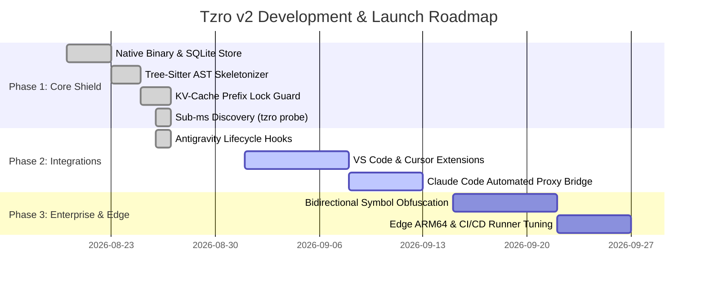

# Tzro v2 Product Roadmap

This roadmap outlines the milestones and engineering deliverables for **Tzro v2: The Local Token Shield & Context Optimization Engine**.

---

## 📅 Roadmap Overview

---

## 🚀 Phase Breakdown

### Phase 1: Core Token Shield Architecture (Completed)
- `[x]` **Zero-Dependency Native Binary**: Compiled Go binary with embedded SQLite WAL + FTS5 store (<50 MB RAM).
- `[x]` **KV-Cache Prefix Lock Guard**: Pins system prompts and tool schemas to guarantee >90% prompt cache read hits ($0.10 \times P_{\text{base}}$) and avoid the 12.5x cache miss penalty.
- `[x]` **Tree-Sitter AST Skeletonizer**: Language-aware structural code pruner across 10 languages (70%–90% token reduction via SHA-256 body hash markers).
- `[x]` **High-Speed Discovery (`tzro probe`)**: Embedded ripgrep + Tree-sitter symbol boundary extraction in <5ms.
- `[x]` **Smart JSON Crusher & Stack Trace Elider**: Deterministic tabular schema flattening and runtime stack frame trimming.
- `[x]` **Zero-Cloud DLP**: On-device regex and entropy scanner for secret masking.
- `[x]` **Transparent Reverse Proxy**: Loopback gateway on `127.0.0.1:7878` with direct SSE token streaming pass-through for Anthropic & OpenAI.

### Phase 2: Seamless Agent Integrations (Current Focus)
- `[x]` **Antigravity Hooks Adapter**: Native `hooks.json` command bridge for `PreToolUse`, `PostToolUse`, and `PreInvocation`.
- `[ ]` **Cursor & VS Code One-Click Helper**: One-click status bar extension showing active shielded tokens and cache hit metrics.
- `[ ]` **Automated Environment Detector**: CLI helper `tzro hook env` that auto-exports `ANTHROPIC_BASE_URL` and `OPENAI_BASE_URL` in shell profiles.

### Phase 3: Enterprise DLP & Security (Upcoming)
- `[ ]` **Bidirectional Symbol Obfuscation**: Maps internal proprietary symbols to synthetic IDs (`InternalFinLedger` $\to$ `Class_8F2`) and re-hydrates returned code edits locally.
- `[ ]` **Air-Gapped Audit Logger**: OpenTelemetry-compliant trace exporter for enterprise compliance verification.

### Phase 4: Edge & Embedded Deployment (Upcoming)
- `[ ]` **Embedded Edge Hardware Profiles**: Optimized builds for NVIDIA Jetson, Apple Silicon Metal, and lightweight CI/CD container runners.
