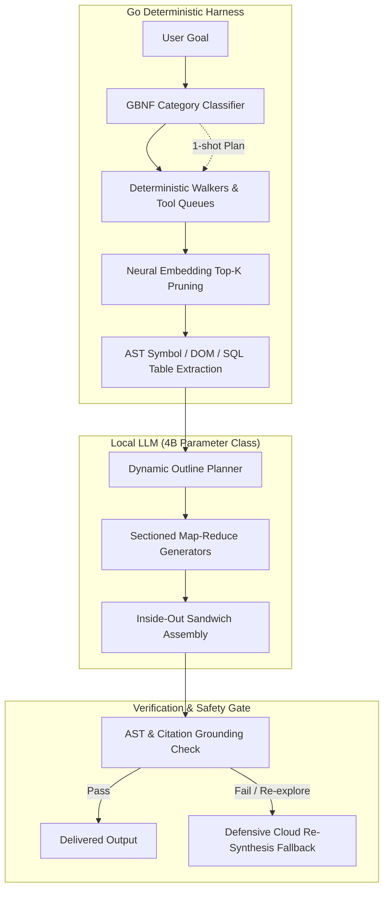

# Solution Design & Engineering Approaches

This document codifies the core philosophies, architectural principles, solution design rules of thumb, and anti-patterns established in the **tzro** codebase. 

All engineering work, agent workflows, and system designs must strictly adhere to these approaches.

---

## 1. Core Philosophy

**tzro** is built on the principle of **Small-Model Parity through Deterministic Scaffolding**: enabling lightweight, on-device models (1B–4B parameters) to match or exceed frontier cloud model quality at zero cloud token cost and local-first privacy.

To achieve this reliably without fragility, our solution design follows a strict hierarchy:
1. **Deterministic Go Scaffolding**: Fast, 100% reliable execution harness for traversal, AST parsing, SQL aggregation, and state transitions.
2. **Neural Embedding Vector Spaces**: High-dimensional semantic similarity ($k$-NN ranking, cosine similarity) for intent extraction, query formulation, and evidence scoring.
3. **GBNF-Constrained Cognitive Inference**: Targeted local LLM generation reserved for macro planning, dynamic outlines, spec-driven code generation, and terminal synthesis.
4. **Defensive Verification Gates**: Verified Task Execution (VTE) with bounded re-exploration and cloud re-synthesis safety floors.

---

## 2. Fundamental Design Principles

### Principle 1: No Heuristics — Semantic Similarity & Embedding Spaces Instead
*(Codified in [ADR-0081](file:///Users/jp/Desktop/Repos/tzro/docs/adr/0081-neural-embedding-policy-and-heuristic-deprecation.md) and [ADR-0075](file:///Users/jp/Desktop/Repos/tzro/docs/adr/0075-neural-embedding-sidecar.md))*

- **Prohibited Anti-Patterns**:
  - Regular expression entity extractors and keyword density counters (e.g. `cveRe`, `metricRe`, `keywordRe`).
  - Hardcoded string truncation (e.g. `query[:100]`) or naive conjunction splitting (`strings.Split(goal, " and ")`).
  - Hand-tuned keyword classification trees or substring prefix stripping (e.g. `strings.TrimPrefix(p, "Search for ")`).
- **Mandated Solution**:
  - Use the on-device **Neural Embedding Sidecar** (`inference.GlobalEmbeddingSidecar` / `embeddings.DefaultEngine`, `All-MiniLM-L6-v2`) with vector cosine similarity and $k$-Nearest Neighbors ($k$-NN) ranking.
  - **Evidence Extraction**: Segment browsed web pages or files into semantic blocks, embed them, compute cosine similarity against the goal vector $v_{\text{goal}}$, and select the top-$K$ ($K=6\text{--}8$) nearest neighbors.
  - **Query Formulation**: Decompose compound goals into candidate clauses, embed them against negative meta-instruction prototypes, and rank domain clauses by semantic relevance.
  - **Schema & Intent Resolution**: Map natural language user requests to SQL columns, filters, and operations via vector cosine distance against candidate schema embeddings.
- **Graceful Fallback Hierarchy**:
  1. *Primary*: On-device Neural Embedding Sidecar via HTTP endpoints with SQLite vector caching.
  2. *Secondary Fallback*: Pure Go bag-of-words vector space (`PureGoEmbeddingEngine` / `embeddings.CosineSimilarity`).
  3. *Strict Policy*: Never fall back to ad-hoc regex heuristics or arbitrary string slicing.

---

### Principle 2: Build Generic Solutions, Not Benchmark-Tailored Solutions (Anti-Overfitting)

- **Prohibited Anti-Patterns**:
  - Hardcoding domain names or URL authorities (e.g. giving manual score boosts to `ollama.com`, `vllm.ai`, or `temporal.io`).
  - Hardcoding test-specific entity names in prompts or templates (e.g. using `Google` or `Postgres` instead of neutral variables `X`, `Target Entity`).
  - Creating bespoke, hardcoded execution branches for specific file names or test cases (e.g. special-cased pipelines for `README.md` vs generic documentation).
  - Hardcoding assumption-heavy scoring rubrics that penalize general valid outputs not explicitly mandated by the user prompt.
- **Mandated Solution**:
  - Solutions must generalize across arbitrary unseen domains, languages, repositories, and prompt phrasings.
  - When domain authority or source quality matters, use generalized rubrics (e.g., link graph density, PageRank proxies, neutral semantic relevance) rather than hardcoded domain whitelists.
  - **Configurability over Magic Constants**: Parameters such as top-$K$ snippet counts, section count ranges (3–6), minimum field lengths, and token thresholds must be exposed via configuration (`config.json`), not hardcoded as immutable magic numbers.

---

### Principle 3: Model/Scaffolding Split — Deterministic Scaffolding for Small-Model Parity
*(Codified in [ADR-0078](file:///Users/jp/Desktop/Repos/tzro/docs/adr/0078-model-scaffolding-split-deterministic-walkers.md) and [ADR-0082](file:///Users/jp/Desktop/Repos/tzro/docs/adr/0082-deterministic-harness-scaffolding-for-small-model-parity.md))*

- **The Core Insight**: Small on-device models (1B–4B) fail at step-level tool routing and parameter extraction (~10% accuracy across benchmark evaluations), but excel at structured summarization and code generation given well-formed context and explicit specs (4.5–5.0 quality).
- **The Architectural Separation**:
  - **Deterministic Walkers (`DeterministicQueueDriver`)**: The Go harness deterministically manages exploration queues, AST symbol traversals, DOM table extractions, database queries, and URL crawl queues. Step-level LLM tool routing loops (`two_pass.go`) are completely eliminated.
  - **Reserved LLM Placement**: LLM inference is strictly reserved for high-leverage cognitive operations:
    1. *Macro Planning & Category Classification*: GBNF-constrained template selection.
    2. *Query Decomposition*: 1-shot Worker call to generate diverse search queries.
    3. *Code Generation*: 1-shot or edit-loop codegen from explicit AST specs (`tzro_code`).
    4. *Terminal Synthesis*: Sectioned Map-Reduce assembly.

---

### Principle 4: Data Values Are Opaque to LLMs — Deterministic Database & SQL Execution
*(Codified in [ADR-0050](file:///Users/jp/Desktop/Repos/tzro/docs/adr/0050-analyze-node.md), [ADR-0074](file:///Users/jp/Desktop/Repos/tzro/docs/adr/0074-structured-query-composition.md), and [ADR-0076](file:///Users/jp/Desktop/Repos/tzro/docs/adr/0076-deterministic-query-path.md))*

- **Prohibited Anti-Patterns**:
  - Feeding raw CSV rows or raw database tables into LLM context prompts for in-context arithmetic, sorting, filtering, or percentage calculations.
  - Relying on LLMs to perform exact mathematical aggregations or count records.
- **Mandated Solution**:
  - Data values remain **completely opaque** to the LLM. The LLM only sees column metadata, data types, and high-level schema profiles.
  - The LLM extracts structural intent (target columns, group-by keys, filter conditions, aggregation requests) via semantic vector matching against schema representations.
  - In-memory SQLite executes all filtering, multi-aggregations (`COUNT(*)`, `SUM()`, `AVG()`), deterministic ratio window functions (`COUNT(*) * 100.0 / SUM(COUNT(*)) OVER() AS percentage`), and NULL-safe grouping (`COALESCE(col, 'Unspecified')`).
  - Only clean, aggregated SQL result tables are formatted into markdown for the final deliverable.

---

### Principle 5: Inside-Out (Sandwich) Sectioned Map-Reduce Synthesis
*(Codified in [ADR-0083](file:///Users/jp/Desktop/Repos/tzro/docs/adr/0083-dynamic-sectioned-map-reduce-and-semantic-citation-remapping.md), [ADR-0084](file:///Users/jp/Desktop/Repos/tzro/docs/adr/0084-generalized-sectioned-map-reduce-synthesis.md), and [ADR-0085](file:///Users/jp/Desktop/Repos/tzro/docs/adr/0085-inside-out-sandwich-section-synthesis.md))*

- **The Problem**: Monolithic single-pass generation exhausts the 2,048-token generation cap, causes attention decay, drops trailing modules (e.g. support types or utility layers), and causes introductory overviews to speculate and drift from subsequent body text.
- **The Sandwich Pipeline**:
  1. **Dynamic Outline Planning**: The model plans an unbounded 3–6+ section outline based on the user's explicit goal (GBNF-constrained).
  2. **Deterministic Context Partitioning**: Discovered files, AST symbols, and crawled evidence are partitioned per section (capped at 10,000 tokens / 40,000 characters per section) using lexical/semantic scoring against `section.Heading + section.Objective`.
  3. **Inside-Out Execution Flow**:
     - **Pass 1 (Body Sections $S_1 \dots S_{N-2}$)**: Synthesize body sections first against their dedicated context slices.
     - **Pass 2 (Executive Overview / Intro $S_0$)**: Synthesize the introduction *after* the body using the drafted body text as authoritative grounding context (guaranteeing 100% factual alignment).
     - **Pass 3 (Terminal Section / API Index $S_{N-1}$)**: Synthesize the conclusion or reference catalog with the consolidated symbol/source index.
     - **Pass 4 (Assembly & Truncation Guard)**: Assemble sections in outline order, verify that no section ended on unclosed blocks or sentences, and stitch the final deliverable.

---

### Principle 6: 100% Citation Grounding & Pre-Flight Verification Gate
*(Codified in [ADR-0080](file:///Users/jp/Desktop/Repos/tzro/docs/adr/0080-high-density-research-pipeline-and-structured-synthesis.md) and [ADR-0083](file:///Users/jp/Desktop/Repos/tzro/docs/adr/0083-dynamic-sectioned-map-reduce-and-semantic-citation-remapping.md))*

- **Prohibited Anti-Patterns**:
  - Free-form uncited assertions, speculative release dates, or hallucinated metrics.
  - Out-of-bounds citation indices (e.g. referencing `[7]` when only 3 sources were crawled).
  - Single-source monoculture (citing only `[1]` across an entire multi-source document).
- **Mandated Solution**:
  - The harness injects a deterministic indexed bibliography (`[1] URL - Title`, `[2] URL - Title`) into the synthesis prompt.
  - The prompt contract strictly instructs the model to write `"Not reported in sources"` when data is absent.
  - **Semantic Citation Remapping**: A deterministic post-flight pass validates all `[N]` tags:
    - Remaps out-of-bounds tags to the best-matching source index via embedding cosine similarity ($\ge 0.45$), or strips them if $< 0.45$.
    - Detects unsourced quantitative metrics/CVEs and attaches `[M]` tags if similarity $\ge 0.65$.
    - Appends a canonical `## Verified Sources & Citations` table.

---

### Principle 7: GBNF Grammars for Structure, Markdown for Expressiveness

- **The Rule**: Use GBNF grammars for classification, enums, structured schemas, and boundary limits.
- **Do Not Over-Constrain Generative Prose into JSON**:
  - Forcing small models to produce long multi-paragraph technical documents or markdown tables inside escaped JSON string fields causes escaped newline errors, JSON parse failures, and extreme prose stiffness.
  - Use GBNF for structural envelopes (e.g. outline schemas, category enums, table schemas) and allow the model to emit clean, unescaped markdown within section generator slots.

---

### Principle 8: Verified Task Execution (VTE) with Defensive Recovery Floors
*(Codified in [ADR-0067](file:///Users/jp/Desktop/Repos/tzro/docs/adr/0067-verified-task-execution.md) and [ADR-0078](file:///Users/jp/Desktop/Repos/tzro/docs/adr/0078-model-scaffolding-split-deterministic-walkers.md))*

- **The Rule**: The engine **never** returns a rejected, hallucinated, or malformed local synthesis to the user or benchmark evaluator.
- **The Recovery Invariant**:
  - When the verification gate rejects an initial synthesis, it evaluates whether re-exploration is viable (`reExplore: true`).
  - If re-exploration budget remains ($\le 1$ attempt per task), the engine triggers an in-place re-exploration pass with targeted hints (`reExploreHint`).
  - If re-exploration fails or the budget is exhausted, the engine falls back defensively to **Cloud Re-Synthesis**.
  - High-quality, verified output is always guaranteed.

---

### Principle 9: Deterministic AST Symbol & Namespace Inspection for Codegen
*(Codified in [ADR-0047](file:///Users/jp/Desktop/Repos/tzro/docs/adr/0047-ast-symbol-extraction-for-probe-nodes.md) and [ADR-0082](file:///Users/jp/Desktop/Repos/tzro/docs/adr/0082-deterministic-harness-scaffolding-for-small-model-parity.md))*

- **The Rule**: Catch syntax, missing imports (e.g. `import "encoding/json"`), and undefined symbol errors deterministically before committing code.
- **The Solution**:
  - Use tree-sitter AST parsers across Go, TypeScript, Python, and Rust to inspect member call roots against declared package imports.
  - If an unimported namespace is referenced, trigger a targeted 1-turn reflection repair prompt before file commitment.
  - Provide a pluggable `LanguageLinter` interface allowing custom language compilers, linters, and typecheckers to register directly into the compilation gate.

---

### Principle 10: Disciplined Red-Team QA & TDD Verification Loops

- **The Rule**: All bug fixes and architectural features must follow strict Test-Driven Development (TDD):
  1. *Red*: Reproduce the issue with a failing unit/integration test.
  2. *Green*: Implement the deterministic scaffolding or neural embedding solution.
  3. *Refactor*: Eliminate legacy heuristics and verify regression safety.
- **Benchmark Red-Teaming**: Use the `/red-team-loop` skill to run iterative benchmark evaluations, classify failure modes into harness vs model categories, and fix root causes structurally in the Go harness.

---

## 3. Quick Reference: Anti-Patterns vs Approved Solutions

| Task / Domain | ❌ Prohibited Anti-Pattern | ✅ Approved Solution Approach |
| :--- | :--- | :--- |
| **Evidence Extraction** | Regex density scoring (`cveRe`, `metricRe`), substring slicing. | Neural Embedding Sidecar (`All-MiniLM-L6-v2`) with vector cosine similarity & $k$-NN ranking ([ADR-0081](file:///Users/jp/Desktop/Repos/tzro/docs/adr/0081-neural-embedding-policy-and-heuristic-deprecation.md)). |
| **Query Formulation** | Hardcoded prefixes (`"Search for "`), length cuts (`[:100]`). | 1-shot Worker query decomposition + negative instruction prototype vector subtraction ([ADR-0078](file:///Users/jp/Desktop/Repos/tzro/docs/adr/0078-model-scaffolding-split-deterministic-walkers.md)). |
| **Data Analysis** | In-context LLM arithmetic on raw CSV text; LLM guessing counts. | Schema-only LLM intent extraction; in-memory SQLite for all aggregations, window ratios, & grouping ([ADR-0076](file:///Users/jp/Desktop/Repos/tzro/docs/adr/0076-deterministic-query-path.md)). |
| **Tool Execution** | Multi-turn LLM step routing loops (`two_pass.go`). | Deterministic Walkers (`DeterministicQueueDriver`) with bounded queues ([ADR-0078](file:///Users/jp/Desktop/Repos/tzro/docs/adr/0078-model-scaffolding-split-deterministic-walkers.md)). |
| **Long-Form DocGen** | Monolithic single-pass prompt broadcasting whole repo. | Inside-Out (Sandwich) Sectioned Map-Reduce with 10K-token partitioned contexts ([ADR-0085](file:///Users/jp/Desktop/Repos/tzro/docs/adr/0085-inside-out-sandwich-section-synthesis.md)). |
| **Web Research** | Free-form uncited text; hardcoded domain authority boosts. | Numbered citation preamble, DOM table extraction, and post-flight semantic citation remapping ([ADR-0083](file:///Users/jp/Desktop/Repos/tzro/docs/adr/0083-dynamic-sectioned-map-reduce-and-semantic-citation-remapping.md)). |
| **Codegen Repairs** | Regenerating entire multi-hundred line files on syntax errors. | AST tree-sitter import validation + targeted 1-turn reflection repair ([ADR-0082](file:///Users/jp/Desktop/Repos/tzro/docs/adr/0082-deterministic-harness-scaffolding-for-small-model-parity.md)). |
| **Quality Safety** | Returning rejected, hallucinated local synthesis. | Verified Task Execution (VTE) with bounded re-exploration and cloud re-synthesis floor ([ADR-0067](file:///Users/jp/Desktop/Repos/tzro/docs/adr/0067-verified-task-execution.md)). |

---

## 4. Key Architectural References

- **ADRs**:
  - [`docs/adr/0075-neural-embedding-sidecar.md`](file:///Users/jp/Desktop/Repos/tzro/docs/adr/0075-neural-embedding-sidecar.md)
  - [`docs/adr/0078-model-scaffolding-split-deterministic-walkers.md`](file:///Users/jp/Desktop/Repos/tzro/docs/adr/0078-model-scaffolding-split-deterministic-walkers.md)
  - [`docs/adr/0081-neural-embedding-policy-and-heuristic-deprecation.md`](file:///Users/jp/Desktop/Repos/tzro/docs/adr/0081-neural-embedding-policy-and-heuristic-deprecation.md)
  - [`docs/adr/0082-deterministic-harness-scaffolding-for-small-model-parity.md`](file:///Users/jp/Desktop/Repos/tzro/docs/adr/0082-deterministic-harness-scaffolding-for-small-model-parity.md)
  - [`docs/adr/0083-dynamic-sectioned-map-reduce-and-semantic-citation-remapping.md`](file:///Users/jp/Desktop/Repos/tzro/docs/adr/0083-dynamic-sectioned-map-reduce-and-semantic-citation-remapping.md)
  - [`docs/adr/0084-generalized-sectioned-map-reduce-synthesis.md`](file:///Users/jp/Desktop/Repos/tzro/docs/adr/0084-generalized-sectioned-map-reduce-synthesis.md)
  - [`docs/adr/0085-inside-out-sandwich-section-synthesis.md`](file:///Users/jp/Desktop/Repos/tzro/docs/adr/0085-inside-out-sandwich-section-synthesis.md)
- **Core Packages**:
  - `internal/embeddings`: Embedding sidecar client and pure Go cosine vector engine.
  - `internal/executor`: Deterministic queue drivers, sectioned map-reduce synthesis, and VTE verification gates.
  - `internal/codegen`: AST symbol extraction, language linters, and repair loops.
