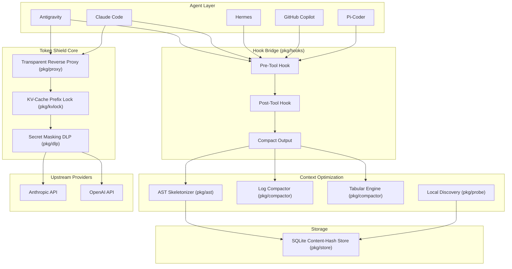
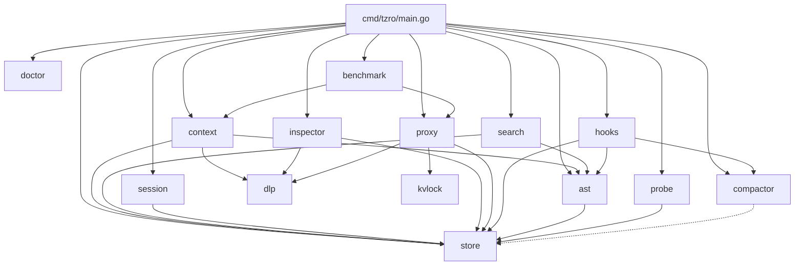

# tzro v2 Architectural Guide

This document describes the high-level design, subsystems, and optimization mechanics of **tzro v2 — The Local Token Shield & Context Optimization Engine**.

---

## 1. High-Level Design & Philosophy

`tzro v2` is an ultra-lightweight, compiled native Go binary (<50 MB RAM, zero Python/PyTorch dependencies) that eliminates cloud API rate limits and token waste for AI coding agents. It operates as a transparent middleware layer between coding agents and cloud LLM providers.

### Architecture Shift: v1 → v2

v1 was a durable local-first agentic runtime with a DAG execution engine, strategy framework, probe nodes, and dual-sidecar inference. v2 radically simplifies the architecture:

- **Removed**: Internal engine (`internal/`), DAG executor, strategy framework, probe nodes, MCP server (`cmd/tzro-mcp`), daemon (`cmd/tzrod`), dashboard, sidecar inference, workspace registry, all 37 internal packages
- **Added**: Public `pkg/` library, transparent reverse proxy, multi-harness hook bridge, KV-cache prefix locking, tabular data engine
- **Result**: From ~1M LOC across 37 internal packages to ~3K LOC across 8 focused public packages

### Design Principles

1. **Zero Dependencies**: Single compiled Go binary. No Python, Node.js, PyTorch, or container runtimes.
2. **Transparent Interception**: Agents don't know tzro exists. Standard `BASE_URL` environment variables route traffic through the proxy.
3. **Local-First**: All processing happens on-device. No data leaves the machine except the optimized LLM request.
4. **Sub-Millisecond Latency**: Probe, skeleton, and compaction operations complete in <5ms.
5. **Universal Agent Support**: Works with any agent that speaks Anthropic or OpenAI API protocols.

```
┌─────────────────────────────────────────────────────────────┐
│  Developer / Agent (Cursor, Claude Code, Antigravity, CLI)  │
└──────────────────────────────┬──────────────────────────────┘
                               │ (Transparent Loopback Proxy / CLI)
                               ▼
┌─────────────────────────────────────────────────────────────┐
│                 TZRO v2 LOCAL TOKEN SHIELD                  │
│                                                             │
│  1. KV-Cache Prefix Lock Guard (70-99% Cache Read Hit Rate) │
│  2. Tree-Sitter AST Skeletonizer (70-90% Token Reduction)  │
│  3. Sub-Millisecond Local Discovery (`tzro probe`)         │
│  4. Local SQLite FTS5 Content-Hash Store (`tzro expand`)   │
│  5. Smart JSON Crusher & Stack Trace Elider                │
│  6. Zero-Cloud DLP / Secret Masking                        │
│  7. Tabular Data Engine (`tzro ingest` / `tzro query`)     │
└──────────────────────────────┬──────────────────────────────┘
                               │ (Dense, High-Signal, Cache-Locked Payload)
                               ▼
┌─────────────────────────────────────────────────────────────┐
│           Cloud LLM Provider (Anthropic / OpenAI)           │
│           ~80% Token Reduction / Zero Rate Limits           │
└─────────────────────────────────────────────────────────────┘
```

---

## 2. System Architecture



---

## 3. Package Architecture

tzro v2 is organized into 15 public packages under `pkg/`, one CLI entrypoint, and a website server:

```
cmd/
  tzro/main.go          # CLI entrypoint — cobra commands for all operations
pkg/
  ast/                   # Tree-sitter AST skeletonizer and span extraction
  benchmark/
    signaldensity/       # Signal density per token benchmark suite and cost guard
  compactor/             # Evidence-contract log compaction and tabular data formatting
  context/               # Task context pack assembler, impact graph, tsconfig path resolution
  dlp/                   # Zero-cloud DLP secret masking & workspace privacy policies
  doctor/                # Synthetic health checks, provider route diagnostics, hook probes
  evidence/              # Typed evidence provenance envelopes and freshness markers
  hooks/                 # Multi-harness agent lifecycle hook bridge (5 harnesses)
  inspector/             # Offline context assembly explainability & ranking inspector
  kvlock/                # KV-cache prefix normalization and locking
  probe/                 # Fast local codebase discovery (ripgrep + AST)
  proxy/                 # Transparent reverse proxy server and usage tracking
  search/                # Unified local evidence search across code, docs, logs, and artifacts
  session/               # Portable, git-aware agent session manifest & continuity engine
  store/                 # SQLite Schema v2 content-hash store, workspace isolation & LRU eviction
website/
  main.go                # Marketing/docs website server
```

### Dependency Graph



---

## 4. Core Subsystems

### 4.1. Transparent Reverse Proxy (`pkg/proxy`)

The proxy is the central interception point for all LLM traffic. It listens on a configurable loopback address (default `127.0.0.1:7878`) and transparently forwards requests to upstream providers.

**Request Flow:**
1. Agent sends request to `http://localhost:7878/v1/messages` (Anthropic) or `/v1/chat/completions` (OpenAI)
2. Proxy identifies the provider from the URL path and API key headers
3. KV-cache prefix lock normalizes system prompts and tool schemas
4. DLP scanner redacts secrets from the request body
5. Optimized request is forwarded to the upstream provider
6. Response is streamed back to the agent unmodified

**Configuration:**
```go
type Config struct {
    ListenAddr        string     // Default: "127.0.0.1:7878"
    UpstreamAnthropic string     // Default: "https://api.anthropic.com"
    UpstreamOpenAI    string     // Default: "https://api.openai.com"
    Store             *store.DB  // SQLite content-hash store
}
```

**Metrics** are exposed via `/metrics` endpoint:
```go
type Metrics struct {
    TotalRequests     int64
    AnthropicRequests int64
    OpenAIRequests    int64
    BytesProcessed    int64
    SecretsRedacted   int64
    MemoryAllocMB     int64
    UptimeSeconds     int64
}
```

### 4.2. KV-Cache Prefix Lock Guard (`pkg/kvlock`)

Normalizes prompt prefixes to ensure byte-for-byte reproducibility across turns. This prevents cache invalidation from:
- Reordered tool schemas
- Whitespace drift in system prompts
- Tool definition changes between turns

**Benchmarked Performance:** 70–99% cache read hit rates across 8 LLM providers via OpenRouter. E2E tests show 5–10 percentage point improvement over native provider caching.

**The 12.5× Cost Problem:**
- Cache hit: 90% discount ($P_{read} = 0.10 × P_{base}$)
- Cache miss: 25% surcharge ($P_{write} = 1.25 × P_{base}$)
- A single unaligned byte makes the next turn 12.5× more expensive

### 4.3. AST Skeletonizer (`pkg/ast`)

Language-aware structural pruner using Tree-sitter to replace method bodies with cryptographic hash tags.

**Supported Languages:** Go, TypeScript, JavaScript, Python, and other languages with Tree-sitter grammars.

**Process:**
1. Parse source file with Tree-sitter
2. Identify function/method bodies
3. Compute SHA-256 hash of each body
4. Replace body with `// [body elided: #hash]` comment
5. Store original body in SQLite content-hash store
6. Return skeleton with compression stats

**Token Reduction:** 70–90% on typical source files.

### 4.4. Local Discovery Engine (`pkg/probe`)

Deterministic ripgrep + AST scope analyzer for sub-millisecond local symbol queries.

**Process:**
1. Execute ripgrep with the search query against the codebase
2. Parse matching files with Tree-sitter for AST context
3. Enrich results with function signatures, struct definitions, and scope info
4. Format as markdown for agent consumption
5. Optionally index results in the content-hash store

**Performance:** <5ms for typical codebases with 0 cloud tokens consumed.

### 4.5. Log Compactor (`pkg/compactor`)

Content-aware compaction engine for build/test output and JSON arrays.

**Compaction Strategies:**
- **Stack Trace Elision:** Strips redundant runtime goroutine stacks while preserving user code frames
- **JSON Array Flattening:** Converts uniform JSON arrays into compact markdown tables
- **Log Line Deduplication:** Collapses repeated log patterns

**Token Reduction:** ~80% on typical build/test logs.

### 4.6. Tabular Data Engine (`pkg/compactor` + `pkg/store`)

Auto-detects and imports CSV, TSV, and JSON array data into SQLite for agent queries.

**Components:**
- `DetectTabular()`: Auto-format detection (CSV, TSV, JSON array)
- `FormatEnvelope()`: Generates compact data envelope with schema and sample rows
- `store.ImportTabular()`: Imports rows into SQLite table
- `store.QuerySQL()`: Execute read-only SQL queries

**Token Reduction:** 97%+ on tabular workloads.

### 4.7. DLP / Secret Masking (`pkg/dlp`)

On-device regex and entropy scanner that masks secrets before request egress.

**Detection Patterns:**
- API keys (OpenAI, Anthropic, AWS, GCP, etc.)
- Bearer tokens and JWTs
- Private keys and certificates
- Database connection strings
- High-entropy strings that look like credentials

### 4.8. Agent Lifecycle Hook Bridge (`pkg/hooks`)

Multi-harness hook bridge that intercepts pre-tool and post-tool events from 5 supported agent frameworks.

**Supported Harnesses:**

| Harness | Pre-Tool | Post-Tool |
|:---|:---|:---|
| Antigravity | `HandlePreToolUse` | `HandlePostToolUse` |
| Claude Code | `HandleClaudePreToolUse` | `HandleClaudePostToolUse` |
| Hermes | `HandleHermesPreTool` | `HandleHermesPostTool` |
| GitHub Copilot | `HandleCopilotPreTool` | `HandleCopilotPostTool` |
| Pi-Coder | `HandlePiCoderPreTool` | `HandlePiCoderPostTool` |

**Post-Tool Compaction Pipeline:**
1. Read tool output from stdin (JSON envelope per harness protocol)
2. Detect content type (code, logs, JSON, text)
3. Apply appropriate compaction (skeleton for code, compress for logs, flatten for JSON)
4. Write optimized output to stdout

**Hook Installer** (`hooks.DetectAndInstallHooks`):
- Auto-detects active agent environments
- Generates hook configuration files for each detected harness
- Supports workspace-scoped (`--workspace`) and global installation

### 4.9. SQLite Content-Hash Store & Schema v2 (`pkg/store`)

Embedded SQLite database in WAL mode with FTS5 full-text indexing, multi-workspace isolation, and LRU artifact lifecycle management.

**Key Capabilities:**
- **Schema v2 Migration:** Seamlessly upgrades v1 databases to v2 with isolated workspace partitioning.
- **LRU Artifact Eviction:** Enforces configurable quota limits with `last_accessed_at` LRU tracking.
- **Traces Storage:** Persists 6-stage context assembly diagnostic traces for offline analysis.
- **Content Addressing:** Deduplicates source snippets, skeletons, and command failure outputs.

### 4.10. Task Context Pack Assembler (`pkg/context`)

Assembles ranked, token-budgeted context packs for an agent task query in a single sub-second turn.

**Process:**
1. Evaluates query against SQLite FTS5 symbol index and lexical search fallback.
2. Traverses Tree-sitter AST to extract relevant functions, types, structs, and interfaces.
3. Resolves TypeScript path aliases (`@/*`, `~/*`) from `tsconfig.json` into canonical workspace filepaths.
4. Identifies co-located and corresponding unit/integration test suites.
5. Skeletons large file bodies, replacing them with cryptographic hashes.
6. Enforces strict token budgeting with deterministic ranking and explainable provenance.

### 4.11. Pre-Edit Change Impact Graph (`pkg/context/impact.go`)

Calculates the blast radius of proposed code edits before modifying shared code or types.

**Features:**
- Computes structural call graphs from AST definitions and import graphs.
- Maps direct callers and downstream dependent modules across the entire repository.
- Identifies existing test coverage for modified files and their callers.
- Accepts explicit file paths or inspects uncommitted git changes (`git diff`).

### 4.12. Unified Local Evidence Search (`pkg/search`)

Heterogeneous local search engine executing across diverse project artifacts in <10ms.

**Search Domains:**
- Source code files with precise AST span extraction.
- Markdown documentation, READMEs, and Architecture Decision Records (ADRs).
- Product specs and working notes.
- Stored execution logs and failure artifacts.
- Agent session manifests.

### 4.13. Agent Session Continuity & Handoffs (`pkg/session`)

Provides git-aware session state capture and restoration across agent turns and handoffs.

**Features:**
- Serializes active objectives, decisions, executed checks, and constraints into Schema v2 manifests.
- Computes git tree state hashes and detects workspace drift between agent handoffs.
- Surfaces stale evidence markers when underlying files are modified out-of-band.

### 4.14. Diagnostic Doctor (`pkg/doctor`)

Comprehensive synthetic diagnostic tool for troubleshooting proxy routing and local environment issues.

**Diagnostic Checks:**
- Probes local loopback proxy routes (`/v1/messages`, `/v1/chat/completions`, `/v1/responses`).
- Validates upstream provider connectivity (DNS resolution, TLS handshake, latency).
- Checks agent lifecycle hook configurations across 5 harnesses.
- Executes synthetic KV-lock normalization and DLP secret redaction.
- Validates SQLite FTS5 extension availability and database health.

### 4.15. Context Inspector & Explainability (`pkg/inspector`)

Provides offline explainability for context assembly decisions with zero cloud token consumption.

**Capabilities:**
- Replays context pack generation from saved trace IDs.
- Explains candidate inclusion, ranking, and stage-by-stage omission reasons.
- Evaluates candidate selection against workspace privacy policies.

### 4.16. Signal Density Benchmark Suite (`pkg/benchmark/signaldensity`)

Empirical benchmarking framework measuring task signal density per token across optimization strategies.

**Features:**
- Runs standardized test batteries across code discovery, refactoring, and execution tasks.
- Calculates Signal Density Metrics ($S = \text{Recall} / \text{Tokens}$).
- Enforces a hard spending circuit breaker (`--max-cost`) to prevent runaway cloud evaluation costs.
- Generates structured Markdown and JSON comparison reports.

### 4.17. Evidence Provenance Envelope (`pkg/evidence`)

Typed container tagging all context artifacts with origin metadata, line coordinates, and verification confidence.

---

## 5. CLI Command Reference

| Command | Package | Description |
|:---|:---|:---|
| `tzro start` | `pkg/proxy` | Start the transparent reverse proxy daemon |
| `tzro context "<task>" --budget <n>` | `pkg/context` | Assemble ranked, token-budgeted context pack |
| `tzro impact [files...]` | `pkg/context` | Compute change-impact graph and test coverage |
| `tzro probe "<query>"` | `pkg/probe` | Fast local codebase discovery |
| `tzro search "<query>"` | `pkg/search` | Unified local evidence search across code, docs, artifacts |
| `tzro skeleton <file>` | `pkg/ast` | Generate AST skeleton with body hashes |
| `tzro expand <hash-or-id>` | `pkg/store` | Retrieve original code body or stored artifact |
| `tzro compact [--run "<cmd>"]` | `pkg/compactor` | Compress logs with evidence contracts & inline diagnostic cap |
| `tzro session save / load / status` | `pkg/session` | Portable git-aware agent session handoffs |
| `tzro inspect explain <trace-id>` | `pkg/inspector` | Offline context pack ranking explainability |
| `tzro doctor` | `pkg/doctor` | Synthetic health checks and provider route diagnostics |
| `tzro bench signal-density` | `pkg/benchmark/signaldensity` | Empirical signal density benchmarking with cost guard |
| `tzro hook [harness] [event]` | `pkg/hooks` | Agent lifecycle hook bridge (5 harnesses) |
| `tzro init` | `pkg/hooks` | Auto-configure agent hooks |
| `tzro status` | `pkg/proxy` | Check proxy metrics, cache hits, and memory |
| `tzro ingest <file>` | `pkg/compactor` + `pkg/store` | Import tabular data into SQLite |
| `tzro query <table> "<sql>"` | `pkg/store` | Execute SQL against imported data |

---

## 6. Resource Footprint

| Metric | Value |
|:---|:---|
| Binary Size | ~15 MB (single static binary) |
| Memory (RSS) | <50 MB steady-state |
| Cold Start | <100ms |
| Probe Latency | <5ms |
| Skeleton Latency | <50ms (typical files) |
| Dependencies | 0 (compiled Go binary) |

---

## 7. Website (`website/`)

A Go-based static website server for marketing and documentation. Serves the tzro landing page, documentation, and installation instructions.

---

## 8. Migration Notes from v1

The following v1 subsystems have been removed in v2:

| v1 Subsystem | Status | Replacement |
|:---|:---|:---|
| DAG Execution Engine | Removed | Agent-native execution (agents handle their own planning) |
| Strategy Framework | Removed | Direct `pkg/` library calls |
| Probe Nodes | Removed | `pkg/probe` (CLI-only, no execution graph) |
| MCP Server (`cmd/tzro-mcp`) | Removed | Agent hooks (`pkg/hooks`) |
| Daemon (`cmd/tzrod`) | Removed | Transparent proxy (`pkg/proxy`) |
| Dashboard | Removed | `tzro status` CLI + `/metrics` endpoint |
| Dual-Sidecar Inference | Removed | Agents use their own LLM providers |
| Workspace Registry | Removed | Single `~/.tzro/store.db` |
| 37 internal packages | Removed | 8 public `pkg/` packages |

The v2 philosophy shifts tzro from an "agentic operating system" to a "transparent token optimization layer" — agents remain in control of their own execution while tzro silently reduces their cloud costs and improves cache hit rates.
