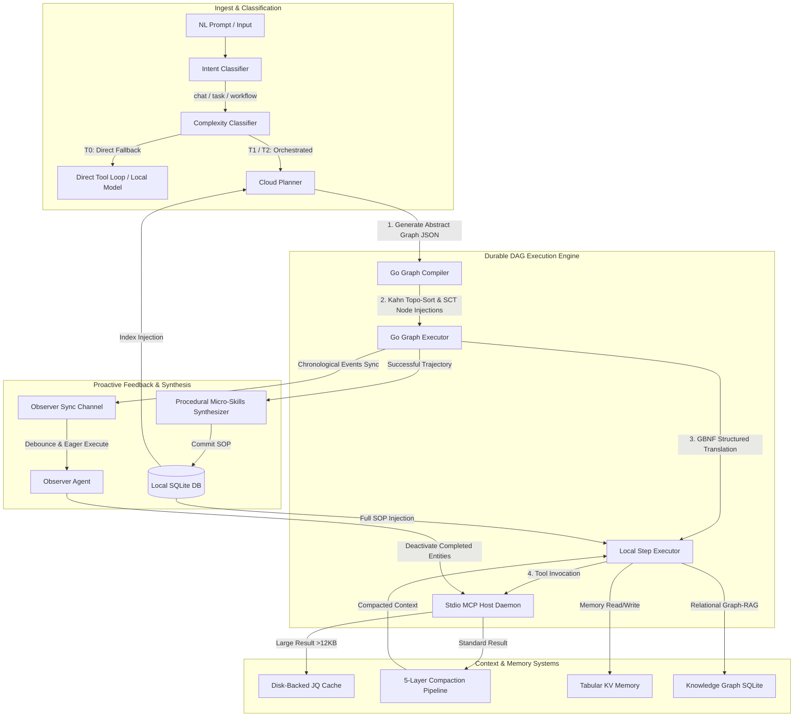

# tzro Architectural Guide

This document describes the high-level design, subsystems, optimization mechanics, Go SDK integrations, and JSON schemas that comprise the **tzro** durable local-first agentic operating system.

---

## 1. High-Level Design & Philosophy

`tzro` is a portable, local-first runtime designed for next-generation AI agents. Rather than acting as a library or importable framework, it provides an operating system substrate that hosts, executes, and persists agent operations.

### The Strategy-vs-Tactics Paradigm

Traditional agent loops loop infinitely or suffer from context window overflow because they plan and execute in the same workspace. `tzro` solves this by separating cognitive tasks into two distinct layers:
1. **The Strategist (Cloud Planner):** A high-capacity remote **Cloud Model** is invoked exactly **once** at the start of a task. It analyzes the user's natural language prompt, classifies the **Intent**, rates the **Complexity Tier**, and compiles a declarative **Abstract Graph** blueprint with dependencies and whitelisted tools. It also assigns **Activation Thresholds** and a **Mutation Budget** for dynamic graph mutations.
2. **The Tactician (Local Step Executor):** A lightweight **Local Model** (hosted via a pluggable **Inference Backend**, such as the embedded `llama-server` sidecar) executes individual steps in isolation. It generates parameters as XML, which are coerced into strict JSON schemas by a **Semantic Validator** and run deterministically.

```
                              USER GOAL PROMPT
                                     │
                                     ▼
                ┌──────────────────────────────────────────┐
                │          Intent Classifier               │ (chat / task / workflow)
                └────────────────────┬─────────────────────┘
                                     │
                                     ▼
                ┌──────────────────────────────────────────┐
                │   Cloud Planner (The Strategist)         │ [Invoked ONCE]
                │   - Generates Abstract Graph JSON        │
                │   - Declares variable bindings           │
                │   - Sets Activation Thresholds & budget  │
                └────────────────────┬─────────────────────┘
                                     │
                                     ▼
                ┌──────────────────────────────────────────┐
                │      Go Graph Compiler & Kahn Sorter     │ [Deterministic]
                │   - Level-based topological sort         │
                │   - Injects Semantic Validator nodes     │
                │   - Applies Proactive Binding Splice     │
                └────────────────────┬─────────────────────┘
                                     │
                      ┌───────────────┴───────────────┐
                      ▼                               ▼
               ┌─────────────┐                 ┌─────────────┐
               │   Node A    │                 │   Node B    │
               └──────┬──────┘                 └──────┬──────┘
                      │ Edge Traversal                │
                      ▼                               ▼
               ┌─────────────────────────────────────────────┐
               │           Edge Thought Generator            │
               │  - Local Model computes goal confidence     │
               │  - confidence < threshold → spawn node      │
               │  - goalAchieved = true   → skip downstream  │
               └──────────────────────┬──────────────────────┘
                                     │
                                     ▼
   ┌────────────────────────────────────────────────────────────────────────┐
   │       Local Step Executor (The Tactician - Pluggable Backend)          │
   │  - Pluggable backend (llama-server, Ollama, LMStudio, vLLM)            │
   │  - XML parameters coerced to strict JSON by Semantic Validator         │
   │  - Invokes Go, WASM (Wazero), or stdio MCP Host tool servers           │
   └────────────────────────────────────────────────────────────────────────┘
```

---

## 2. System Architecture



---

## 3. Core Subsystems

### 3.1. Ingest & Classification

- **Intent Classifier:** Classifies the incoming natural language request into a core runtime entity type (`chat`, `task`, or `workflow`) and extracts parameters.
- **Complexity Classifier:** Assigns a **Complexity Tier** to the request:
  - **T0 Direct:** Conversational questions or one-shot commands, bypassing planning.
  - **T1 Planned:** Standard multi-step operations compiling into execution graphs.
  - **T2 Supervised:** High-risk tasks requiring supervisor validation and approval gates.
- **Heuristic Pre-Classifier:** A high-speed Go regex analyzer that matches simple prompts and handles them under **T0 Direct** without invoking LLM inference, reducing intake latency by ~200ms.

### 3.2. Go Graph Compiler & Kahn Sorter

The compiler reads the Strategist's **Abstract Graph** and dynamically builds a fine-grained Strategist-Compiler-Translator (SCT) execution graph:
1. **Validation:** Asserts that the graph is free of cyclic loops.
2. **Topological Sorting:** Groups execution nodes into parallel levels utilizing Kahn's algorithm.
3. **SCT Node Injections:**
   - **Semantic Validator Nodes (`semantic_validator`):** Prepended to each tool-dependent node. They parse loose XML parameter structures from the model and coerce them into strict JSON matching the tool's schema.
   - **Deterministic Nodes (`deterministic`):** Execute the actual tool using the coerced parameters without LLM intervention.
   - **Terminal Synthesis Node (`synthesis`):** Injected at the leaf of the graph to summarize the results of all executions into a cohesive natural-language summary.
4. **Proactive Binding Splice:** Strips deterministically-known parameter variables from the schema before the model plans, then splices them back in after parameter generation to prevent extraction failures.

### 3.3. Durable Execution Engine & Checkpointing

The executor processes sorted levels concurrently using Go goroutines:
- **State Checkpointing:** Node outcomes are persisted to the SQLite database immediately upon completion. If a crash or restart occurs, the task is resumed from the last completed level.
- **Cycle Budgets:** A counter (`MaxCycles`) decrements on loop executions, terminating the engine if it reaches zero to avoid infinite looping charges.
- **Weighted Circuit Breaker (v0.7.3):** The executor computes a time budget per task based on the node composition of the DAG. Each node type has a defined budget (probe: 10min, action: 5min, deterministic/synthesis: 90s). A configurable `circuitBreakerMultiplier` (default 1.0) scales the total budget. When the budget expires, remaining pending nodes are marked `timed_out` and the `terminal_synthesis` node is preserved to produce a coherent final output.
- **Tool Name Classification Fallback (v0.7.3):** At execution time, if a node references a tool that doesn't exist in the registry, the executor uses local inference to classify the hallucinated name to the closest real tool before failing.

```sql
CREATE TABLE graph_node_states (
    task_id        TEXT NOT NULL,
    node_id        TEXT NOT NULL,
    status         TEXT CHECK(status IN ('pending', 'running', 'completed', 'failed', 'skipped', 'timed_out')) NOT NULL,
    output_payload TEXT,
    completed_at   INTEGER,
    PRIMARY KEY (task_id, node_id)
);
```

### 3.4. Probe Nodes & Content-Aware Truncation

**Probe Nodes** are autonomous exploration agents that run a bounded Thought Chain loop on the Local Model. They navigate codebases, directories, or data sources using whitelisted filesystem tools (`read_file`, `list_dir`, `search_files`), persisting each step to SQLite.

- **Minimum Step Budget (v0.7.3):** Probes enforce a floor before accepting `<SYNTHESIZE_READY>` signals. Adaptive: `min(8, stepBudget/2)`. Premature synthesis signals are ignored and exploration continues.
- **Compaction Levels (v0.7.3):** Configurable per-probe via `CompactionLevel`: `"preserve"` (raw passthrough), `"moderate"` (summarize prose, preserve code/tables), `"aggressive"` (heavy summarization). Default is `"preserve"`.
- **Content-Aware Truncation (v0.7.3):** The synthesis pass applies type-aware truncation to tool outputs before feeding them to the Local Model:
  - **Code:** Truncated at the lowest bracket nesting level, preserving function signatures and doc comments. 500-char floor per file.
  - **Tabular data:** Retains 3 sample rows plus summary statistics.
  - **Text/prose:** Middle-out elision (keep first and last 30 lines).
  - Truncation budget: 160K characters (~40K tokens). Applied oldest-first, preserving the most recent tool results intact.

### 3.5. Neural Edge Traversal & Activation Thresholds

To handle open-ended exploration dynamically, `tzro` uses **Activation Thresholds** and **Edge Thoughts**:
- When the execution traverses an edge pointing to a node with a non-zero threshold (0.0 to 1.0), the **Local Model** evaluates the accumulated context.
- It produces an **Edge Thought** containing:
  - **Goal Confidence (0.0–1.0):** An assessment of whether it has sufficient parameters and details.
  - **Goal Achieved (bool):** A halt flag indicating the objective has already been met.
- **Sufficiency Gate:**
  - `Confidence >= Threshold` → The target node executes normally.
  - `Confidence < Threshold` → The engine dynamically spawns a new node to gather the missing details (e.g. read a file, query a database) and inserts it into the graph.
  - `Goal Achieved == true` → Skips the target node and cascades skip statuses downstream.
- **Safety Dampening:** If 3 consecutive spawned nodes fail, further spawning is suppressed. A **Mutation Budget** restricts total spawns per task.

### 3.6. Plan Repair Pipeline (v0.7.3)

When the local planner generates a graph containing nodes that reference non-existent (hallucinated) tools, the **Plan Repair Pipeline** surgically replaces those nodes rather than immediately escalating to cloud planning:
1. **Detection:** `findInvalidTools()` identifies all nodes referencing unregistered tools.
2. **Surgical Repair:** Invalid-tool nodes are replaced with a single Probe Node that can explore the problem space using filesystem tools.
3. **Iteration Cap:** Up to `maxRepairAttempts` (default: 2) repair passes. If invalid tools persist, the pipeline escalates to cloud planning (if allowed by privacy policy).
4. **Telemetry:** `plan_repair_attempt` and `plan_repair_exhausted` events are published for observability.

### 3.7. Pluggable Inference Backend (The Tactician)

Decouples structured LLM inference from the core execution loop. Pluggable backends are configured in `config.json`:
- **llama-server sidecar:** Embeds a local llama-server running GGUF weights (e.g. Qwen-3.5 4B).
- **External Servers:** Integrates OpenAI-compatible local APIs (LMStudio, Ollama, vLLM).
- **Harness Callback:** Redirects inference programmatically through an external agent framework.

### 3.8. Input-Output Normalization Seams

- **Semantic Validator:** Coerces loose XML tags (`<tool>...</tool>`) generated by the model into the strict JSON parameters required by tool schemas, handling types, defaults, and typos.
- **Response Resolver:** Normalizes raw outputs into flat key-value pairs using a three-tier resolution cascade (recursive search, fuzzy search, semantic fallback), making them queryable by downstream **DynamicBindings** (`{{nodes.node_id.output.key}}`).

### 3.9. Hybrid Memory & Graph-RAG

- **Tabular KV Memory:** Persists facts, preferences, and strategies in SQLite.
- **Relational Knowledge Graph (KG):** Maps cross-system entities and links (e.g. contact belongs to account).
- **Hybrid Vector Search:** Runs FTS5 keyword indexing first to generate candidate pools, followed by local ONNX cosine similarity ranking.
- **Neighborhood Multi-Hop Traversal:** Recursively queries adjacent edges up to $N$ hops to build a context subgraph for Graph-RAG injection.

### 3.10. Background Agents & Attention Loop

- **Observer Agent:** A background agent that debounces telemetry events. Performs post-execution reflection, synthesizes memories, and writes **Procedural Micro-Skills** (Markdown SOPs) or **Corrective Micro-Skills** (anti-patterns) to the database.
- **Sentinel Agent:** A periodic background agent that correlates user activity reports against memory and alerts the user of critical details or suggestions.
- **Attention Scheduler:** Coordinates background daemons under preemption, budget, and safety limits.
- **Proactivity Ladder:** Restricts background proposed actions to L0 (Observe) through L4 (External Side Effect) based on active approval gates.
- **Attention Queue:** A user-visible queue containing pending actions awaiting approval.

### 3.11. Comparison & Benchmarking Framework (v0.7.3)

The `internal/comparison/` package provides a structured framework for evaluating execution quality across modes:
- **Suite Runner:** Executes benchmark task definitions across multiple execution modes (local-only, cloud-only, cooperative).
- **LLM Judge:** Evaluates output quality using an LLM against defined criteria (completeness, accuracy, depth), producing per-criterion scores and rationale.
- **ReAct Loop:** Multi-step reasoning for complex judging scenarios.
- **Structured Reports:** Generates JSON and markdown reports with per-task breakdowns, latencies, token counts, and cost estimates.
- **CLI Command:** `tzro compare` orchestrates the full comparison pipeline.

### 3.12. Extensibility & Sandboxing

- **Agent Apps:** capability packages (`.tzroapp` archives) containing tool definitions, SQLite migrations, micro-skills, and manifests.
- **Wazero WASM Sandboxing:** Executed via `wazero` to isolate custom Go or Rust tools with strict memory and filesystem bounds.
- **Stdio MCP Host Gateway:** Spawns third-party tool servers (e.g., Slack, Postgres) locally over stdio pipes, injecting environment-delegated secrets.

---

## 4. Context & KV Cache Optimization

To operate efficiently on consumer hardware, `tzro` implements a series of context management pipelines.

### 4.1. 5-Layer Context Compaction Pipeline

Before outputs are injected back into the LLM's active prompt, they pass through five compression layers:
1. **Layer 0 (Binary Pruning):** Strips base64 strings and replaces them with `[binary:image/png, Size: 1.2MB]`.
2. **Layer 1 (HTML Converter):** Translates raw HTML text into clean, simplified Markdown.
3. **Layer 2 (Tabular TSV Hoisting):** Converts homogeneous JSON arrays into single-row tab-separated values, saving up to 85% of KV token space.
4. **Layer 3 (KV Compactor):** Collapses single flat objects into line-delimited `key: value` formats, removing JSON brackets.
5. **Layer 4 (Dot Notation):** Flattens nested structures (`user.profile.zip: 94016`) up to depth 3 and discards metadata.

### 4.2. SQLite Disk-Backed JQ Cache

When a compacted payload exceeds **12KB**, the Go Executor intercepts it:
1. Writes the full JSON to the SQLite cache table (`disk_backed_jq_cache`).
2. Returns a light **Cache Envelope** containing the cache ID, columns, and a sample record.
3. Appends a **Cache Exploration Guide** to the step prompt.
4. The model uses `jq_cached_data` to run `jq` queries directly on-disk, feeding only the matching slice back into memory.

### 4.3. Priority KV Cache Preemption

Background execution must not slow down interactive user chat:
- The **`PreemptionManager`** exports active KV slots to disk (`~/.tzro/models/kv-cache/slot_0.bin`) when an interactive user message arrives.
- It erases Slot 0 to free VRAM and executes the user's chat message (~450ms TTFT).
- It restores the saved background task cache state once the user query finishes.

### 4.4. Surgical Cloud Fallback Escalation

If local processing speeds drop below **5 tokens/second** for 3 consecutive steps (due to thermal throttling or system load), the engine switches `ForceCloudFallback = true` for that step, routing inference to the Cloud Model while retaining local tool execution.

### 4.5. Built-in Filesystem Tools & Noise Filtering

To optimize context usage and prevent the local model from becoming anchored by irrelevant filesystem details, `tzro` incorporates active noise filtering and specialized sampling tools:
- **`peek_file` tool:** A low-cost sampling tool that returns the first 20 lines of a file, encouraging the model to perform quick checks rather than costly `read_file` operations.
- **Active Noise Filtering (`isNoisyEntry`):** Automatically hides OS clutter (`.DS_Store`), dependency trees (`node_modules`), build artifacts (`dist`, `.next`), and log/database files in both `list_dir` and `search_files` to keep the context clean.
- **Directory Profiling (`computeDirProfile`):** Summarizes directory contents mathematically by file extensions (e.g., "45 .go, 3 .mod, 2 .sum, 8 directories"), providing context grounding without exposing individual filenames.

### 4.6. Context Compaction API (`tzro_compact`)

The context compaction engine is exposed as an MCP tool `tzro_compact`, enabling clients or agents to request on-demand 5-layer compaction of JSON context structures to optimize token footprints.

---

## 5. Go SDK & Integration Guide

### 5.1. Custom Tool Registration

Developers can extend `tzro` programmatically by implementing the `tools.Tool` interface and registering it in the package initialization phase:

```go
package main

import (
	"context"
	"encoding/json"
	"fmt"
	"tzro/internal/tools"
)

type FileArchiveTool struct{}

func (f *FileArchiveTool) Name() string {
	return "archive_files"
}

func (f *FileArchiveTool) GetSchema() (string, error) {
	return `{
		"type": "object",
		"properties": {
			"sourcePath": {"type": "string", "description": "Target folder to archive"},
			"compress": {"type": "boolean"}
		},
		"required": ["sourcePath"]
	}`, nil
}

func (f *FileArchiveTool) Call(ctx context.Context, args map[string]interface{}) (string, error) {
	path, _ := args["sourcePath"].(string)
	compress, _ := args["compress"].(bool)

	resp := map[string]interface{}{
		"status": "archived",
		"target": path + ".zip",
	}
	bytes, _ := json.Marshal(resp)
	return string(bytes), nil
}

func init() {
	tools.Register(&FileArchiveTool{})
}
```

### 5.2. Programmatic Graph Compilation & Execution

```go
package main

import (
	"context"
	"log"
	"time"

	"tzro/internal/compiler"
	"tzro/internal/executor"
	"tzro/internal/memory"
)

func main() {
	ctx, cancel := context.WithTimeout(context.Background(), 60*time.Second)
	defer cancel()

	// Initialize SQLite Database
	memory.DB.SetDBPathForTesting("tzro_runtime.db")
	if err := memory.DB.Init(); err != nil {
		log.Fatalf("Failed to init database: %v", err)
	}
	defer memory.DB.Close()

	// Define Abstract Graph (DAG)
	graph := &compiler.ExecutionGraph{
		TaskID:    "t_sdk_demo",
		CreatedAt: time.Now().Unix(),
		Nodes: []compiler.GraphNode{
			{
				ID:           "node_01",
				Type:         "action",
				Action:       "archive_files",
				Instructions: "Archive folder '/Users/jp/reports'.",
				AllowedTools: []string{"archive_files"},
				Status:       "pending",
			},
		},
		Edges: []compiler.GraphEdge{},
	}

	// Kahn topological sort compilation
	levels, err := compiler.CompileAndSort(graph)
	if err != nil {
		log.Fatalf("Compilation failed: %v", err)
	}

	// Execute graph concurrently by level
	err = executor.GlobalEngine.ExecuteGraph(ctx, graph, levels)
	if err != nil {
		log.Fatalf("Execution failed: %v", err)
	}
}
```

### 5.3. Synchronous DAG Execution Hooks

Developers can intercept, validate, mutate, or pause execution of DAG levels or nodes in-flight using synchronous hooks.

```go
type HookAction string

const (
	ActionContinue HookAction = "continue" // Proceed normally
	ActionSkip     HookAction = "skip"     // Skip node/level and propagate skip downstream
	ActionPause    HookAction = "pause"    // Pause execution and return ErrTaskPaused
	ActionAbort    HookAction = "abort"    // Interrupt and fail task immediately
)

type ExecutionHook interface {
	BeforeLevel(ctx context.Context, taskID string, levelNodes []*compiler.GraphNode) (HookAction, error)
	AfterLevel(ctx context.Context, taskID string, levelNodes []*compiler.GraphNode) (HookAction, error)
	BeforeNode(ctx context.Context, taskID string, node *compiler.GraphNode) (HookAction, error)
	AfterNode(ctx context.Context, taskID string, node *compiler.GraphNode, rawOutput *string) (HookAction, error)
}
```

- **PII Sanitization:** Modify the `*string` argument in `AfterNode` to redact sensitive fields before context compaction or DB checkpoint serialization.
- **HITL Pause Gateway:** Return `ActionPause` to suspend the engine and return `ErrTaskPaused` to the caller. The engine de-allocates local context slots. Upon resumption via `tzro_resume`, the Kahn compiler skips completed levels and resumes execution seamlessly.
- **Thread-Safety:** The engine takes a copied snapshot of the registered hooks slice at execution start to ensure concurrent nodes execute safely without lock contention or race conditions.

---

## 6. JSON Schemas

### 6.1. Abstract Execution Graph (DAG) Schema

The strategizing agent returns a graph payload conforming to this schema:

```json
{
  "$schema": "http://json-schema.org/draft-07/schema#",
  "title": "ExecutionGraph",
  "type": "object",
  "properties": {
    "taskId": { "type": "string" },
    "maxCycles": { "type": "integer", "default": 5 },
    "mutationBudget": {
      "type": "object",
      "properties": {
        "maxSpawns": { "type": "integer" },
        "remainingSpawns": { "type": "integer" },
        "consecutiveFailures": { "type": "integer" }
      }
    },
    "nodes": {
      "type": "array",
      "items": {
        "type": "object",
        "properties": {
          "id": { "type": "string" },
          "type": { "type": "string", "enum": ["action", "conditional", "loop", "probe", "synthesis", "deterministic", "semantic_validator"] },
          "action": { "type": "string" },
          "instructions": { "type": "string" },
          "allowedTools": { "type": "array", "items": { "type": "string" } },
          "suggestedSkillIds": { "type": "array", "items": { "type": "string" } },
          "activationThreshold": { "type": "number", "minimum": 0.0, "maximum": 1.0, "default": 0.0 },
          "status": { "type": "string", "enum": ["pending", "running", "completed", "failed", "skipped", "timed_out"] }
        },
        "required": ["id", "type", "action", "instructions"]
      }
    },
    "edges": {
      "type": "array",
      "items": {
        "type": "object",
        "properties": {
          "sourceId": { "type": "string" },
          "targetId": { "type": "string" }
        },
        "required": ["sourceId", "targetId"]
      }
    }
  },
  "required": ["taskId", "nodes", "edges"]
}
```

### 6.2. StreamChunk SSE Telemetry Schema

Real-time state and token updates dispatched over Server-Sent Events (SSE) use this format:

```json
{
  "streamId": "exec_t_quickstart_demo_node_01",
  "source": "executor",
  "taskId": "t_quickstart_demo",
  "nodeId": "node_01",
  "type": "token",
  "content": "{\"tool_arguments\": {\"sourcePath\": \"/Users/jp/reports\"}}",
  "usage": {
    "prompt_tokens": 128,
    "completion_tokens": 32
  }
}
```
