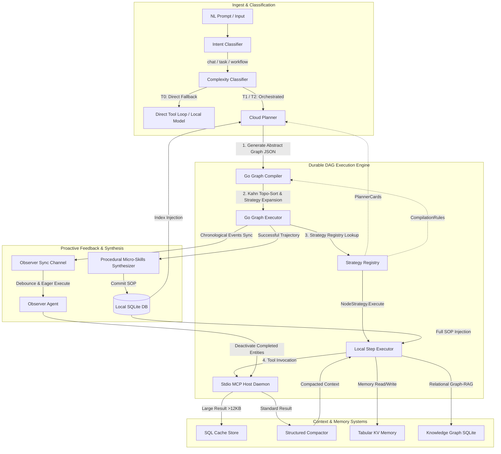
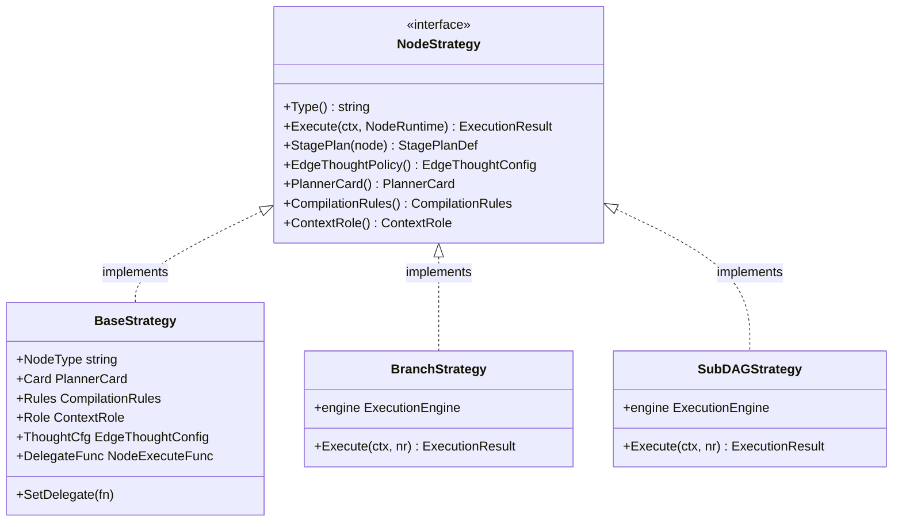
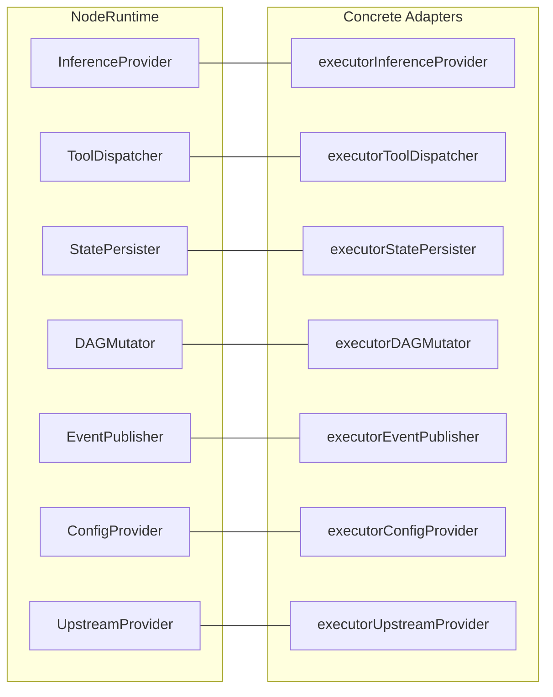
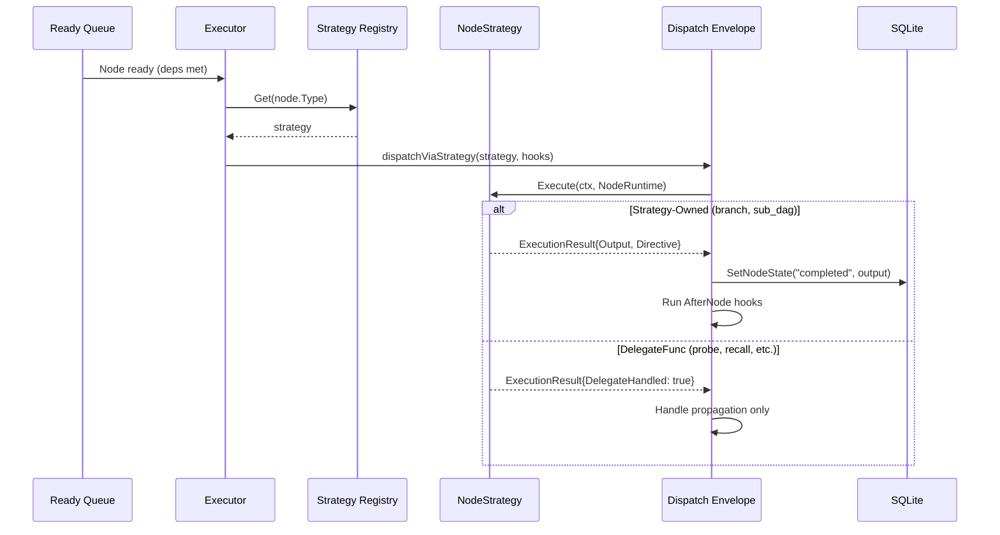
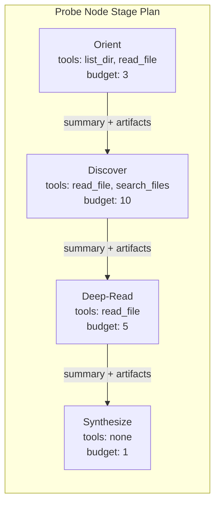
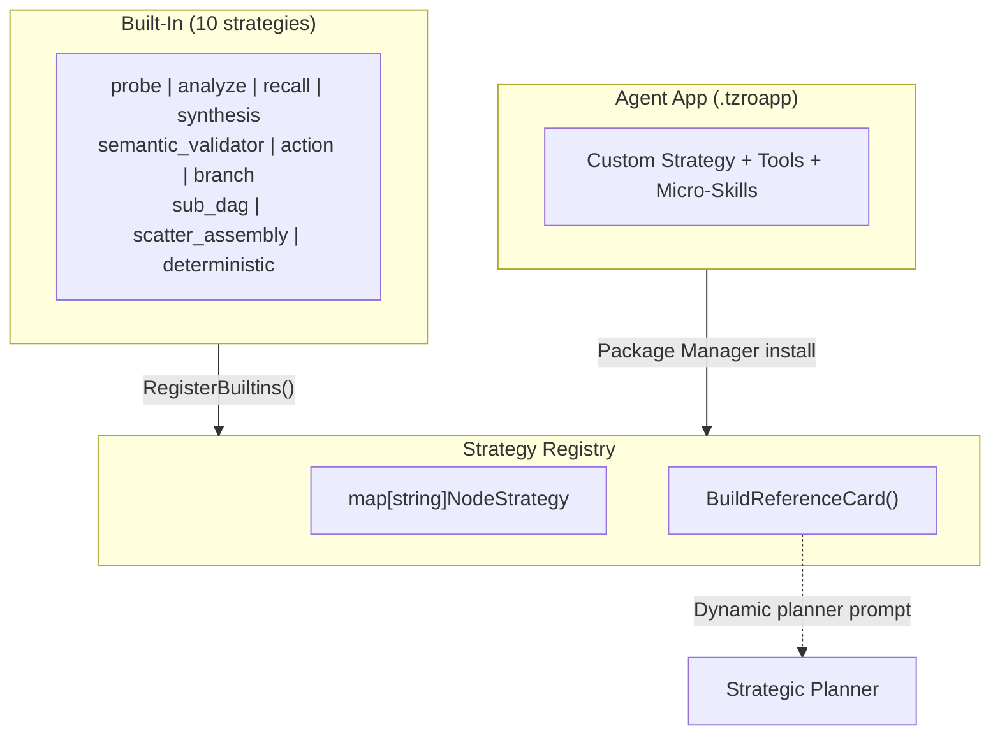

# tzro Architectural Guide

This document describes the high-level design, subsystems, optimization mechanics, Go SDK integrations, and JSON schemas that comprise the **tzro** durable local-first agentic operating system.

---

## 1. High-Level Design & Philosophy

`tzro` is a portable, local-first runtime designed for next-generation AI agents. Rather than acting as a library or importable framework, it provides an operating system substrate that hosts, executes, and persists agent operations.

### The Strategy-vs-Tactics Paradigm

Traditional agent loops loop infinitely or suffer from context window overflow because they plan and execute in the same workspace. `tzro` solves this by separating cognitive tasks into two distinct layers:
1. **The Strategist (Cloud Planner):** A high-capacity remote **Cloud Model** is invoked exactly **once** at the start of a task. It analyzes the user's natural language prompt, classifies the **Intent**, rates the **Complexity Tier**, and compiles a declarative **Abstract Graph** blueprint with dependencies and whitelisted tools. It also assigns **Activation Thresholds** and a **Mutation Budget** for dynamic graph mutations.
2. **The Tactician (Local Step Executor):** A lightweight **Local Model** (hosted via a pluggable **Inference Backend**, such as the embedded `llama-server` sidecar) executes individual steps in isolation. It generates parameters as XML, which are coerced into strict JSON schemas by a **Semantic Validator** and run deterministically.

```
                              USER GOAL PROMPT
                                     │
                                     ▼
                ┌──────────────────────────────────────────┐
                │          Intent Classifier               │ (chat / task / workflow)
                └────────────────────┬─────────────────────┘
                                     │
                                     ▼
                ┌──────────────────────────────────────────┐
                │   Cloud Planner (The Strategist)         │ [Invoked ONCE]
                │   - Generates Abstract Graph JSON        │
                │   - Declares variable bindings           │
                │   - Sets Activation Thresholds & budget  │
                └────────────────────┬─────────────────────┘
                                     │
                                     ▼
                ┌──────────────────────────────────────────┐
                │      Go Graph Compiler & Kahn Sorter     │ [Deterministic]
                │   - Level-based topological sort         │
                │   - Injects Semantic Validator nodes     │
                │   - Applies Proactive Binding Splice     │
                └────────────────────┬─────────────────────┘
                                     │
                      ┌───────────────┴───────────────┐
                      ▼                               ▼
               ┌─────────────┐                 ┌─────────────┐
               │   Node A    │                 │   Node B    │
               └──────┬──────┘                 └──────┬──────┘
                      │ Edge Traversal                │
                      ▼                               ▼
               ┌─────────────────────────────────────────────┐
               │           Edge Thought Generator            │
               │  - Local Model computes goal confidence     │
               │  - confidence < threshold → spawn node      │
               │  - goalAchieved = true   → skip downstream  │
               └──────────────────────┬──────────────────────┘
                                     │
                                     ▼
   ┌────────────────────────────────────────────────────────────────────────┐
   │       Local Step Executor (The Tactician - Pluggable Backend)          │
   │  - Pluggable backend (llama-server, Ollama, LMStudio, vLLM)            │
   │  - XML parameters coerced to strict JSON by Semantic Validator         │
   │  - Invokes Go, WASM (Wazero), or stdio MCP Host tool servers           │
   └────────────────────────────────────────────────────────────────────────┘
```

---

## 2. System Architecture



---

## 3. Core Subsystems

### 3.1. Ingest & Classification

- **Intent Classifier:** Classifies the incoming natural language request into a core runtime entity type (`chat`, `task`, or `workflow`) and extracts parameters.
- **Complexity Classifier:** Assigns a **Complexity Tier** to the request:
  - **T0 Direct:** Conversational questions or one-shot commands, bypassing planning.
  - **T1 Planned:** Standard multi-step operations compiling into execution graphs.
  - **T2 Supervised:** High-risk tasks requiring supervisor validation and approval gates.
- **Heuristic Pre-Classifier:** A high-speed Go regex analyzer that matches simple prompts and handles them under **T0 Direct** without invoking LLM inference, reducing intake latency by ~200ms.

### 3.2. Go Graph Compiler & Kahn Sorter

The compiler reads the Strategist's **Abstract Graph** and dynamically builds a fine-grained Strategist-Compiler-Translator (SCT) execution graph:
1. **Validation:** Asserts that the graph is free of cyclic loops.
2. **Topological Sorting:** Groups execution nodes into parallel levels utilizing Kahn's algorithm.
3. **Strategy-Driven Node Expansion (v1.2.0, ADR-0069):** Each registered **Node Strategy** declares **CompilationRules** with an `Expand` function. The compiler iterates over graph nodes and calls `strategy.CompilationRules().Expand(node, graph)` to perform type-specific transformations:
   - **Semantic Validator Nodes (`semantic_validator`):** Prepended to each tool-dependent node. They parse loose XML parameter structures from the model and coerce them into strict JSON matching the tool's schema.
   - **Deterministic Nodes (`deterministic`):** Execute the actual tool using the coerced parameters without LLM intervention.
   - **Recall Nodes (`recall`):** Auto-injected after probe/analyze nodes to separate exploration from synthesis (ADR-0037).
   - **Terminal Synthesis Node (`synthesis`):** Injected at the leaf of the graph to summarize the results of all executions into a cohesive natural-language summary.
   - The `ExpansionResult` contract supports `ReplacementNodes` (replace a node entirely, e.g., action → validator+exec pair), `AdditionalNodes` (inject siblings, e.g., probe → recall), `AdditionalEdges`, and `ModifiedNode` (apply defaults/mutations).
4. **Proactive Binding Splice:** Strips deterministically-known parameter variables from the schema before the model plans, then splices them back in after parameter generation to prevent extraction failures.
5. **Docgen Category Routing (v0.8.0):** The planner system prompt now includes explicit `Documentation & Exploration Rules (CategoryDocgen)` that mandate a single probe node for documentation generation, function indexing, and architecture analysis tasks. This prevents the planner from misrouting docgen tasks through multi-step action node pipelines, which fail because action nodes cannot observe intermediate exploration results.
6. **Plan Template Registry (v1.1.0, ADR-0048):** Replaces freeform LLM graph generation with a template-based mutation approach. The GBNF-constrained template classifier (`internal/classifier/template_classifier.go`) routes each prompt to a canonical DAG template (explore-only, research, data-analysis, multi-tool, etc.) from the `internal/templates/registry.go`. The planner then mutates the selected template rather than generating a graph from scratch, reducing hallucinated node types and improving plan quality. Post-mutation binding validation repairs any `DynamicBindings` referencing hallucinated or renamed node IDs.
7. **Dynamic Planner Reference Card (v1.2.0):** The **Strategy Registry** generates a `NodeTypeReferenceCard` dynamically from all registered strategies' `PlannerCard` metadata via `BuildReferenceCard()`. Custom strategies installed via **Agent Apps** automatically appear in the planner's prompt alongside built-in types.

### 3.3. Durable Execution Engine & Checkpointing

The executor processes sorted levels concurrently using Go goroutines. Since v1.2.0 (ADR-0069), all node dispatch routes through the **Strategy Registry** and **dispatch envelope** — the executor has zero hardcoded node type knowledge.

- **Strategy-Based Dispatch (v1.2.0, ADR-0069):** For each ready node, the executor calls `Registry.Get(node.Type)` to retrieve the `NodeStrategy`, constructs a `NodeRuntime` (see §3.14), and calls `dispatchViaStrategy()`. The dispatch envelope wraps `strategy.Execute()` with directive processing, state management, hook evaluation, and event publishing. Two modes support the Strangler Fig migration: strategy-owned mode (envelope manages ceremony) and delegate-handled mode (legacy code manages its own lifecycle).
- **State Checkpointing:** Node outcomes are persisted to the SQLite database immediately upon completion. If a crash or restart occurs, the task is resumed from the last completed level.
- **Cycle Budgets:** A counter (`MaxCycles`) decrements on loop executions, terminating the engine if it reaches zero to avoid infinite looping charges.
- **Weighted Circuit Breaker (v0.7.3):** The executor computes a time budget per task based on the node composition of the DAG. Each node type has a defined budget (probe: 10min, action: 5min, deterministic/synthesis: 90s). A configurable `circuitBreakerMultiplier` (default 1.0) scales the total budget. When the budget expires, remaining pending nodes are marked `timed_out` and the `terminal_synthesis` node is preserved to produce a coherent final output.
- **Tool Name Classification Fallback (v0.7.3):** At execution time, if a node references a tool that doesn't exist in the registry, the executor uses local inference to classify the hallucinated name to the closest real tool before failing.
- **Failure Dampening Initialization (v0.8.0):** The executor automatically initializes the mutation budget (`maxSpawns` and `remainingSpawns`) if unset by the planner, preventing unbounded node spawning. Consecutive failure counters are tracked per-task and reset on successful activation.
- **Two-Tier Context Budget (v0.9.0, ADR-0043/0044):** The accumulated context assembly now uses tiered per-node output budgets derived from each strategy's `ContextRole.ContextWeight` (see §3.14.4). A dynamic ceiling of `min(nodeCount × 4096, 32000)` characters bounds total context size. Synthesis nodes use a dedicated 16K ceiling with proportional budgets when total untruncated content exceeds the ceiling (ADR-0044, v1.1.0 hardening).
- **Spawn Depth Tracking (v0.9.0):** `countSpawnDepth()` tracks nested spawn ancestry by counting `spawned_` prefix levels in node IDs. `canSpawnAtDepth()` enforces `MutationBudget.MaxDepth` to prevent infinite recursive spawning. Spawned nodes always use single-shot mode (never multi-branch).
- **PreFlect Hook (v0.9.0):** The `PreFlectHook` execution hook injects corrective micro-skills (SOPs) into node instructions before execution. It queries the skill store for skills matching the node's tool action and prepends their SOP content, implementing proactive "pre-flight correction" for known failure modes.
- **Verified Task Execution (v1.1.0, ADR-0067/0071):** A verification gate runs after terminal synthesis to validate output quality. Stage 1 performs a structural pre-check (non-empty synthesis, valid format). Stage 2 sends a cloud rubric evaluation scoring goal alignment, factual accuracy, coherence, and completeness on a 0–1 scale. Rejected outputs trigger a cloud re-synthesis fallback. If the privacy level blocks cloud access, only Stage 1 (structural pre-check) is applied. Scatter probes fill detected coverage gaps by spawning targeted sub-probes for missing items.
- **Phase Runner (v1.1.0, ADR-0073):** Replaces the monolithic probe execution loop with a multi-phase state machine (`internal/executor/phase_runner.go`). Each node executes through ordered phases (e.g., explore → analyze → synthesize) with per-phase step budgets and recovery strategies (skip or backtrack on failure). Phases are defined in node configuration and enable structured multi-stage execution within a single node.
- **Two-Pass Tool Extraction (v1.1.0, ADR-0064/0065):** Separates reasoning from parameter extraction. Pass 1 uses the worker model for natural-language reasoning about what action to take. Pass 2 uses the router model with GBNF grammar constraints to extract structured tool parameters from the reasoning output. This eliminates the failure mode where a single model must simultaneously reason and produce valid structured output.

```sql
CREATE TABLE graph_node_states (
    task_id        TEXT NOT NULL,
    node_id        TEXT NOT NULL,
    status         TEXT CHECK(status IN ('pending', 'running', 'completed', 'failed', 'skipped', 'timed_out')) NOT NULL,
    output_payload TEXT,
    completed_at   INTEGER,
    PRIMARY KEY (task_id, node_id)
);
```

### 3.4. Probe Nodes & Content-Aware Compaction

**Probe Nodes** are autonomous exploration agents that run a bounded Thought Chain loop on the Local Model. They navigate codebases, directories, or data sources using whitelisted filesystem tools (`read_file`, `list_dir`, `search_files`), persisting each step to SQLite.

- **Minimum Step Budget (v0.7.3):** Probes enforce a floor before accepting `<SYNTHESIZE_READY>` signals. Adaptive: `min(8, stepBudget/2)`. Premature synthesis signals are ignored and exploration continues.
- **Structured Content-Aware Compaction (v1.0.0):** Replaces the earlier configurable `CompactionLevel` system. The new `internal/compactor/` package applies deterministic, content-type-aware strategies to tool outputs — code is **never** LLM-compressed:
  - **Code (skeleton extraction):** Parses Go, Python, JS/TS, and other languages to extract function signatures, type definitions, and constants while omitting function bodies. Uses AST/regex-based extraction.
  - **JSON (pruning):** Truncates large arrays and prunes deeply nested objects beyond a configurable depth threshold.
  - **Logs/text (line truncation):** Retains head/tail lines with an omission marker. Preserves error stack traces.
  - **Reasoning text (LLM compression):** Only the model's own `Thought` field is routed through the 1B router model for compression into key conclusions. Chunks are ≤500 chars.
  - Compaction triggers every **3 steps** (architectural constant `compactEvery = 3`, not planner-controlled).
- **Worker Sidecar Synthesis (v1.0.0):** Terminal synthesis now routes through `WorkerInference` (the worker sidecar with 64K context) for superior content generation quality. The router sidecar handles step-level tool decisions; the worker handles final synthesis.
- **Goal-Directed File Compaction (v1.0.0):** When a probe reads a file >100 lines via `read_file`, the tool automatically compresses the output against the probe's goal using the router model (`FileReadGoalKey` context propagation). Files ≤100 lines are returned raw. Non-probe callers always get raw output.
- **Adaptive Futility Thresholds (v0.9.0):** Probes abort early when ALL initial steps return errors with zero successful calls. The threshold scales dynamically: `max(5, stepBudget/4)`. Failed step diagnostics (step number, tool name, error message) are logged for debugging.
- **Output Fingerprint Convergence (v0.9.0):** Tracks the first 200 characters of each successful tool output. After 3 consecutive duplicate outputs (indicating diminishing information gain), the minimum step budget is lowered to allow synthesis instead of redundant exploration.
- **KV Cache Prefix Sharing (v0.9.0):** The system prompt (goal + tool schemas) is hoisted outside the step loop. This ensures the llama-server's `--cache-reuse` window matches system message tokens on every step, avoiding ~500-1000 tokens of redundant KV computation per step.
- **Router Sidecar Routing (v0.9.0):** Probe thought chain steps route through the router sidecar (fast, small model) for tool-selection decisions. Falls back to the worker sidecar transparently when the router is unavailable.

### 3.5. Neural Edge Traversal & Activation Thresholds

To handle open-ended exploration dynamically, `tzro` uses **Activation Thresholds** and **Edge Thoughts**:
- When the execution traverses an edge pointing to a node with a non-zero threshold (0.0 to 1.0), the **Local Model** evaluates the accumulated context.
- It produces an **Edge Thought** containing:
  - **Goal Confidence (0.0–1.0):** An assessment of whether it has sufficient parameters and details.
  - **Goal Achieved (bool):** A halt flag indicating the objective has already been met.
- **Sufficiency Gate:**
  - `Confidence >= Threshold` → The target node executes normally.
  - `Confidence < Threshold` → The engine dynamically spawns a new node to gather the missing details (e.g. read a file, query a database) and inserts it into the graph.
  - `Goal Achieved == true` → Skips the target node and cascades skip statuses downstream.
- **Safety Dampening:** If 3 consecutive spawned nodes fail, further spawning is suppressed. A **Mutation Budget** restricts total spawns per task.

#### Multi-Branch MCTS Evaluation (v0.9.0, ADR-0045)

For nodes with `MCTSBranches > 0`, the engine generates K candidate actions in a single inference call using a GBNF-constrained JSON schema, then evaluates each through speculative rollouts:

- **Single-Slot K-Candidate Generation:** The Local Model outputs a ranked JSON array of K alternative approaches with self-assessed scores, avoiding the need for n=K parallel inference batching.
- **Speculation Fence:** Uses the Proactivity Ladder to classify each candidate's tool call:
  - `Level ≤ ceil` → **SpecReal**: Execute the real tool during evaluation.
  - `Level > ceil && ≤ L3` → **SpecImagined**: The Local Model simulates the tool's output via `ImagineToolOutput`.
  - `Level > ceil && > L3` → **SpecBlocked**: Candidate is pruned.
- **Heuristic Value Function:** Scores candidates using four weighted signals: output quality (0.3), key term coverage from goal prompt (0.3), anti-hallucination GoalProgressGuard (0.2), and dampened model self-assessment (0.2 × 0.7x dampening).
- **Branch Safety:** Spawned nodes always use single-shot mode (never multi-branch) to prevent exponential branching. Spawn depth is tracked and enforced via `MutationBudget.MaxDepth`.

### 3.6. Plan Repair Pipeline (v0.7.3)

When the local planner generates a graph containing nodes that reference non-existent (hallucinated) tools, the **Plan Repair Pipeline** surgically replaces those nodes rather than immediately escalating to cloud planning:
1. **Detection:** `findInvalidTools()` identifies all nodes referencing unregistered tools.
2. **Surgical Repair:** Invalid-tool nodes are replaced with a single Probe Node that can explore the problem space using filesystem tools.
3. **Iteration Cap:** Up to `maxRepairAttempts` (default: 2) repair passes. If invalid tools persist, the pipeline escalates to cloud planning (if allowed by privacy policy).
4. **Telemetry:** `plan_repair_attempt` and `plan_repair_exhausted` events are published for observability.

### 3.7. Pluggable Inference Backend (The Tactician)

Decouples structured LLM inference from the core execution loop. Pluggable backends are configured in `config.json`:
- **llama-server sidecar:** Embeds a local llama-server running GGUF weights (e.g. Qwen-3.5 4B).
- **External Servers:** Integrates OpenAI-compatible local APIs (LMStudio, Ollama, vLLM).
- **Harness Callback:** Redirects inference programmatically through an external agent framework.
- **Dual-Sidecar Architecture (v0.9.0):** Two independent llama-server processes run concurrently:
  - **Router Sidecar:** A fast, small model (e.g., MiniCPM5-1B) for classification, tool selection, parameter extraction, Probe navigation, edge thought scoring, and validation passes. Exposed via `CallRouter()` / `ExecuteRouterStructured()`.
  - **Worker Sidecar:** A larger quality model for code generation, complex reasoning, DAG planning, synthesis, and long-form output. Exposed via `CallWorker()` / `ExecuteWorkerStructured()`.
  - **Automatic Fallback:** When the router sidecar is unavailable (not configured, stopped, or unhealthy), all router calls transparently fall back to the worker sidecar with a logged warning.
  - **Hot-Swappable Model Management (v0.9.0):** The engine can temporarily swap to a code-specialized GGUF model for codegen tasks, then lazily restore the default model after completion. Swap failures fall back to the active model without error.
- **Embedding Sidecar (v1.1.0, ADR-0075):** A dedicated third llama-server process runs the All-MiniLM-L6-v2 GGUF model for embedding generation. It operates independently from the router and worker sidecars, providing neural vector embeddings for memory queries, skill matching, and Graph-RAG retrieval. The embedding sidecar adopts existing running processes and supports hot-restart.

### 3.8. Input-Output Normalization Seams

- **Semantic Validator:** Coerces loose XML tags (`<tool>...</tool>`) generated by the model into the strict JSON parameters required by tool schemas, handling types, defaults, and typos.
- **Response Resolver:** Normalizes raw outputs into flat key-value pairs using a three-tier resolution cascade (recursive search, fuzzy search, semantic fallback), making them queryable by downstream **DynamicBindings** (`{{nodes.node_id.output.key}}`).
- **Deterministic Query Path (v1.1.0, ADR-0076):** For data analysis tasks, a GBNF-constrained intent extraction step maps the user prompt directly to the `query_builder` tool, bypassing stochastic parameter extraction. The intent classifier outputs a structured query intent (table, columns, filters, aggregation) that deterministically maps to SQL query construction.

### 3.9. Hybrid Memory & Graph-RAG

- **Tabular KV Memory:** Persists facts, preferences, and strategies in SQLite.
- **Relational Knowledge Graph (KG):** Maps cross-system entities and links (e.g. contact belongs to account).
- **Hybrid Vector Search:** Runs FTS5 keyword indexing first to generate candidate pools, followed by local ONNX cosine similarity ranking.
- **Neighborhood Multi-Hop Traversal:** Recursively queries adjacent edges up to $N$ hops to build a context subgraph for Graph-RAG injection.
- **WAL Mode (v0.8.0):** The SQLite database now enables Write-Ahead Logging (`PRAGMA journal_mode=WAL`) on initialization, improving concurrent read/write performance and preventing locking issues during parallel benchmark and probe executions.

### 3.10. Background Agents & Attention Loop

- **Observer Agent:** A background agent that debounces telemetry events. Performs post-execution reflection, synthesizes memories, and writes **Procedural Micro-Skills** (Markdown SOPs) or **Corrective Micro-Skills** (anti-patterns) to the database.
- **Sentinel Agent:** A periodic background agent that correlates user activity reports against memory and alerts the user of critical details or suggestions.
- **Attention Scheduler:** Coordinates background daemons under preemption, budget, and safety limits.
- **Proactivity Ladder:** Restricts background proposed actions to L0 (Observe) through L4 (External Side Effect) based on active approval gates.
- **Attention Queue:** A user-visible queue containing pending actions awaiting approval.

### 3.11. Comparison & Benchmarking Framework (v0.7.3)

The `internal/comparison/` package provides a structured framework for evaluating execution quality across modes:
- **Suite Runner:** Executes benchmark task definitions across multiple execution modes (local-only, cloud-only, cooperative).
- **LLM Judge:** Evaluates output quality using an LLM against defined criteria (completeness, accuracy, depth), producing per-criterion scores and rationale.
- **ReAct Loop:** Multi-step reasoning for complex judging scenarios.
- **Structured Reports:** Generates JSON and markdown reports with per-task breakdowns, latencies, token counts, and cost estimates.
- **CLI Command:** `tzro compare` orchestrates the full comparison pipeline.
- **Codegen Benchmark Conditions (v0.8.0):** The comparison framework supports codegen-specific conditions (`ConditionTzroCode`, `ConditionTzroDraft`, `ConditionCloudCode`) with language-specific seed files and pseudocode task definitions for evaluating code generation quality across execution modes.
- **High-Reliability Prompting (v0.8.0):** Benchmark task prompts now employ hardened patterns for 4B local models: explicit technical anchors (`IMPORTANT:` with mandatory signatures), pattern locking (idiomatic code requirements), mandatory tool usage directives (`You MUST use write_file`), and deterministic exit signals (`Save to [PATH] and EXIT`). These patterns achieve 4.0+ quality scores on Tier 4-5 codegen tasks.
- **Benchmark Run Loop (v0.8.0):** Shell script (`run_loop.sh`) for automated multi-iteration benchmark evaluation with averaging, retry on failure, and CSV summary output.

### 3.12. Extensibility & Sandboxing

- **Agent Apps:** capability packages (`.tzroapp` archives) containing tool definitions, SQLite migrations, micro-skills, and manifests.
- **Wazero WASM Sandboxing:** Executed via `wazero` to isolate custom Go or Rust tools with strict memory and filesystem bounds.
- **Stdio MCP Host Gateway:** Spawns third-party tool servers (e.g., Slack, Postgres) locally over stdio pipes, injecting environment-delegated secrets.

### 3.13. Code Generation Pipeline (`tzro_code`)

The `internal/codegen/` package provides a static DAG pipeline for single-file code generation, exposed via the `tzro_code` MCP tool:

- **Complexity-Based Routing (v0.8.0):** `ClassifyComplexity` evaluates spec length, existing file size, and language to route between **direct mode** (single-pass generation for simple tasks) and **draft mode** (two-phase generate → refine for complex tasks). This replaces the prior static 3-node DAG with dynamic graph construction.
- **Context Gathering:** `GatherContext` reads the target file (if it exists) and up to 5 sibling files from the same directory, prioritizing same-extension files. Content-aware truncation from `internal/executor` is applied to files exceeding 15K characters (target) or 6K characters (siblings).
- **Module Context Extraction (v0.8.0):** For Go files, `ExtractModuleContext` parses the package directory to extract exported type signatures, function declarations, and interface definitions — injected into the generation prompt to provide package-level awareness.
- **Exemplar Injection (v0.8.0):** Language-specific code exemplars are injected into the generation prompt to bias the LLM toward idiomatic patterns (e.g., Go error handling, TypeScript type narrowing).
- **Diff Mode (v0.8.0):** For updates to large existing files, the pipeline generates a structured diff patch instead of a full-file rewrite. `BuildDiffPrompt` produces a targeted prompt, and `ApplyDiff` applies the patch preserving unchanged sections. This prevents catastrophic file rewrites on minor edits.
- **Compilation Quality Gate (v0.8.0):** After code generation, `RunCompilationGate` executes language-appropriate compilation checks (`go build`, `tsc --noEmit`, `python -m py_compile`, `node --check`). Failures trigger the repair pipeline.
- **Edge Thought-Driven Repair (v0.8.0):** `CompilationGateHook` implements `ExecutionHook.AfterNode` to intercept compilation failures. It generates a structured repair prompt containing the original code, compilation errors, and language-specific reference patterns, then spawns a repair node via the executor's neural traversal mechanism. Failure dampening (3 consecutive failures) prevents infinite repair loops.
- **Prompt Builder:** `BuildCodePrompt` assembles a structured prompt with spec, file path, language, action (create/update), existing content, sibling files, module context, and configurable line cap.
- **Code Cleaning:** `CleanGeneratedCode` strips markdown fences from LLM output and enforces the `CodeMaxLines` cap (default 500, configurable via `codeMaxLines` in engine config).
- **`write_file` Tool:** A filesystem tool with `ValidateWritePath` (allows writing to non-existent paths), automatic parent directory creation, backup-on-overwrite with LRU eviction at 50 files, and binary content rejection.
- **Design Goal:** Structurally encourages compact, single-responsibility files by capping output and requiring a spec + filepath per invocation.

### 3.14. Node Strategy Framework (v1.2.0, ADR-0069)

The **Node Strategy** abstraction is the composable framework that decouples node execution logic from the DAG executor. Every node type — probe, analyze, recall, synthesis, semantic_validator, action, branch, sub_dag, scatter_assembly, deterministic — implements the `NodeStrategy` interface and registers in the **Strategy Registry**. The executor dispatches to strategies via registry lookup with **zero hardcoded node type knowledge**.

#### 3.14.1. NodeStrategy Interface

The central abstraction with seven methods:



- **`Type()`** — canonical string identifier (e.g., `"probe"`, `"analyze"`).
- **`Execute()`** — imperative execution logic. Called when `StagePlan()` returns nil.
- **`StagePlan()`** — declarative stage sequence. When non-nil, the executor runs stages in order.
- **`EdgeThoughtPolicy()`** — strategy-owned confidence evaluation on outgoing edges.
- **`PlannerCard()`** — compact description injected into the planner's prompt.
- **`CompilationRules()`** — type-specific graph expansion rules for the Kahn Compiler.
- **`ContextRole()`** — accumulated context budgeting and compaction behavior.

#### 3.14.2. Strategy Registry

A runtime map (`map[string]NodeStrategy`) of node type strings to implementations. Built-in strategies are registered at executor startup via `RegisterBuiltins()`. Agent App strategies are registered at install time via the Package Manager.

The registry generates the strategic planner's `NodeTypeReferenceCard` dynamically from each strategy's `PlannerCard` via `BuildReferenceCard()`. Custom node types automatically appear in the planner's prompt alongside built-in types.

The 10 built-in strategies:

| Type | Planner-Facing | Primary Role |
|:---|:---|:---|
| `probe` | Yes | Autonomous codebase/log exploration via Thought Chain |
| `analyze` | Yes | Data analysis via SQL cache tools |
| `recall` | Yes | Upstream probe findings alignment (refinement pass) |
| `synthesis` | Yes | Final consolidation of all upstream outputs |
| `semantic_validator` | Yes | XML→JSON parameter extraction bridge |
| `action` | Yes | Single known tool execution |
| `branch` | Yes | Conditional — skip downstream if condition not met |
| `sub_dag` | Yes | Invoke pre-built macro node templates |
| `scatter_assembly` | No (internal) | Item-Level Scatter post-processing |
| `deterministic` | No (internal) | Direct tool dispatch (legacy) |

#### 3.14.3. Node Runtime — Capability Decomposition

The **NodeRuntime** is the capability object provided to every strategy during execution. It decomposes executor internals into 7 focused interfaces — strategies use only what they need.



| Interface | Responsibility | Key Methods |
|:---|:---|:---|
| `InferenceProvider` | Local/cloud LLM calls | `CallModel`, `CallModelStream`, `IsCloud` |
| `ToolDispatcher` | Tool execution + proactivity gating | `Dispatch`, `GetSchema`, `ListAvailable` |
| `StatePersister` | Node state + thought step DB ops | `SetNodeState`, `PersistThoughtStep`, `PersistPhaseResult` |
| `DAGMutator` | Spawn nodes, propagate skip, child tasks | `SpawnNode`, `PropagateSkip`, `SpawnChildTask` |
| `EventPublisher` | Telemetry + StreamBus events | `PublishEvent`, `PublishStream` |
| `ConfigProvider` | Execution Policy + Node Policy access | `GetExecutionPolicy`, `GetNodePolicy` |
| `UpstreamProvider` | Accumulated context + binding resolution | `AccumulatedContext`, `ResolveBinding`, `GetUpstreamOutput` |

Go-native strategies receive concrete implementations with zero serialization overhead. WASM/external strategies receive serializing adapters.

#### 3.14.4. ContextRole & Accumulated Context

The `ContextRole` on each strategy controls how its output participates in the accumulated context pipeline, eliminating all `node.Type` switching in the context builder:

| Field | Purpose | Example |
|:---|:---|:---|
| `IsPrimaryDataCarrier` | Never compact in accumulated context | recall = `true` |
| `HasThoughtSteps` | Extract thought steps for synthesis enrichment | probe, analyze = `true` |
| `ContextWeight` | Proportional weight for budget allocation | recall=2.0, action=1.5, probe=0.5, deterministic=0.25 |
| `ProducesPlainText` | Use entire output as resolved value (plain_text_fallback) | probe, recall, synthesis = `true` |

#### 3.14.5. Dispatch Envelope & Flow Directives

The executor wraps every strategy call in a **dispatch envelope** (`dispatchViaStrategy`) that handles state management, hooks, and flow control:



| Directive | Meaning | Envelope Action |
|:---|:---|:---|
| `DirectiveContinue` | Normal completion | Run hooks → persist state → publish events |
| `DirectiveSkipDownstream` | Condition not met | Set "skipped" → propagateSkip to children |
| `DirectivePause` | Awaiting external input | Set "pending" → return `ErrTaskPaused` |
| `DirectiveRetry` | Re-execute (escalation) | Retry with cloud model |
| `DirectiveHalt` | Fatal error | Set "failed" → return error |

#### 3.14.6. Declarative Execution: Stage Plans

Strategies can declare a **Stage Plan** — a sequence of composable **Stages** — instead of imperative `Execute`. Each stage gets scoped tools, a step budget, a model target, and a recovery strategy. Data flows via summary accumulation and the typed **Artifact Store**.



- **Artifact Store:** A dual-layer typed/serialized data store for passing structured outputs between stages. Go-native access uses compile-time-safe generics (`ArtifactKey[T]`) with zero serialization cost. JSON wire format layer exists for WASM/external strategies. Well-known keys: `terminalSynthesis`, `refinedContext`, `directoryManifest`, `analyticalEvidence`, `edgeEntries`, `symbolIndex`.
- **Recovery strategies:** `RecoveryFail` (abort), `RecoveryRetry` (retry up to budget), `RecoverySkip` (skip and continue), `RecoveryBacktrack` (re-enter previous stage with error context).

#### 3.14.7. Strangler Fig Migration

The migration from monolithic executor switch-cases to strategy-owned execution uses the **Strangler Fig** pattern:

1. **BaseStrategy** provides default implementations and a `DelegateFunc` field — a function injected by the executor that captures existing methods.
2. Built-in strategies start as metadata-only stubs with `DelegateFunc` pointing to existing executor code.
3. Strategies are incrementally extracted — when a strategy owns its `Execute` method, the delegate is removed.
4. The dispatch envelope detects `DelegateHandled=true` to skip ceremony for legacy delegates.

Current state: `branch` and `sub_dag` are fully strategy-owned. The remaining 8 strategies use `DelegateFunc` during the migration.

#### 3.14.8. Extensibility via Agent Apps

Custom strategies are installed via **Agent Apps** (`.tzroapp` archives). The **Package Manager** registers custom strategies at install time. Custom planner cards automatically appear in the planner's reference card. The executor dispatches to custom strategies identically to built-in ones.



---

## 4. Context & KV Cache Optimization

To operate efficiently on consumer hardware, `tzro` implements a series of context management pipelines.

### 4.1. 5-Layer Context Compaction Pipeline

Before outputs are injected back into the LLM's active prompt, they pass through five compression layers:
1. **Layer 0 (Binary Pruning):** Strips base64 strings and replaces them with `[binary:image/png, Size: 1.2MB]`.
2. **Layer 1 (HTML Converter):** Translates raw HTML text into clean, simplified Markdown.
3. **Layer 2 (Tabular TSV Hoisting):** Converts homogeneous JSON arrays into single-row tab-separated values, saving up to 85% of KV token space.
4. **Layer 3 (KV Compactor):** Collapses single flat objects into line-delimited `key: value` formats, removing JSON brackets.
5. **Layer 4 (Dot Notation):** Flattens nested structures (`user.profile.zip: 94016`) up to depth 3 and discards metadata.

### 4.2. SQLite Disk-Backed Query Cache & Analyze Nodes (v1.0.1, ADR-0048–0053)

When a compacted payload exceeds **12KB** or represents a structured tabular dataset (CSV, JSON array):
1. Writes the full dataset to the SQLite query cache (`disk_backed_query_cache`).
2. Data profiler extracts table schemas and creates sanitized table and column identifiers (`introspect_cache`).
3. Executes full SQL queries (`sql_cached_data`) via embedded SQLite engine with reserved SQL keyword sanitization and column matching.
4. **Analyze Nodes (v1.0.1):** Structured analysis nodes that maintain **CompactPreserve** semantics (preserving tabular query results and cache IDs during probe compaction) and collect analytical evidence to feed upstream DAG context.

### 4.3. Self-Contained Task Short-Circuiting & Task Lifecycle (v1.0.1, ADR-0054)

- **Self-Contained Short-Circuit:** Tasks with self-contained prompts bypass unnecessary exploration probe loops. Direct synthesis mode operates using prompt inline context when `ContextFile` is omitted.
- **Task Lifecycle Schema:** Persists orchestration mode, goals, token consumption, and approval levels across workflow execution tables in SQLite.

### 4.4. Priority KV Cache Preemption

Background execution must not slow down interactive user chat:
- The **`PreemptionManager`** exports active KV slots to disk (`~/.tzro/models/kv-cache/slot_0.bin`) when an interactive user message arrives.
- It erases Slot 0 to free VRAM and executes the user's chat message (~450ms TTFT).
- It restores the saved background task cache state once the user query finishes.

### 4.4. Surgical Cloud Fallback Escalation

If local processing speeds drop below **5 tokens/second** for 3 consecutive steps (due to thermal throttling or system load), the engine switches `ForceCloudFallback = true` for that step, routing inference to the Cloud Model while retaining local tool execution.

### 4.5. Built-in Filesystem Tools & Noise Filtering

To optimize context usage and prevent the local model from becoming anchored by irrelevant filesystem details, `tzro` incorporates active noise filtering and specialized sampling tools:
- **`peek_file` tool:** A low-cost sampling tool that returns the first 20 lines of a file, encouraging the model to perform quick checks rather than costly `read_file` operations.
- **Active Noise Filtering (`isNoisyEntry`):** Automatically hides OS clutter (`.DS_Store`), dependency trees (`node_modules`), build artifacts (`dist`, `.next`), and log/database files in both `list_dir` and `search_files` to keep the context clean.
- **Directory Profiling (`computeDirProfile`):** Summarizes directory contents mathematically by file extensions (e.g., "45 .go, 3 .mod, 2 .sum, 8 directories"), providing context grounding without exposing individual filenames.
- **Regex Pattern Search (v0.8.0):** `search_files` now uses Go `regexp.Compile` instead of substring matching, supporting full regex patterns for more precise codebase exploration. Invalid patterns return a structured error.
- **Increased Tool Limits (v0.8.0):** `read_file` cap raised from 100 to 500 lines and `list_dir` cap raised from 20 to 100 entries, giving probe nodes access to larger code contexts in a single call.
- **Goal-Directed File Compaction (v1.0.0):** When `FileReadGoalKey` is present in the execution context (set by the probe executor), `read_file` automatically goal-compresses outputs for files >100 lines via the router model. Each 100-line chunk is compressed against the probe's goal, retaining relevant function signatures and structure. Falls back to deterministic truncation (first/last 20 lines) on router errors. Non-probe callers and files ≤100 lines are unaffected.
- **`.gitignore` Support (v1.0.0):** Directory copying operations now respect `.gitignore` patterns, preventing accidental inclusion of build artifacts and dependency trees.

### 4.6. Context Compaction API (`tzro_compact`)

The context compaction engine is exposed as an MCP tool `tzro_compact`, enabling clients or agents to request on-demand 5-layer compaction of JSON context structures to optimize token footprints.

---

## 5. Go SDK & Integration Guide

### 5.1. Custom Tool Registration

Developers can extend `tzro` programmatically by implementing the `tools.Tool` interface and registering it in the package initialization phase:

```go
package main

import (
	"context"
	"encoding/json"
	"fmt"
	"tzro/internal/tools"
)

type FileArchiveTool struct{}

func (f *FileArchiveTool) Name() string {
	return "archive_files"
}

func (f *FileArchiveTool) GetSchema() (string, error) {
	return `{
		"type": "object",
		"properties": {
			"sourcePath": {"type": "string", "description": "Target folder to archive"},
			"compress": {"type": "boolean"}
		},
		"required": ["sourcePath"]
	}`, nil
}

func (f *FileArchiveTool) Call(ctx context.Context, args map[string]interface{}) (string, error) {
	path, _ := args["sourcePath"].(string)
	compress, _ := args["compress"].(bool)

	resp := map[string]interface{}{
		"status": "archived",
		"target": path + ".zip",
	}
	bytes, _ := json.Marshal(resp)
	return string(bytes), nil
}

func init() {
	tools.Register(&FileArchiveTool{})
}
```

### 5.2. Programmatic Graph Compilation & Execution

```go
package main

import (
	"context"
	"log"
	"time"

	"tzro/internal/compiler"
	"tzro/internal/executor"
	"tzro/internal/memory"
)

func main() {
	ctx, cancel := context.WithTimeout(context.Background(), 60*time.Second)
	defer cancel()

	// Initialize SQLite Database
	memory.DB.SetDBPathForTesting("tzro_runtime.db")
	if err := memory.DB.Init(); err != nil {
		log.Fatalf("Failed to init database: %v", err)
	}
	defer memory.DB.Close()

	// Define Abstract Graph (DAG)
	graph := &compiler.ExecutionGraph{
		TaskID:    "t_sdk_demo",
		CreatedAt: time.Now().Unix(),
		Nodes: []compiler.GraphNode{
			{
				ID:           "node_01",
				Type:         "action",
				Action:       "archive_files",
				Instructions: "Archive folder '~/reports'.",
				AllowedTools: []string{"archive_files"},
				Status:       "pending",
			},
		},
		Edges: []compiler.GraphEdge{},
	}

	// Kahn topological sort compilation
	levels, err := compiler.CompileAndSort(graph)
	if err != nil {
		log.Fatalf("Compilation failed: %v", err)
	}

	// Execute graph concurrently by level
	err = executor.GlobalEngine.ExecuteGraph(ctx, graph, levels)
	if err != nil {
		log.Fatalf("Execution failed: %v", err)
	}
}
```

### 5.3. Synchronous DAG Execution Hooks

Developers can intercept, validate, mutate, or pause execution of DAG levels or nodes in-flight using synchronous hooks.

```go
type HookAction string

const (
	ActionContinue HookAction = "continue" // Proceed normally
	ActionSkip     HookAction = "skip"     // Skip node/level and propagate skip downstream
	ActionPause    HookAction = "pause"    // Pause execution and return ErrTaskPaused
	ActionAbort    HookAction = "abort"    // Interrupt and fail task immediately
)

type ExecutionHook interface {
	BeforeLevel(ctx context.Context, taskID string, levelNodes []*compiler.GraphNode) (HookAction, error)
	AfterLevel(ctx context.Context, taskID string, levelNodes []*compiler.GraphNode) (HookAction, error)
	BeforeNode(ctx context.Context, taskID string, node *compiler.GraphNode) (HookAction, error)
	AfterNode(ctx context.Context, taskID string, node *compiler.GraphNode, rawOutput *string) (HookAction, error)
}
```

- **PII Sanitization:** Modify the `*string` argument in `AfterNode` to redact sensitive fields before context compaction or DB checkpoint serialization.
- **HITL Pause Gateway:** Return `ActionPause` to suspend the engine and return `ErrTaskPaused` to the caller. The engine de-allocates local context slots. Upon resumption via `tzro_resume`, the Kahn compiler skips completed levels and resumes execution seamlessly.
- **Thread-Safety:** The engine takes a copied snapshot of the registered hooks slice at execution start to ensure concurrent nodes execute safely without lock contention or race conditions.

---

## 6. JSON Schemas

### 6.1. Abstract Execution Graph (DAG) Schema

The strategizing agent returns a graph payload conforming to this schema:

```json
{
  "$schema": "http://json-schema.org/draft-07/schema#",
  "title": "ExecutionGraph",
  "type": "object",
  "properties": {
    "taskId": { "type": "string" },
    "maxCycles": { "type": "integer", "default": 5 },
    "mutationBudget": {
      "type": "object",
      "properties": {
        "maxSpawns": { "type": "integer" },
        "remainingSpawns": { "type": "integer" },
        "consecutiveFailures": { "type": "integer" }
      }
    },
    "nodes": {
      "type": "array",
      "items": {
        "type": "object",
        "properties": {
          "id": { "type": "string" },
          "type": { "type": "string", "enum": ["action", "probe", "analyze", "recall", "synthesis", "branch", "sub_dag", "scatter_assembly", "deterministic", "semantic_validator"] },
          "action": { "type": "string" },
          "instructions": { "type": "string" },
          "allowedTools": { "type": "array", "items": { "type": "string" } },
          "suggestedSkillIds": { "type": "array", "items": { "type": "string" } },
          "activationThreshold": { "type": "number", "minimum": 0.0, "maximum": 1.0, "default": 0.0 },
          "status": { "type": "string", "enum": ["pending", "running", "completed", "failed", "skipped", "timed_out"] }
        },
        "required": ["id", "type", "action", "instructions"]
      }
    },
    "edges": {
      "type": "array",
      "items": {
        "type": "object",
        "properties": {
          "sourceId": { "type": "string" },
          "targetId": { "type": "string" }
        },
        "required": ["sourceId", "targetId"]
      }
    }
  },
  "required": ["taskId", "nodes", "edges"]
}
```

### 6.2. StreamChunk SSE Telemetry Schema

Real-time state and token updates dispatched over Server-Sent Events (SSE) use this format:

```json
{
  "streamId": "exec_t_quickstart_demo_node_01",
  "source": "executor",
  "taskId": "t_quickstart_demo",
  "nodeId": "node_01",
  "type": "token",
  "content": "{\"tool_arguments\": {\"sourcePath\": \"~/reports\"}}",
  "usage": {
    "prompt_tokens": 128,
    "completion_tokens": 32
  }
}
```
