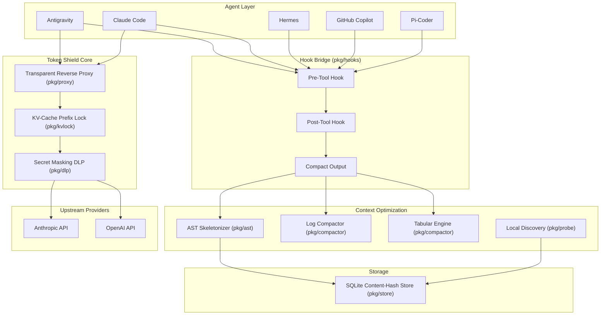
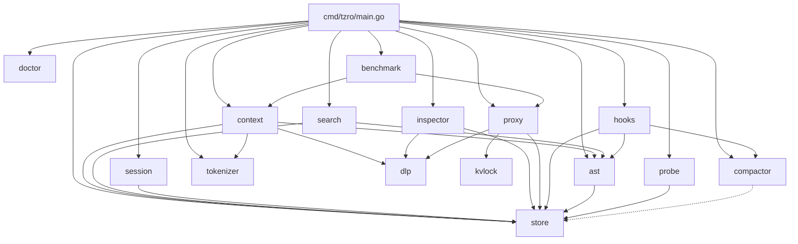

# tzro v3 Architectural Guide

This document describes the high-level design, subsystems, and optimization mechanics of **tzro v3 — The Local Token Shield, Context Optimization Engine & System 1 Graph Call Runtime**.

---

## 1. High-Level Design & Philosophy

`tzro v3` extends the ultra-lightweight compiled native Go binary with a deterministic System 1 Graph Call execution engine. It retains all v2 token optimization (transparent proxy, KV-cache prefix locking, AST skeletonization, tabular data engine) and adds a **System 1 / System 2 dual-process architecture**: cloud LLMs (System 2) compile declarative graph DAGs, while tzro executes them locally using non-autoregressive models for ~25ms decisions (Laya/ModernBERT-large) and zero-shot parameter extraction (GLiNER/ONNX). Exposed via CLI (`tzro execute`) and MCP server (`tzro mcp`) for IDE integration.

### Architecture Shift: v1 → v2

v1 was a durable local-first agentic runtime with a DAG execution engine, strategy framework, probe nodes, and dual-sidecar inference. v2 radically simplifies the architecture:

- **Removed**: Internal engine (`internal/`), DAG executor, strategy framework, probe nodes, MCP server (`cmd/tzro-mcp`), daemon (`cmd/tzrod`), dashboard, sidecar inference, workspace registry, all 37 internal packages
- **Added**: Public `pkg/` library, transparent reverse proxy, multi-harness hook bridge, KV-cache prefix locking, tabular data engine
- **Result**: From ~1M LOC across 37 internal packages to ~3K LOC across 8 focused public packages

### Design Principles

1. **Zero Dependencies**: Single compiled Go binary. No Python, Node.js, PyTorch, or container runtimes.
2. **Transparent Interception**: Agents don't know tzro exists. Standard `BASE_URL` environment variables route traffic through the proxy.
3. **Local-First**: All processing happens on-device. No data leaves the machine except the optimized LLM request.
4. **Sub-Millisecond Latency**: Probe, skeleton, and compaction operations complete in <5ms.
5. **Universal Agent Support**: Works with any agent that speaks Anthropic or OpenAI API protocols.

```
┌─────────────────────────────────────────────────────────────┐
│  Developer / Agent (Cursor, Claude Code, Antigravity, CLI)  │
└──────────────────────────────┬──────────────────────────────┘
                               │ (Transparent Proxy / CLI / MCP)
                               ▼
┌─────────────────────────────────────────────────────────────┐
│                 TZRO v3.1 LOCAL TOKEN SHIELD                │
│                                                             │
│  1. KV-Cache Prefix Lock Guard (70-99% Cache Read Hit Rate) │
│  2. Tree-Sitter AST Skeletonizer (70-90% Token Reduction)  │
│  3. Sub-Millisecond Local Discovery (`tzro probe`)         │
│  4. Local SQLite FTS5 Content-Hash Store (`tzro expand`)   │
│  5. Smart JSON Crusher & Stack Trace Elider                │
│  6. Zero-Cloud DLP / Secret Masking                        │
│  7. Tabular Data Engine (`tzro ingest` / `tzro query`)     │
│  8. System 1 Graph Call Executor (`tzro execute`)          │
│  9. Laya Decision Daemon (ModernBERT-large, ~25ms)         │
│ 10. GLiNER Span Extractor (ONNX, zero-shot)               │
│ 11. MCP Server (`tzro mcp`, JSON-RPC 2.0 / stdio)         │
│ 12. Multi-Language Context Packs (Go/TS/Python/Rust)       │
│ 13. Predictive Test Selection (`tzro test --impact`)       │
│ 14. Git Hook Manager (`tzro hook install`)                 │
│ 15. Shell Integration (`tzro shell init`)                  │
│ 16. Session Pause/Resume (`tzro pause` / `tzro resume`)   │
│ 17. Turn Reduction Benchmark (`pkg/benchmark/turnreduction`)│
│ 18. Edit Verification Service (`pkg/verification`)         │
└──────────────────────────────┬──────────────────────────────┘
                               │ (Dense, High-Signal, Cache-Locked Payload)
                               ▼
┌─────────────────────────────────────────────────────────────┐
│           Cloud LLM Provider (Anthropic / OpenAI)           │
│     43% Fewer Agent Turns / 37% Faster / Zero Rate Limits   │
└─────────────────────────────────────────────────────────────┘
```

---

## 2. System Architecture


```mermaid
graph TD
    subgraph "Agent Layer"
        AGY[Antigravity]
        CC[Claude Code]
        HM[Hermes]
        CP[GitHub Copilot]
        PC[Pi-Coder]
    end

    subgraph "Hook Bridge (pkg/hooks)"
        PreHook[Pre-Tool Hook]
        PostHook[Post-Tool Hook]
        Compact[Compact Output]
    end

    subgraph "Token Shield Core"
        Proxy["Transparent Reverse Proxy (pkg/proxy)"]
        KVLock["KV-Cache Prefix Lock (pkg/kvlock)"]
        DLP["Secret Masking DLP (pkg/dlp)"]
    end

    subgraph "Context Optimization"
        Skel["AST Skeletonizer (pkg/ast)"]
        Comp["Log Compactor (pkg/compactor)"]
        Tab["Tabular Engine (pkg/compactor)"]
        Probe["Local Discovery (pkg/probe)"]
    end

    subgraph "Storage"
        Store["SQLite Content-Hash Store (pkg/store)"]
    end

    subgraph "Upstream Providers"
        Anthropic[Anthropic API]
        OpenAI[OpenAI API]
    end

    AGY --> PreHook
    CC --> PreHook
    HM --> PreHook
    CP --> PreHook
    PC --> PreHook

    PreHook --> PostHook
    PostHook --> Compact
    Compact --> Skel
    Compact --> Comp
    Compact --> Tab

    Skel --> Store
    Probe --> Store

    AGY --> Proxy
    CC --> Proxy
    Proxy --> KVLock
    KVLock --> DLP
    DLP --> Anthropic
    DLP --> OpenAI
```

---

## 3. Package Architecture

tzro v3.1 is organized into 19 public packages under `pkg/`, one CLI entrypoint, and a website server:

```
cmd/
  tzro/main.go          # CLI entrypoint — cobra commands for all operations
  tzro/execute.go       # System 1 Graph Call CLI execution
  tzro/mcp.go           # MCP JSON-RPC 2.0 server over stdio for IDE integration
pkg/
  ast/                   # Tree-sitter AST skeletonizer and span extraction
  benchmark/
    signaldensity/       # Signal density per token benchmark suite and cost guard
  compactor/             # Evidence-contract log compaction and tabular data formatting
  context/               # Task context pack assembler, multi-language adapters (Go/TS/Python/Rust),
                         #   impact graph, predictive test selection, diff analysis, tree rendering
  dlp/                   # Zero-cloud DLP secret masking & workspace privacy policies
  doctor/                # Synthetic health checks, provider route diagnostics, hook probes
  evidence/              # Typed evidence provenance envelopes and freshness markers
  executor/              # System 1 Graph Call DAG execution engine (Kahn's topological sort)
  extractor/             # GLiNER zero-shot span extraction sidecar client & adapter
  hooks/                 # Multi-harness agent lifecycle hook bridge (5 harnesses) + git hook manager
  inspector/             # Offline context assembly explainability & ranking inspector
  kvlock/                # KV-cache prefix normalization and locking
  laya/                  # Laya System 1 decision daemon client, adapter & state compaction
  probe/                 # Fast local codebase discovery (ripgrep + AST)
  proxy/                 # Transparent reverse proxy server and usage tracking
  search/                # Unified local evidence search across code, docs, logs, and artifacts
  session/               # Portable, git-aware agent session manifest, pause/resume, shell integration
  store/                 # SQLite Schema v2 content-hash store, workspace isolation, command events & LRU eviction
  tokenizer/             # BPE token counting (tiktoken-go) and budget-constrained truncation
website/
  main.go                # Marketing/docs website server
```

### Dependency Graph


```mermaid
graph TD
    CLI[cmd/tzro/main.go] --> proxy
    CLI --> probe
    CLI --> ast
    CLI --> compactor
    CLI --> hooks
    CLI --> store
    CLI --> context
    CLI --> search
    CLI --> session
    CLI --> doctor
    CLI --> inspector
    CLI --> benchmark
    CLI --> tokenizer

    context --> store
    context --> ast
    context --> dlp
    context --> tokenizer

    search --> store
    search --> ast

    session --> store

    inspector --> store
    inspector --> dlp

    benchmark --> proxy
    benchmark --> context

    proxy --> store
    proxy --> kvlock
    proxy --> dlp

    hooks --> ast
    hooks --> compactor
    hooks --> store

    ast --> store
    probe --> store
    compactor -.-> store
```

---

## 4. Core Subsystems

### 4.1. Transparent Reverse Proxy (`pkg/proxy`)

The proxy is the central interception point for all LLM traffic. It listens on a configurable loopback address (default `127.0.0.1:7878`) and transparently forwards requests to upstream providers.

**Request Flow:**
1. Agent sends request to `http://localhost:7878/v1/messages` (Anthropic) or `/v1/chat/completions` (OpenAI)
2. Proxy identifies the provider from the URL path and API key headers
3. KV-cache prefix lock normalizes system prompts and tool schemas
4. DLP scanner redacts secrets from the request body
5. Optimized request is forwarded to the upstream provider
6. Response is streamed back to the agent unmodified

**Configuration:**
```go
type Config struct {
    ListenAddr        string     // Default: "127.0.0.1:7878"
    UpstreamAnthropic string     // Default: "https://api.anthropic.com"
    UpstreamOpenAI    string     // Default: "https://api.openai.com"
    Store             *store.DB  // SQLite content-hash store
}
```

**Metrics** are exposed via `/metrics` endpoint:
```go
type Metrics struct {
    TotalRequests     int64
    AnthropicRequests int64
    OpenAIRequests    int64
    BytesProcessed    int64
    SecretsRedacted   int64
    MemoryAllocMB     int64
    UptimeSeconds     int64
}
```

### 4.2. KV-Cache Prefix Lock Guard (`pkg/kvlock`)

Normalizes prompt prefixes to ensure byte-for-byte reproducibility across turns. This prevents cache invalidation from:
- Reordered tool schemas
- Whitespace drift in system prompts
- Tool definition changes between turns

**Benchmarked Performance:** 70–99% cache read hit rates across 8 LLM providers via OpenRouter. E2E tests show 5–10 percentage point improvement over native provider caching.

**The 12.5× Cost Problem:**
- Cache hit: 90% discount ($P_{read} = 0.10 × P_{base}$)
- Cache miss: 25% surcharge ($P_{write} = 1.25 × P_{base}$)
- A single unaligned byte makes the next turn 12.5× more expensive

### 4.3. AST Skeletonizer (`pkg/ast`)

Language-aware structural pruner using Tree-sitter to replace method bodies with cryptographic hash tags.

**Supported Languages:** Go, TypeScript, JavaScript, Python, and other languages with Tree-sitter grammars.

**Process:**
1. Parse source file with Tree-sitter
2. Identify function/method bodies
3. Compute SHA-256 hash of each body
4. Replace body with `// [body elided: #hash]` comment
5. Store original body in SQLite content-hash store
6. Return skeleton with compression stats

**Token Reduction:** 70–90% on typical source files.

### 4.4. Local Discovery Engine (`pkg/probe`)

Deterministic ripgrep + AST scope analyzer for sub-millisecond local symbol queries.

**Process:**
1. Execute ripgrep with the search query against the codebase
2. Parse matching files with Tree-sitter for AST context
3. Enrich results with function signatures, struct definitions, and scope info
4. Format as markdown for agent consumption
5. Optionally index results in the content-hash store

**Performance:** <5ms for typical codebases with 0 cloud tokens consumed.

### 4.5. Log Compactor (`pkg/compactor`)

Content-aware compaction engine for build/test output and JSON arrays.

**Compaction Strategies:**
- **Stack Trace Elision:** Strips redundant runtime goroutine stacks while preserving user code frames
- **JSON Array Flattening:** Converts uniform JSON arrays into compact markdown tables
- **Log Line Deduplication:** Collapses repeated log patterns

**Token Reduction:** ~80% on typical build/test logs.

### 4.6. Tabular Data Engine (`pkg/compactor` + `pkg/store`)

Auto-detects and imports CSV, TSV, and JSON array data into SQLite for agent queries.

**Components:**
- `DetectTabular()`: Auto-format detection (CSV, TSV, JSON array)
- `FormatEnvelope()`: Generates compact data envelope with schema and sample rows
- `store.ImportTabular()`: Imports rows into SQLite table
- `store.QuerySQL()`: Execute read-only SQL queries

**Token Reduction:** 97%+ on tabular workloads.

### 4.7. DLP / Secret Masking (`pkg/dlp`)

On-device regex and entropy scanner that masks secrets before request egress.

**Detection Patterns:**
- API keys (OpenAI, Anthropic, AWS, GCP, etc.)
- Bearer tokens and JWTs
- Private keys and certificates
- Database connection strings
- High-entropy strings that look like credentials

### 4.8. Agent Lifecycle Hook Bridge (`pkg/hooks`)

Multi-harness hook bridge that intercepts pre-tool and post-tool events from 5 supported agent frameworks.

**Supported Harnesses:**

| Harness | Pre-Tool | Post-Tool |
|:---|:---|:---|
| Antigravity | `HandlePreToolUse` | `HandlePostToolUse` |
| Claude Code | `HandleClaudePreToolUse` | `HandleClaudePostToolUse` |
| Hermes | `HandleHermesPreTool` | `HandleHermesPostTool` |
| GitHub Copilot | `HandleCopilotPreTool` | `HandleCopilotPostTool` |
| Pi-Coder | `HandlePiCoderPreTool` | `HandlePiCoderPostTool` |

**Post-Tool Compaction Pipeline:**
1. Read tool output from stdin (JSON envelope per harness protocol)
2. Detect content type (code, logs, JSON, text)
3. Apply appropriate compaction (skeleton for code, compress for logs, flatten for JSON)
4. Write optimized output to stdout

**Hook Installer** (`hooks.DetectAndInstallHooks`):
- Auto-detects active agent environments
- Generates hook configuration files for each detected harness
- Supports workspace-scoped (`--workspace`) and global installation

### 4.9. SQLite Content-Hash Store & Schema v2 (`pkg/store`)

Embedded SQLite database in WAL mode with FTS5 full-text indexing, multi-workspace isolation, and LRU artifact lifecycle management.

**Key Capabilities:**
- **Schema v2 Migration:** Seamlessly upgrades v1 databases to v2 with isolated workspace partitioning.
- **LRU Artifact Eviction:** Enforces configurable quota limits with `last_accessed_at` LRU tracking.
- **Traces Storage:** Persists 6-stage context assembly diagnostic traces for offline analysis.
- **Content Addressing:** Deduplicates source snippets, skeletons, and command failure outputs.

### 4.10. Task Context Pack Assembler (`pkg/context`)

Assembles ranked, token-budgeted context packs for an agent task query in a single sub-second turn. v3.1 adds multi-language reference discovery, symbol anchoring, and predictive test selection.

**Process:**
1. Evaluates query against SQLite FTS5 symbol index and lexical search fallback.
2. Traverses Tree-sitter AST to extract relevant functions, types, structs, and interfaces.
3. Resolves language-specific import paths via pluggable adapters:
   - **Go**: ripgrep + AST with JSON-streamed results
   - **TypeScript/JavaScript**: `tsconfig.json`/`jsconfig.json` path alias resolution, barrel re-exports, namespace imports
   - **Python**: `from ... import` chains, relative imports, `__init__.py` re-exports, `src/` layouts
   - **Rust**: `use` declarations, `crate::`/`super::`/`self::` resolution, Cargo workspace awareness
4. Identifies co-located and corresponding unit/integration test suites.
5. Skeletons large file bodies, replacing them with cryptographic hashes.
6. Enforces strict token budgeting via knapsack packing — references degrade to signature stubs when budget is tight rather than being dropped entirely.
7. Supports symbol-anchored mode (`--symbol <name> [--file <path>]`) for surgical context around a specific declaration.
8. Outputs as Markdown or JSON with atomic file writing (`--output <path>`).
9. Configurable via `.tzro/context.yaml` for default budgets, tokenizer selection, and language priorities.

### 4.11. Pre-Edit Change Impact Graph (`pkg/context/impact.go`)

Calculates the blast radius of proposed code edits before modifying shared code or types. v3.1 adds scoped analysis modes and multi-language support.

**Features:**
- Computes structural call graphs from AST definitions and import graphs across Go, TypeScript, Python, and Rust.
- Maps direct callers and downstream dependent modules across the entire repository.
- Identifies existing test coverage for modified files and their callers.
- Accepts explicit file paths, `--staged`, `--unstaged`, or `--all` scopes for granular control.
- Filters comment-only diff hunks to avoid false positives.
- Renders blast radius as ANSI hierarchical trees, JSON, or Markdown (`--format tree|json|markdown`).

### 4.12. Predictive Test Selection (`pkg/context/test_selection.go`)

Identifies and executes only the tests affected by code changes, avoiding full-suite overhead.

**Features:**
- Parses git diffs to map changed lines to enclosing AST declarations.
- Traces transitive callers from changed symbols to test files.
- Auto-dispatches to the correct test runner: `go test`, `vitest`, `jest`, or `pytest`.
- Falls back to broader suite when build configs or shared fixtures change.
- Compacts test output through the evidence compactor.

### 4.13. Git Hook Manager (`pkg/hooks/git_hook.go`)

Automates installation and management of tzro's advisory `pre-commit` Git hook.

**Features:**
- Installs a non-blocking pre-commit hook that displays staged impact analysis.
- Discovers git hooks directories across standard repos, linked worktrees, and submodules.
- Preserves existing pre-commit hooks via `.tzro.backup` chaining.
- Provides `install`, `uninstall`, and `status` subcommands.

### 4.14. Session Pause/Resume & Shell Integration (`pkg/session`)

Extends session continuity with task pause/resume and developer command capture.

**Pause/Resume (`pkg/session/resume.go`, `dashboard.go`):**
- `tzro pause [description]` creates a session snapshot for later resumption.
- `tzro resume [id]` loads a session and renders an interactive resumption dashboard.
- Dashboard displays git divergence, file drift, stale evidence, and shifted symbol lines.
- Supports `tty`, `plain`, and `json` output formats.

**Shell Integration (`pkg/session/shell.go`):**
- `tzro shell init [zsh|bash]` installs lightweight preexec/precmd hooks.
- Captures development commands into SQLite with sub-millisecond overhead.
- Strict allowlist filtering, credential redaction, and retention pruning.

### 4.15. BPE Tokenizer (`pkg/tokenizer`)

Exact BPE token counting and budget-constrained truncation using `tiktoken-go`.

**Features:**
- Supports `cl100k_base` and `o200k_base` encodings with singleton codec caching.
- Thread-safe exact counting with character fallback heuristics.
- UTF-8-safe truncation that prevents multi-byte rune corruption.

### 4.16. Unified Local Evidence Search (`pkg/search`)

Heterogeneous local search engine executing across diverse project artifacts in <10ms.

**Search Domains:**
- Source code files with precise AST span extraction.
- Markdown documentation, READMEs, and Architecture Decision Records (ADRs).
- Product specs and working notes.
- Stored execution logs and failure artifacts.
- Agent session manifests.

### 4.17. Agent Session Continuity & Handoffs (`pkg/session`)

Provides git-aware session state capture and restoration across agent turns and handoffs.

**Features:**
- Serializes active objectives, decisions, executed checks, and constraints into Schema v2 manifests.
- Computes git tree state hashes and detects workspace drift between agent handoffs.
- Surfaces stale evidence markers when underlying files are modified out-of-band.

### 4.18. Diagnostic Doctor (`pkg/doctor`)

Comprehensive synthetic diagnostic tool for troubleshooting proxy routing and local environment issues.

**Diagnostic Checks:**
- Probes local loopback proxy routes (`/v1/messages`, `/v1/chat/completions`, `/v1/responses`).
- Validates upstream provider connectivity (DNS resolution, TLS handshake, latency).
- Checks agent lifecycle hook configurations across 5 harnesses.
- Executes synthetic KV-lock normalization and DLP secret redaction.
- Validates SQLite FTS5 extension availability and database health.

### 4.19. Context Inspector & Explainability (`pkg/inspector`)

Provides offline explainability for context assembly decisions with zero cloud token consumption.

**Capabilities:**
- Replays context pack generation from saved trace IDs.
- Explains candidate inclusion, ranking, and stage-by-stage omission reasons.
- Evaluates candidate selection against workspace privacy policies.

### 4.20. Signal Density Benchmark Suite (`pkg/benchmark/signaldensity`)

Empirical benchmarking framework measuring task signal density per token across optimization strategies.

**Features:**
- Runs standardized test batteries across code discovery, refactoring, and execution tasks.
- Calculates Signal Density Metrics ($S = \text{Recall} / \text{Tokens}$).
- Enforces a hard spending circuit breaker (`--max-cost`) to prevent runaway cloud evaluation costs.
- Generates structured Markdown and JSON comparison reports.

### 4.21. Evidence Provenance Envelope (`pkg/evidence`)

Typed container tagging all context artifacts with origin metadata, line coordinates, and verification confidence.

---

## 5. CLI Command Reference

| Command | Package | Description |
|:---|:---|:---|
| `tzro start` | `pkg/proxy` | Start the transparent reverse proxy daemon |
| `tzro execute [graph.json \| -]` | `pkg/executor` | Execute a System 1 Graph Call DAG |
| `tzro mcp` | `pkg/executor` | Start the MCP JSON-RPC 2.0 server over stdio |
| `tzro context "<task>" --budget <n>` | `pkg/context` | Assemble ranked, token-budgeted context pack |
| `tzro context --symbol <name>` | `pkg/context` | Symbol-anchored context assembly |
| `tzro impact [files...]` | `pkg/context` | Compute change-impact graph and test coverage |
| `tzro impact --staged\|--unstaged\|--all` | `pkg/context` | Scoped impact analysis with format options |
| `tzro test --impact [--dry-run]` | `pkg/context` | Predictive test selection and execution |
| `tzro pause [description]` | `pkg/session` | Pause current session with snapshot |
| `tzro resume [id] [--format]` | `pkg/session` | Resume session with drift dashboard |
| `tzro shell init [zsh\|bash]` | `pkg/session` | Install shell command capture hooks |
| `tzro hook install\|uninstall\|status` | `pkg/hooks` | Manage advisory git pre-commit hooks |
| `tzro probe "<query>"` | `pkg/probe` | Fast local codebase discovery |
| `tzro search "<query>"` | `pkg/search` | Unified local evidence search across code, docs, artifacts |
| `tzro skeleton <file>` | `pkg/ast` | Generate AST skeleton with body hashes |
| `tzro expand <hash-or-id>` | `pkg/store` | Retrieve original code body or stored artifact |
| `tzro compact [--run "<cmd>"]` | `pkg/compactor` | Compress logs with evidence contracts & inline diagnostic cap |
| `tzro session save / load / status` | `pkg/session` | Portable git-aware agent session handoffs |
| `tzro inspect explain <trace-id>` | `pkg/inspector` | Offline context pack ranking explainability |
| `tzro doctor` | `pkg/doctor` | Synthetic health checks and provider route diagnostics |
| `tzro bench signal-density` | `pkg/benchmark/signaldensity` | Empirical signal density benchmarking with cost guard |
| `tzro hook [harness] [event]` | `pkg/hooks` | Agent lifecycle hook bridge (5 harnesses) |
| `tzro init` | `pkg/hooks` | Auto-configure agent hooks |
| `tzro status` | `pkg/proxy` | Check proxy metrics, cache hits, and memory |
| `tzro ingest <file>` | `pkg/compactor` + `pkg/store` | Import tabular data into SQLite |
| `tzro query <table> "<sql>"` | `pkg/store` | Execute SQL against imported data |

---

## 6. Resource Footprint

| Metric | Value |
|:---|:---|
| Binary Size | ~15 MB (single static binary) |
| Memory (RSS) | <50 MB steady-state |
| Cold Start | <100ms |
| Probe Latency | <5ms |
| Skeleton Latency | <50ms (typical files) |
| Dependencies | 0 (compiled Go binary) |

---

## 7. Website (`website/`)

A Go-based static website server for marketing and documentation. Serves the tzro landing page, documentation, and installation instructions.

---

## 8. Migration Notes: v2 → v3

v3 re-introduces local execution capabilities that were removed in v2, but with a fundamentally different architecture:

| Capability | v1 (Removed in v2) | v3 (Re-introduced) |
|:---|:---|:---|
| DAG Execution | Autonomous generative loops (90% failure rate) | Deterministic topological sort with typed nodes |
| Local Inference | 4B autoregressive Worker + 1B Router (~3.5s/step) | ModernBERT-large encoder (~25ms/decision) |
| Parameter Extraction | LLM-generated (hallucination-prone) | GLiNER zero-shot span extraction (150M ONNX) |
| MCP Server | In-process, tightly coupled | JSON-RPC 2.0 stdio, standards-compliant |
| Execution Control | Open-ended agent loops | Bounded DAG with yield/suspension protocol |
| Memory Footprint | Dynamic KV-cache growth | Static ~870 MB (no cache growth) |

### Key Architectural Differences from v1

1. **No local generative codegen** — All creative code synthesis remains on cloud LLMs. Local models only answer structured questions and extract spans.
2. **Yield protocol** — When a decision node's confidence is below threshold, execution suspends with a structured `YieldEnvelope` rather than hallucinating forward.
3. **Sidecar isolation** — Laya and GLiNER run as separate OS processes via stdin/stdout IPC, not in-process Cgo bindings.
4. **State compaction** — Decision input is compressed to ≤450 tokens via progressive degradation before dispatch to ModernBERT's context window.

The v3 philosophy adds a **System 1 fast-path** to the v2 token optimization layer — agents can now offload deterministic sub-tasks to local execution while retaining cloud-side creative reasoning.
