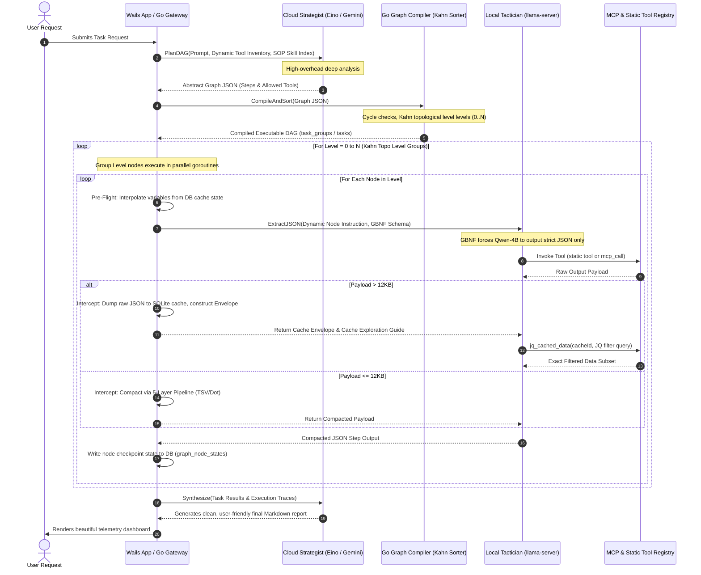

# Cooperative Local-Cloud DAG Execution: Strategic Handoffs, Context Boundaries, and Runtime Lifecycle

Modern enterprise automation requires orchestrating complex, multi-system workflows while maintaining strict data privacy, cost control, and performance guarantees. High-overhead planning tasks require deep-context reasoning that is best handled by massive cloud models (The Strategist). Conversely, specific tool execution, data retrieval, and API integration tasks are best executed locally on performance cores using lightweight local worker models (The Tactician) to prevent latency, data leakage, and excessive cloud subscription costs.

This manual serves as the definitive developer guide and architectural specification detailing the **Cooperative Local-Cloud DAG Execution Engine** in X v2. It defines the conceptual division of labor, the step-by-step synchronization protocol, mathematical context borders, preemption cache mechanics, and provides a complete end-to-end execution walkthrough.

---

## 1. The Strategist-Tactician division of labor

To eliminate the brittle, infinite-looping tendencies of standard conversational agent loops, X v2 decouples LLM execution into a rigid, tri-role planning and execution paradigm.

```
                                  USER REQUEST
                                       │
                                       ▼
                  ┌──────────────────────────────────────────┐
                  │           Intent Classifier              │ (T0/T1/T2 Routing)
                  └────────────────────┬─────────────────────┘
                                       │
                                       ▼ [Task / Workflow]
                  ┌──────────────────────────────────────────┐
                  │    Cloud Planner - Eino (The Strategist) │ [Runs ONCE]
                  │  - Large Reasoning Model (Gemini 3.5)    │
                  │  - Synthesizes Abstract DAG JSON Layout  │
                  └────────────────────┬─────────────────────┘
                                       │
                                       ▼
                  ┌──────────────────────────────────────────┐
                  │    Go Graph Compiler & Kahn Sorter       │ [Deterministic]
                  │  - Parses & Validates Graph Boundaries    │
                  │  - Establishes Parallel Level Groups     │
                  └────────────────────┬─────────────────────┘
                                       │
                        ┌──────────────┴──────────────┐
                        ▼                             ▼
                  ┌───────────┐                 ┌───────────┐
                  │  Level 0  │                 │  Level 1  │
                  └─────┬─────┘                 └─────┬─────┘
                        │ (Goroutines)                │
                        ▼                             ▼
  ┌────────────────────────────────────────────────────────────────────────┐
  │              Local Step Executor - GBNF Bridge (The Tactician)         │
  │ - llama-server (GRM-2.5) local process pinned to performance CPU cores │
  │ - Compactor: TSV / leaf / base64 stripping reduces context.            │
  │ - Tools: Dispatches local static tools + MCP SSE JSON-RPC 2.0 gateways. │
  └────────────────────────────────────────────────────────────────────────┘
```

The system assigns specialized cognitive loads across these boundaries:

### 1.1 The Strategist (Cloud Planner)

- **Underlying Model:** High-capacity frontier cloud LLM (e.g. Gemini 1.5/3.5 Flash or GPT-4o-mini).
- **Execution Count:** Invoked exactly **once** at task startup.
- **Responsibilities:**
  - Analyzes the user's natural language goal.
  - Discovers relevant procedural standard operating procedures (SOPs) from the `synthesized_skills` index.
  - Generates the dependency edges, action steps, allowed tool lists, and variable constraints as a structured Abstract Graph JSON.
  - Maps variables forward across Kahn topo levels using the double-braced syntax `{{nodes.node_id.output.property}}`.
- **Exclusions:** Never directly calls execution tools, saving cloud API tokens and preventing network timeouts.

### 1.2 The Compiler & Executor (Go Systems Core)

- **Underlying Engine:** Pure, deterministic Go codebase within `services/go-api/dataservice`.
- **Execution Count:** Controls loop transitions, levels, and retries.
- **Responsibilities:**
  - Runs cycle detection and structural graph validations.
  - Topologically sorts execution nodes into concurrent Level groups (0 to N).
  - Performs string-regex variable interpolation at level-start borders.
  - Evaluates conditional logic expressions at Branch/Merge nodes natively, bypassing LLM invocations.
  - Manages the task state persistence, writing intermediate checkpoints to the SQLite database.
- **Exclusions:** Has no native cognitive reasoning capability; coordinates execution layers.

### 1.3 The Tactician (Local Step Executor)

- **Underlying Model:** Local `llama-server` sidecar process loading a lightweight, hardware-tuned GGUF model (e.g. **GRM-2.5** / Qwen-3.5-Instruct 4B) running on system P-cores.
- **Execution Count:** Called once per individual action node execution.
- **Responsibilities:**
  - Performs single-turn inference constrained by a strict Backus-Naur Form (GBNF) grammar.
  - Focuses on converting natural language node instructions into concrete JSON-RPC tool parameters.
  - Processes tool outputs, applying 5-layer context compaction or disk-backed JQ caching to keep slot RAM low.
- **Exclusions:** Never makes high-level architectural planning decisions; executes isolated operational objectives.

---

## 2. Mathematical Context Boundaries & Payload Management

Because local consumer hardware is severely constrained in memory bandwidth and compute speed compared to massive cloud datacenters, the local model's attention window must be guarded from excessive context bloat. The system enforces strict payload boundaries to keep inference throughput high ($\ge 25\text{ tok/s}$).

### 2.1 The Context Partition Border

Information is partitioned surgically across planning and execution boundaries:

$$\text{Total System Prompt Length} = \text{Base Instruction} + \text{Memories} + \text{SOP Injections} + \text{Dynamic Tool Specs}$$

To prevent memory thrashing, the framework implements a **Dual-Inject Pipeline** that separates index lookups from full-text procedural instructions:

```
[User Goal] ──► [Eino Cloud Planner] ──► Inject INDEX ONLY (Triggers & IDs)
                                               │
                                               ▼
[Local Step Executor] ◄── [Go Compiler]  ◄── [Selected skill ID]
        │
        ▼ (Retrieve full Markdown SOP content)
Inject FULL SOP Content into Local Step System Message
```

- **Planner Injection (Index Only):** The Cloud Planner receives a highly condensed trigger index of available procedural skills. Rather than reading full SOP markdown blocks, it sees index signatures:
  ```json
  [
    {
      "id": "skill_042",
      "trigger": "When merging duplicate Salesforce contacts using email mappings"
    },
    {
      "id": "skill_099",
      "trigger": "When exporting relational opportunity reports into local CSV files"
    }
  ]
  ```
  This reduces the Cloud Planner's initial system prompt context size by **80%**, saving input tokens.
- **Executor Injection (Full-Text SOP):** When the Go Executor triggers an individual DAG Node, it checks the node's `suggestedSkillIds`. It fetches the corresponding _full-text Markdown SOP_ from the `synthesized_skills` database table and injects it directly into the local model's active system prompt for that step only.

### 2.2 The 5-Layer Context Compaction Pipeline

When local static tools or dynamic Model Context Protocol (MCP) servers return raw datasets, the outputs are passed through a highly optimized compaction pipeline to strip redundant characters:

```
                         RAW DATASET (JSON Payload)
                                     │
                                     ▼
         ┌────────────────────────────────────────────────────────┐
         │             Layer 0: Binary Stream Pruning             │
         │ - Scan for Base64 headers (e.g. data:image/png;base64) │
         │ - Replace with: [binary:image/png, Size: 1.4MB]        │
         └───────────────────────────┬────────────────────────────┘
                                     │
                                     ▼
         ┌────────────────────────────────────────────────────────┐
         │             Layer 1: HTML-to-Markdown Parser           │
         │ - Detect HTML structural trees (e.g. scrapers, emails) │
         │ - Convert markup to standard compressed Markdown       │
         └───────────────────────────┬────────────────────────────┘
                                     │
                                     ▼
         ┌────────────────────────────────────────────────────────┐
         │            Layer 2: Tabular Hoisting (JSON-to-TSV)     │
         │ - Detect arrays of homogenous objects                  │
         │ - Extract keys into single tab-separated header row    │
         │ - Strip repeating JSON syntax braces, quotes, and colons│
         └───────────────────────────┬────────────────────────────┘
                                     │
                                     ▼
         ┌────────────────────────────────────────────────────────┐
         │            Layer 3: Single Object KV Compactor         │
         │ - Convert non-array JSON maps to flat line lists       │
         │ - Format: "key: value\n" (removes brackets and commas) │
         └───────────────────────────┬────────────────────────────┘
                                     │
                                     ▼
         ┌────────────────────────────────────────────────────────┐
         │          Layer 4: Dot-Notation Tree Flattening         │
         │ - Detect nested structures up to depth 3               │
         │ - Flatten: {"a":{"b":{"c":1}}} -> "a.b.c: 1"           │
         │ - Discard internal metadata keys (e.g. __typename)     │
         └────────────────────────────────────────────────────────┘
```

The mathematical reduction ratio ($R$) achieved by the TSV transformation layer is represented as:

$$R = 1 - \frac{\text{Length of TSV String}}{\text{Length of Raw JSON String}}$$

For typical CRM database rows (which repeat keys like `"id"`, `"Name"`, `"attributes"`, `"type"` on every single item in the array), the TSV transformation achieves a reduction ratio of:

$$0.65 \le R \le 0.85$$

This effectively saves up to **85% of token space**, allowing thousands of rows of local data to fit comfortably inside the KV cache slot of the local tactician.

### 2.3 Disk-Backed SQLite JQ Cache Envelope

If a tool output remains above a critical threshold (**12KB**) after applying the 5-layer compaction, the Go Executor intercepts the payload, writes the raw JSON to a localized SQLite cache table, and returns a lightweight **Cache Envelope** JSON struct to the LLM:

```json
{
  "cacheId": "cache_7cc91f9b_3a5c",
  "dataType": "array",
  "rootPath": ".records",
  "recordCount": 1420,
  "fields": ["Id", "Name", "Email", "AccountId", "StageName"],
  "sampleRecord": {
    "Id": "0038W00001zKx4zQAC",
    "Name": "Sarah Jenkins",
    "Email": "sjenkins@enterprise.com",
    "AccountId": "0018W000021cZ9rQAE",
    "StageName": "Prospecting"
  }
}
```

The engine then appends a dynamic **Cache Exploration Guide** to the step's system instructions:

```
## DATA CACHED ON DISK
The data returned by the tool is extremely large (1.2MB) and has been cached to disk.
To interact with this data without bloat, use the following tools:
- introspect_cache(cacheId) -> Retreive full nested property types
- read_cached_data(cacheId, limit, offset) -> Paginated sliding window read
- jq_cached_data(cacheId, filter) -> Execute offline JQ extraction query

CRITICAL: The root path of the cached array is ".records".
Your JQ filter must select relative to the root path:
- Correct: jq_cached_data(cacheId, ".records[] | select(.StageName == \"Closed Won\")")
- Incorrect: jq_cached_data(cacheId, ".[] | select(.StageName == \"Closed Won\")")
```

The local model can then write precise `jq` query strings. The Go backend executes these queries natively against the cached file using compiled `jq` engines, feeding only the highly specific filtered result back into the local model's attention window.

---

## 3. Step-by-Step Cooperative Execution Workflow

The runtime coordination between Eino's cloud planners, Go system threads, and the local `llama-server` sidecar process flows through a structured, multi-phase lifecycle.



### 3.1 Pre-Flight Variable Interpolation

Before starting any level node, the Go Executor scans the node's `instructions` string for cross-node variable references using regex mapping:

```go
// Interpolates dynamic double-braced node outputs from the graph state database
func (e *GraphExecutor) InterpolateNodeVariables(node GraphNode, parentOutputs map[string]string) string {
	re := regexp.MustCompile(`\{\{nodes\.([^.]+)\.output\.([^}]+)\}\}`)
	return re.ReplaceAllStringFunc(node.Instructions, func(match string) string {
		submatches := re.FindStringSubmatch(match)
		if len(submatches) < 3 {
			return match
		}
		sourceNodeID := submatches[1]
		propertyKey := submatches[2]

		// Retrieve serialized JSON string from the source node's completed execution
		rawOutputJSON, exists := parentOutputs[sourceNodeID]
		if !exists {
			return "null"
		}

		// Extract target property value
		var outputMap map[string]interface{}
		if err := json.Unmarshal([]byte(rawOutputJSON), &outputMap); err != nil {
			return rawOutputJSON // Fallback to raw string if output is not JSON
		}

		val, found := outputMap[propertyKey]
		if !found {
			return "null"
		}

		return fmt.Sprintf("%v", val)
	})
}
```

### 3.2 GBNF Constrained Local Execution

The interpolated instruction is dispatched to the local `llama-server` process over HTTP. To prevent small-model decay, the request is forced through a GBNF grammar bridge that limits the output space of the model to a rigid JSON schema:

```ebnf
# GBNF Schema for Dynamic Tool Argument Extraction
root             ::= object
object           ::= "{" ws member (ws "," ws member)* ws "}"
member           ::= "\"" "tool_arguments" "\"" ws ":" ws arg_object
arg_object       ::= "{" ws (arg_member (ws "," ws arg_member)*)? ws "}"
arg_member       ::= string_key ws ":" ws value

# Standard Scalar Definitions
value            ::= string_val | number | "true" | "false" | "null"
string_key       ::= "\"" [a-zA-Z0-9_-]+ "\""
string_val       ::= "\"" ([^"\\] | "\\" (["\\/bfnrt] | "u" [0-9a-fA-F]{4}))* "\""
number           ::= "-"? ([0-9] | [1-9] [0-9]*) ("." [0-9]+)?
ws               ::= [ \t\n\r]*
```

This ensures that the output is physically locked to a JSON payload containing only the specific keys required for the tool argument schema, preventing conversational noise.

---

## 4. Priority KV Cache Preemption & Process Lifecycle

Because local execution is limited to a single GGUF model instance on a consumer laptop, executing a background DAG workflow task could block the interactive UI. If the user types a message in a conversational `chat` session while a background `task` is executing a node, the system must coordinate access to the local model instantly.

X v2 implements **Priority KV Cache Preemption** to support multi-tenant local model execution without requiring duplicate RAM processes:

```
[Background Task Executing Node Step]
             │
             ▼
[User Sends Interactive Chat Message]
             │
             ▼ (Preempt Triggered)
┌────────────────────────────────────────────────────────┐
│               Go PreemptionManager                     │
│ ────────────────────────────────────────────────────── │
│ 1. POST /slots/0/save to export KV context state to    │
│    ~/.dynamic/models/kv-cache/slot_0.bin               │
│ 2. POST /slots/0?action=erase to wipe active cache     │
│ 3. Execute User Chat completions on Slot 0             │◄── Sub-second Chat TTFT (~450ms)
│    (Generates immediate response)                      │
│ 4. POST /slots/0/restore to reload slot_0.bin          │
│ 5. Delete slot_0.bin from disk                         │
└────────────────────────────┬───────────────────────────┘
                             │
                             ▼
[Background Task Resumes Execution Safely]
```

### 4.1 Step 1: Save Active Slot KV Cache

When the Go Gateway receives an interactive chat completion request, it queries the `PreemptionManager` to check if a background task is running. If active, it dispatches an HTTP POST request to the `llama-server` `/slots/0/save` endpoint to export the exact mathematical state of the model's key-value attention buffers:

```go
func (pm *PreemptionManager) SaveSlotContext(ctx context.Context) error {
	pm.mu.Lock()
	defer pm.mu.Unlock()

	saveURL := fmt.Sprintf("http://localhost:%d/slots/0/save", pm.activePort)
	req, err := http.NewRequestWithContext(ctx, "POST", saveURL, nil)
	if err != nil {
		return err
	}

	resp, err := pm.httpClient.Do(req)
	if err != nil {
		return fmt.Errorf("KV save request failed: %w", err)
	}
	defer resp.Body.Close()

	if resp.StatusCode != http.StatusOK {
		return fmt.Errorf("unexpected status during KV save: %d", resp.StatusCode)
	}

	pm.isPreempted = true
	pm.checkpointFile = filepath.Join(pm.modelsDir, "kv-cache", "slot_0.bin")
	return nil
}
```

### 4.2 Step 2: Clear Slot Memory for Chat

Immediately after saving, the slot is erased via `/slots/0?action=erase`. This wipes the background task's attention memory, liberating space for the interactive chat session's context.

### 4.3 Step 3: Run Interactive Chat

The user's chat completions request is executed. Because Slot 0 is now completely clean, Qwen-4B evaluates the short chat prompt with sub-second Time-to-First-Token (TTFT) speeds:

$$\text{TTFT}_{\text{Chat}} \le 450\text{ms}$$

### 4.4 Step 4: Restore Slot Context

Once the user's chat stream completes, the preemption manager invokes the `/slots/0/restore` endpoint, loading `slot_0.bin` back into physical RAM. The background task resumes executing its node step without needing to re-evaluate prior tokens, guaranteeing zero data loss and absolute continuity.

---

## 5. Surgical Cloud Escalation & Fallback Routing

Local worker execution is subject to runtime volatilizes (thermal throttling, memory pressure limits, or local LLM reasoning decay). To guarantee task completion, X v2 implements **Surgical Cloud Escalation** inside Eino's execution adapters.

```
                  Local Node Execution Initiated
                                │
                 ┌──────────────┴──────────────┐
                 ▼ (Condition OK)              ▼ (Local Blocked / Low Speed)
       [Execute Local Sidecar]        [Escalate to Cloud Planner]
                 │                             │
        ┌────────┴────────┐                    │
        ▼ (Generates >5t/s)▼ (Under 5t/s)      │
     [Success]     [Speed Floor Failure]       │
                          │                    │
                          ▼ (Escalate)         ▼
                  ┌────────────────────────────────┐
                  │    Cloud Execution Fallback    │
                  │  (Dynamic Schema Inject via    │
                  │   System Prompt Constraints)   │
                  └──────────────┬─────────────────┘
                                 │
                                 ▼
                        [Step Completed]
```

### 5.1 The Speed Floor Monitor

Token generation metrics are tracked after every single local execution run:

$$\text{Generation Speed (t/s)} = \frac{\text{Completion Tokens}}{\text{Inference Duration (seconds)}}$$

If the generation speed drops below **5 tokens/second** for **3 consecutive steps**, the `SpeedFloorMonitor` registers a hardware resource throttling block and sets `ForceCloudFallback = true` for the session.

### 5.2 Dynamic Schema Fallback Router

When a local step fails or is preempted by the Speed Floor Monitor, the Go executor dynamically routes that specific step to Eino's cloud interface.

Because cloud APIs (e.g. Gemini) do not accept local GBNF grammar files over standard REST endpoints, the Eino dynamic schema adapter automatically translates the local GBNF constraints back into strict prompt-injected JSON instructions:

```go
func (s *LocalStepExecutor) ExecuteSurgicallyEscalatedStep(ctx context.Context, node GraphNode, rawInstruction string) (string, error) {
	cloudModel, err := s.getCloudModel(ctx)
	if err != nil {
		return "", fmt.Errorf("failed to fetch fallback model: %w", err)
	}

	// 1. Generate JSON schema guidelines based on allowed tools
	targetSchemaJSON, err := s.getSchemaJSONForTools(node.AllowedTools)
	if err != nil {
		return "", fmt.Errorf("failed mapping fallback schemas: %w", err)
	}

	// 2. Inject schema constraints directly into System Message
	systemPrompt := fmt.Sprintf(
		"You are the Node Executor acting as a surgical fallback tactician. You must execute the following step instructions.\n\n"+
			"CRITICAL: You must output ONLY a valid JSON object matching this schema. Do NOT wrap output in markdown code blocks:\n%s",
		targetSchemaJSON,
	)

	messages := []schema.Message{
		schema.SystemMessage(systemPrompt),
		schema.UserMessage(rawInstruction),
	}

	// 3. Dispatch Eino request with exponential retry backoff
	resp, err := s.retryableCloudGenerate(ctx, cloudModel, messages)
	if err != nil {
		return "", fmt.Errorf("cloud escalation failed: %w", err)
	}

	return resp.Content, nil
}
```

This surgical fallback saves cloud token costs by only escalating the specific failing step, while maintaining 100% execution resilience.

---

## 6. Detailed End-to-End Walkthrough: Enterprise Contact Deduplication

To illustrate how these cooperative systems function in practice, we trace the execution of a complex, multi-source contact deduplication request.

### 6.1 Phase 1: Planning (The Strategist)

- **User Input:** "Find duplicate contacts in Salesforce by email, merge them, and output a CSV report."
- **Cloud Planner Invocation:** Eino calls Gemini 3.5 with the request, active tool definitions, and skill indices.
- **Strategist Response:** Emits the Abstract Graph JSON. It detects that a merge operation is sequential, requiring cycles to verify outcomes:

```json
{
  "taskId": "task_dedup_0891a",
  "maxCycles": 10,
  "nodes": [
    {
      "id": "node_01_query",
      "type": "action",
      "action": "salesforce_query",
      "instructions": "Query Salesforce for contacts containing Email addresses. Select fields: Id, Name, Email, AccountId. Order by Email.",
      "allowedTools": ["salesforce_query"]
    },
    {
      "id": "node_02_detect",
      "type": "action",
      "action": "detect_duplicates_csv",
      "instructions": "Parse the query outputs in {{nodes.node_01_query.output.records}} and detect contacts sharing duplicate Email keys.",
      "allowedTools": ["detect_duplicates_csv"]
    },
    {
      "id": "node_03_branch",
      "type": "branch",
      "condition": "nodes.node_02_detect.output.duplicateCount > 0",
      "defaultTarget": "node_06_report"
    },
    {
      "id": "node_04_merge",
      "type": "action",
      "action": "salesforce_merge_contacts",
      "instructions": "Merge the duplicate contact IDs discovered in {{nodes.node_02_detect.output.duplicates}} into a single primary contact.",
      "allowedTools": ["salesforce_merge_contacts"]
    },
    {
      "id": "node_05_verify",
      "type": "action",
      "action": "salesforce_query",
      "instructions": "Query Salesforce contacts for duplicate records again to verify merge success.",
      "allowedTools": ["salesforce_query"]
    },
    {
      "id": "node_06_report",
      "type": "action",
      "action": "write_local_csv",
      "instructions": "Compile a local CSV report summarizing the merged contact details and write to local disk.",
      "allowedTools": ["write_local_csv"]
    }
  ],
  "edges": [
    { "sourceId": "node_01_query", "targetId": "node_02_detect" },
    { "sourceId": "node_02_detect", "targetId": "node_03_branch" },
    { "sourceId": "node_03_branch", "targetId": "node_04_merge" },
    { "sourceId": "node_04_merge", "targetId": "node_05_verify" },
    { "sourceId": "node_05_verify", "targetId": "node_06_report" }
  ]
}
```

### 6.2 Phase 2: Compilation (Go Compiler)

- **Kahn's Sort:** Sorter parses the graph and establishes concurrent levels:
  - **Level 0:** `node_01_query`
  - **Level 1:** `node_02_detect`
  - **Level 2:** `node_03_branch` (Deterministic Branch Gate)
  - **Level 3:** `node_04_merge`
  - **Level 4:** `node_05_verify`
  - **Level 5:** `node_06_report`

### 6.3 Phase 3: Execution Steps & Handoffs

#### Step 1: Execute `node_01_query` (Local Tactician)

- **Action:** Go executor calls `llama-server` to generate Salesforce query arguments.
- **GBNF Output:**
  ```json
  {
    "tool_arguments": {
      "soql": "SELECT Id, Name, Email, AccountId FROM Contact WHERE Email != null AND IsDeleted = false ORDER BY Email"
    }
  }
  ```
- **Tool Invocation:** Go executes `salesforce_query` over the Salesforce proxy.
- **Payload Compaction:** The tool returns a massive JSON block (140KB) containing 500 contact records. The compactor intercepts this, notices the size exceeds the 12KB boundary, dumps the raw JSON into the SQLite cache under `cache_node_01`, and returns a compact **Cache Envelope** JSON block:
  ```json
  {
    "cacheId": "cache_node_01",
    "dataType": "array",
    "rootPath": ".records",
    "recordCount": 500,
    "fields": ["Id", "Name", "Email", "AccountId"]
  }
  ```

#### Step 2: Execute `node_02_detect` (Local Tactician)

- **Variable Interpolation:** The Go Executor extracts `{{nodes.node_01_query.output.records}}`. Because it resolved to a cache envelope, it injects the Cache Exploration instructions.
- **Local Inference:** Pinned to Performance Cores, `llama-server` uses the `jq_cached_data` tool to detect duplicates entirely offline:
  ```json
  {
    "tool_arguments": {
      "cacheId": "cache_node_01",
      "filter": ".records | group_by(.Email) | map(select(length > 1))"
    }
  }
  ```
- **Offline Execution:** Go runs the compiled JQ query on the SQLite cached JSON on disk. It discovers **4 duplicate email groups** (8 contacts total) and returns this condensed list (1.2KB) back to the LLM.
- **Step Output:** Local model returns a highly compact JSON payload:
  ```json
  {
    "duplicateCount": 4,
    "duplicates": [
      {
        "email": "sjenkins@enterprise.com",
        "primaryId": "con_01",
        "duplicateIds": ["con_02"]
      },
      {
        "email": "jdoe@analytics.org",
        "primaryId": "con_03",
        "duplicateIds": ["con_04"]
      }
    ]
  }
  ```

#### Step 3: Execute `node_03_branch` (Go Systems Core)

- **Action:** The Go Executor parses the branch node condition natively: `duplicateCount > 0` $\rightarrow$ `4 > 0` $\rightarrow$ `true`.
- **Execution Bypass:** Bypasses LLM, routing execution directly to `node_04_merge`.

#### Step 4: Execute `node_04_merge` (Local Tactician)

- **Variable Interpolation:** Resolves duplicate contact list arrays into step instructions:
  ```
  "Merge the duplicate contact IDs [con_02, con_04] into primary contacts..."
  ```
- **Local Inference:** Emits argument commands to the CRM `salesforce_merge_contacts` endpoint.
- **DB Commit:** Go executes the database/API updates, saving checkpoint statuses back to SQLite.

#### Step 5: Execute `node_06_report` (Local Tactician)

- **Action:** Compiles the merged trace records, writes a local CSV file, and returns:
  ```json
  {
    "filePath": "~/Reports/merged_contacts_2026-05-21.csv",
    "success": true
  }
  ```

### 6.4 Phase 4: Report Synthesis (The Strategist)

- **Cloud Synthesis:** Go sends the complete chronological database execution telemetry logs and final CSV output back to the cloud model (Gemini 3.5).
- **Final Output:** Renders a gorgeous interactive dashboard summary:

  ```markdown
  # Contact Deduplication Task Completed Successfully

  The contact database was audited and cleaned entirely offline.

  ### Telemetry Metrics

  - **Total Steps Executed:** 5 (1 branch bypassed)
  - **Local Processing Speed:** 28.4 tokens/second (P-cores pinned)
  - **Disk Cache Hits:** 2 (140KB raw CRM records kept offline)

  ### Resolution Report

  - **Duplicates Discovered:** 4 email groups (8 contact nodes)
  - **Primary Target:** `con_01` (Sarah Jenkins) merged with `con_02`.
  - **Primary Target:** `con_03` (John Doe) merged with `con_04`.
  - **Report Generated:** `merged_contacts_2026-05-21.csv`
  ```

---

## 7. Operational SLA & Monitoring Benchmarks

To ensure the Strategist-Tactician orchestration engine maintains peak performance, telemetry logs written to the `orchestration_telemetry` database table are governed by strict operational SLAs:

- **SLA-1 (Local Generation Speed):** Pinned local Qwen-4B models must maintain generation speeds of $\ge 25\text{ tok/s}$. If performance falls below $\le 5\text{ tok/s}$, dynamic escalation is triggered.
- **SLA-2 (Preemption Time):** Interactive KV preemption slot saves must complete in $\le 200\text{ms}$ to ensure user-visible chat lag is imperceptible.
- **SLA-3 (Context Reduction Ratio):** The TSV compaction layer must sustain a reduction ratio of $R \ge 0.60$ for relational structures, preventing attention decay.

Developers can inspect live orchestration metrics by querying the REST telemetry diagnostic dashboard at:

```bash
curl -X GET http://localhost:36888/api/sessions/telemetry/stats
```
