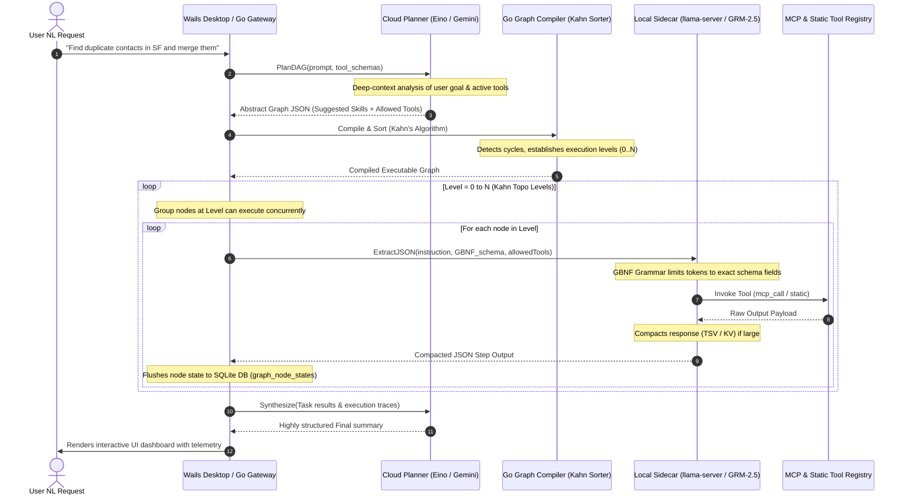

# X Hybrid Local-Cloud Orchestration: DAG Planning & Sidecar Execution Manual

Modern enterprise automation requires balancing high-overhead planning capabilities with lightweight, offline-first, and cost-effective execution. Complex multi-step integrations (such as updating CRMs, querying databases, and analyzing local files) should run locally on consumer laptops to guarantee privacy, low latency, and infinite execution scalability. However, constructing a Directed Acyclic Graph (DAG) for these tasks requires advanced reasoning, broad general knowledge, and deep context windows.

X v2 implements a **Hybrid Local-Cloud Orchestration Engine** built on CloudWeGo's **Eino** framework. This manual serves as the production-grade architectural specification and developer guide detailing how the **Cloud Planner (The Strategist)** and the **Local Worker Sidecar (The Tactician)** collaborate to plan, compile, execute, and verify complex agentic workflows.

---

## 1. Orchestration Topology & Interaction Flow

The orchestration lifecycle splits responsibilities between high-overhead cloud reasoning and offline local tool execution. The Go API Gateway serves as the centralized coordinator, driving the DAG state machine.



---

## 2. Phase 1: The Cloud Planner as the Strategist (DAG Generation)

Constructing a reliable execution graph requires mapping natural language intents to a series of deterministic and agentic execution blocks.

### 2.1 Eino Chat Model Instantiation

The Go gateway instantiates the Cloud Planner using Eino's `model.ChatModel` interface, loading the highly capable cloud model (e.g. Gemini 3.5 Flash or GPT-4o-mini).

```go
func NewCloudPlannerModel(ctx context.Context, provider string, apiKey string) (model.ChatModel, error) {
	switch provider {
	case "google":
		return openai.NewChatModel(ctx, &openai.ChatModelConfig{
			BaseURL:     "https://generativelanguage.googleapis.com/v1beta/openai",
			APIKey:      apiKey,
			Model:       "gemini-1.5-flash",
			MaxTokens:   4096,
			Temperature: 0.1, // Low temperature for deterministic planning
		})
	default:
		return nil, fmt.Errorf("unsupported cloud provider: %s", provider)
	}
}
```

### 2.2 Strategist System Prompt

The Eino executor compiles available tool definitions, active user settings, and procedural micro-skills index signatures, and feeds them into the Planner:

```
You are the Strategist Planner for the X enterprise platform. Your task is to compile a user's natural language goal into a Directed Acyclic Graph (DAG) for local execution.

## Available Tool Inventory
{{tool_definitions}}

## Available Procedural SOP Micro-Skills
{{suggested_skills_index}}

## Schema Constraints
You must output a single valid JSON object representing the graph. Do NOT include markdown fences, comments, or pleasantries.
{
  "taskId": "{{task_id}}",
  "maxCycles": 15,
  "nodes": [
    {
      "id": "node_id_1",
      "type": "action" | "deterministic" | "branch" | "merge",
      "action": "target_tool_name",
      "instructions": "Extremely detailed step instructions specifying what variables to read and write",
      "allowedTools": ["tool_1", "tool_2"],
      "suggestedSkillIds": ["skill_44"]
    }
  ],
  "edges": [
    { "sourceId": "node_id_1", "targetId": "node_id_2" }
  ]
}

## Execution Design Rules
1. Strategy only: You NEVER execute tools yourself. Plan the steps logically.
2. Variable binding: Use the syntax `{{nodes.node_id.output.property}}` to pass variables forward between nodes.
3. allowedTools limit: Restrict the local worker's action space at each node. Only include the 1-3 tools absolutely necessary.
4. Scale: Keep DAGs concise. If a task requires more than 8 steps, partition them.
```

---

## 3. Phase 2: Go Graph Compiler & Kahn Sorter

Once the Cloud Planner returns the Abstract Graph JSON, the **Go Graph Compiler** receives the structural payload, runs structural validation gates, and topological-sorts the execution layout.

```go
type GoGraphCompiler struct {
	db *sql.DB
}

func (c *GoGraphCompiler) CompileAndSort(ctx context.Context, rawJSON string) (*ExecutionGraph, [][]string, error) {
	var g ExecutionGraph
	if err := json.Unmarshal([]byte(rawJSON), &g); err != nil {
		return nil, nil, fmt.Errorf("invalid graph json: %w", err)
	}

	// 1. Structural Validations
	if len(g.Nodes) == 0 {
		return nil, nil, errors.New("graph contains zero nodes")
	}

	// 2. Build Dependency Map & Compute In-Degrees
	inDegree := make(map[string]int)
	adjList := make(map[string][]string)

	for _, node := range g.Nodes {
		inDegree[node.ID] = 0
	}

	for _, edge := range g.Edges {
		adjList[edge.SourceID] = append(adjList[edge.SourceID], edge.TargetID)
		inDegree[edge.TargetID]++
	}

	// 3. Kahn's Topological Sorting with Concurrent Execution Levels
	var queue []string
	for id, deg := range inDegree {
		if deg == 0 {
			queue = append(queue, id)
		}
	}

	var executionLevels [][]string
	visitedCount := 0

	for len(queue) > 0 {
		// All nodes currently in the queue have in-degree == 0 and are logically parallel
		var level []string
		var nextQueue []string

		for _, currID := range queue {
			level = append(level, currID)
			visitedCount++

			for _, neighbor := range adjList[currID] {
				inDegree[neighbor]--
				if inDegree[neighbor] == 0 {
					nextQueue = append(nextQueue, neighbor)
				}
			}
		}

		executionLevels = append(executionLevels, level)
		queue = nextQueue
	}

	// 4. Cycle Detection
	if visitedCount != len(g.Nodes) {
		return nil, nil, errors.New("illegal cycle detected in graph strategy; execution aborted")
	}

	return &g, executionLevels, nil
}
```

---

## 4. Phase 3: The Local Sidecar as the Tactician (Step Execution)

When an execution level fires, the Go Graph Executor orchestrates node execution. Action nodes are delegated to the **Local Step Executor** (the `llama-server` sidecar running the **GRM-2.5** model).

### 4.1 Interface Mapping (`openai.NewChatModel` with noThinkTransport)

For each node, Eino instantiates a local ChatModel targeting the dynamic port of the active `llama-server` process, bound to the dynamic GBNF schema generated for the node:

```go
func (s *LocalStepExecutor) ExecuteNode(ctx context.Context, node GraphNode, parentOutputs map[string]string) (string, error) {
	// 1. Interpolate Input Variables (Chain-Forward)
	instructions := s.interpolateVariables(node.Instructions, parentOutputs)

	// 2. Retrieve Full SOP content for suggested micro-skills
	var sopInjections []string
	for _, skillID := range node.SuggestedSkills {
		sop, err := s.fetchSOPContent(skillID)
		if err == nil {
			sopInjections = append(sopInjections, sop)
		}
	}

	// 3. Dynamic GBNF Grammar Generation based on Node Tool Specs
	gbnfGrammar, err := s.compileGBNFForNode(node.AllowedTools)
	if err != nil {
		return "", fmt.Errorf("failed compiling node grammar: %w", err)
	}

	// 4. Bind Eino Local Chat Model targeting Llama-Server Sidecar Port
	localPort := s.localManager.GetActivePort()
	localModel, _ := openai.NewChatModel(ctx, &openai.ChatModelConfig{
		BaseURL:          fmt.Sprintf("http://localhost:%d/v1", localPort),
		APIKey:           "local-dummy-key",
		Model:            "grm-2.5",
		Temperature:      0.0, // Forced zero temperature for structural parsing
		HTTPClient:       &http.Client{
			Transport: NewNoThinkTransport(gbnfGrammar),
			Timeout:   120 * time.Second,
		},
	})

	// 5. Build Chat Messages with SOP Injections
	systemPrompt := fmt.Sprintf(
		"You are the Local Tactician Node Executor. Your job is to execute the step using the allowed tools.\n\nSOP SKILLS:\n%s",
		strings.Join(sopInjections, "\n\n"),
	)

	messages := []schema.Message{
		schema.SystemMessage(systemPrompt),
		schema.UserMessage(instructions),
	}

	// 6. Execute step offline
	resp, err := localModel.Generate(ctx, messages)
	if err != nil {
		return "", err
	}

	return resp.Content, nil
}
```

---

## 5. Phase 4: Dynamic Variable Interpolation & Context Compaction

To maintain operational continuity across graph transitions, step outputs are forwarded to dependent nodes using an explicit, double-braced interpolation pipeline.

```
                  ┌──────────────────────┐
                  │ Node 1 Completed     │
                  │ Output: {"count": 5} │
                  └──────────┬───────────┘
                             │
                             ▼ (State Database Save)
                 Flushed to SQLite graph_node_states
                             │
                             ▼ (Execution level +1)
                  ┌──────────────────────────────────────────────┐
                  │ Node 2 Pre-flight Parse                      │
                  │ Raw Instruction: "Process {{node_1.count}}"  │
                  └──────────┬───────────────────────────────────┘
                             │
                             ▼ (Regex Variable Binding)
                  ┌──────────────────────────────────────────────┐
                  │ Interpolated Instruction:                    │
                  │ "Process 5"                                  │
                  └──────────────────────────────────────────────┘
```

### 5.1 Interpolation Parser

The variable resolver parses node instructions and injects previous step payloads:

```go
func (s *LocalStepExecutor) interpolateVariables(instruction string, parentOutputs map[string]string) string {
	re := regexp.MustCompile(`\{\{nodes\.([^.]+)\.output\.([^}]+)\}\}`)
	return re.ReplaceAllStringFunc(instruction, func(match string) string {
		submatches := re.FindStringSubmatch(match)
		if len(submatches) < 3 {
			return match
		}
		nodeID := submatches[1]
		propertyKey := submatches[2]

		// Fetch serialized JSON string for the source node
		rawOutput, exists := parentOutputs[nodeID]
		if !exists {
			return "null"
		}

		// Extract specific property field
		var outputMap map[string]interface{}
		if err := json.Unmarshal([]byte(rawOutput), &outputMap); err != nil {
			return rawOutput // Fallback to raw output text if not JSON
		}

		val, found := outputMap[propertyKey]
		if !found {
			return "null"
		}

		return fmt.Sprintf("%v", val)
	})
}
```

### 5.2 Context Compaction at Node Borders

When a node returns a tool output payload that is returned to the state machine, it is forcefully processed by the **5-Layer Compaction Engine**:

1.  **Tabular Hoisting:** Arrays of object structures are converted into space-saving TSV files, stripping repeating JSON keys.
2.  **Dot Flattening:** Multi-level JSON objects are flattened to a dot-notation key list up to depth 3, discarding system meta-keys.
3.  **Base64 Stripping:** Replacing long data strings with size pointers (`[binary:image/png,1.2MB]`).
    This ensures that the parent context variables remain highly compact, fitting comfortably inside local model KV cache slots.

---

## 6. Phase 5: Self-Healing & Cloud Escalation Fallback

Local environments are highly volatile. A standard consumer laptop might experience thermal throttling, memory spikes, or thread preemption. The system incorporates three layers of **Self-Healing Fallbacks** to guarantee execution completion:

```
                  Local Node Execution Initiated
                                │
                 ┌──────────────┴──────────────┐
                 ▼ (Condition OK)              ▼ (Local Blocked / Throttled)
         [Execute Local Sidecar]       [Escalate to Cloud Planner]
                 │                             │
        ┌────────┴────────┐                    │
        ▼ (Generates >5t/s)▼ (Under 5t/s)      │
     [Success]      [Speed Floor Failure]      │
                          │                    │
                          ▼ (Escalate)         ▼
                  ┌────────────────────────────────┐
                  │    Cloud Execution Fallback    │
                  │  (Dynamic Schema Inject via    │
                  │   System Prompt Constraints)   │
                  └──────────────┬─────────────────┘
                                 │
                                 ▼
                        [Step Completed]
```

### 6.1 Speed Floor Tracking

Generation speed is computed at the end of each local execution step:

$$\text{Generation Speed} = \frac{\text{Tokens Generated}}{\text{Inference Duration (seconds)}}$$

If the performance falls below **5 tokens/second** for 3 consecutive steps, the `SpeedFloorMonitor` registers a failure and sets:

$$\text{ExecutionState.ForceCloudFallback} = \text{true}$$

### 6.2 The Escalation Fallback Router (`callLocalOrCloud`)

If a local step fails, times out, triggers a memory GC wall, or is flagged by the speed floor monitor, Eino routes the step automatically to the cloud provider.

Since cloud providers (Gemini/OpenAI) execute in remote managed environments that cannot accept local GBNF grammar syntax sheets, the compiler dynamically translates the GBNF schema back into strict prompt-injected JSON templates:

```go
func (s *LocalStepExecutor) ExecuteEscalatedStep(ctx context.Context, node GraphNode, instruction string) (string, error) {
	cloudModel, err := s.getCloudModel(ctx)
	if err != nil {
		return "", fmt.Errorf("failed to fetch fallback model: %w", err)
	}

	// 1. Generate JSON schema guidelines
	targetSchemaJSON, _ := s.getSchemaJSONForTools(node.AllowedTools)

	// 2. Inject schema constraints directly into System Message
	systemPrompt := fmt.Sprintf(
		"You are the Node Executor acting as a fallback tactician. You must execute the following step instructions.\n\n"+
			"CRITICAL: You must output ONLY a valid JSON object matching this schema. Do NOT wrap output in markdown code blocks:\n%s",
		targetSchemaJSON,
	)

	messages := []schema.Message{
		schema.SystemMessage(systemPrompt),
		schema.UserMessage(instruction),
	}

	// 3. Dispatch Eino request with exponential retry backoff
	resp, err := s.retryableGenerate(ctx, cloudModel, messages)
	if err != nil {
		return "", fmt.Errorf("cloud escalation failed: %w", err)
	}

	return resp.Content, nil
}
```

---

## 7. Verification & Telemetry Specs

Every phase transition of the hybrid orchestration loop logs high-precision diagnostic traces to the localized database under the `orchestration_telemetry` table:

```sql
CREATE TABLE orchestration_telemetry (
    id                  TEXT PRIMARY KEY,
    task_id             TEXT NOT NULL,
    node_id             TEXT NOT NULL,
    execution_tier      TEXT NOT NULL, -- 'local' | 'cloud_fallback'
    planning_latency_ms INTEGER NOT NULL,
    execution_latency_ms INTEGER NOT NULL,
    prompt_tokens       INTEGER NOT NULL,
    completion_tokens   INTEGER NOT NULL,
    tokens_per_second   REAL NOT NULL,
    error_message       TEXT,
    created_at          INTEGER NOT NULL
);
```

### Telemetry Health Rules

- **Operational SLA:** Any local node execution running on Perf-cores (M1/M2 Max chips) must sustain a speed of $\ge 25\text{ tok/s}$.
- **GC Trigger Threshold:** If `execution_latency_ms` for a local node step exceeds $15,000\text{ms}$ (15s) for a simple tool extraction, the GC worker triggers slot erasure immediately post-step.
- **Escalation Rate Alarm:** If more than 30% of steps within a single Kahn level undergo `cloud_fallback` escalation, the Wails dashboard alerts the user that system background resource congestion is high.
