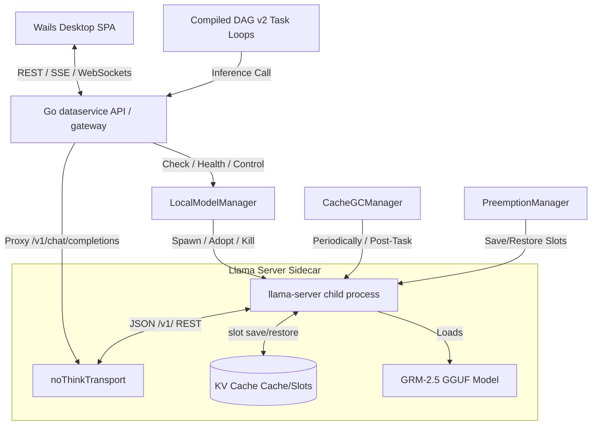

# Llama-Server Sidecar Architecture & Implementation

X v2 utilizes a local, offline-first execution model where lightweight reasoning steps, tool completions, and structured output formatting are delegated to a local LLM worker. Rather than depending exclusively on cloud providers, X runs a local **llama-server** child process (a compiled server from `llama.cpp`) running **GRM-2.5** (an OrionLLM reasoning fine-tune of Qwen3.5-4B).

This document details the architecture, process lifecycle management, inference controls, hardware-aware resource guarding, KV cache preemption, memory optimization, and GBNF schema constraints of the `llama-server` sidecar implementation.

---

## 1. System Topology

The local model infrastructure is designed around a single Go package (`services/go-api/dataservice`) that manages a native child process of `llama-server`. The Go gateway acts as the controller, proxying LLM requests from both the Wails desktop frontend and background task loops.



---

## 2. Process Lifecycle Management (`local_model.go`)

The lifecycle of the `llama-server` sidecar is managed by the `LocalModelManager` singleton. It supports lazy-loading, auto-start, server adoption across reloads, and automatic cleanup of resources.

### 2.1 Lazy Startup & Pre-Warming

The server process is launched lazily when the first inference call is made, or it is **pre-warmed** in a background goroutine during:

1.  **Application Startup:** If the local model is enabled and ready.
2.  **App Focus Event (`OnAppFocus`):** Triggered when the user returns focus to the desktop window, preparing the local LLM for immediate interactive response.

### 2.2 Server Adoption Across restarts

To support rapid iterative development (such as Wails dev hot-reloads) without spawning duplicate processes that hog memory (~2.7 GB RAM each), the manager supports **server adoption**:

- Upon spawning a `llama-server` process, the manager writes its port and PID to `.llama-server.port` inside the models directory (`~/.dynamic/models/`).
- During startup, before launching a new process, the manager reads the port file, checks the health of the existing server via a `GET /health` request, and, if healthy, adopts the running process instead of spawning a new one.
- Adoption is skipped if a GGUF model override is active, forcing a fresh spawn of the server with the custom evaluation model.

### 2.3 Binary Auto-Installer (`llama_server_installer.go`)

If the bundled `llama-server` binary is missing from the application bundle, the manager initiates a runtime auto-download:

1.  **Platform Resolution:** Resolves the host OS and CPU architecture to map to the appropriate `llama.cpp` release asset (tag `b8892`).
    - `darwin/arm64` $\rightarrow$ `llama-b8892-bin-macos-arm64.tar.gz`
    - `darwin/amd64` $\rightarrow$ `llama-b8892-bin-macos-x64.tar.gz`
    - `linux/amd64` $\rightarrow$ `llama-b8892-bin-ubuntu-x64.tar.gz`
    - `windows/amd64` $\rightarrow$ `llama-b8892-bin-win-cpu-x64.zip`
2.  **Archive Extraction:** Downloads the compressed archive to a temporary file, then extracts the `llama-server` binary plus all platform-specific dynamic libraries (`.dylib`, `.so`, `.dll`) into `~/.dynamic/bin/`.
3.  **Library Symlink Resolution:** For macOS/Linux, it processes symlink headers (e.g. `libllama.0.dylib` $\rightarrow$ `libllama.0.0.8892.dylib`) to support runtime dynamic linker `@rpath` resolution.

### 2.4 Model Lifecycle & Cleanup

- **HF Download:** GGUF models are fetched from HuggingFace (`GRM-2.5-i1-GGUF`) with smooth manifest.json progress updates (updated on 1% increments or every 2 seconds).
- **Version Upgrades:** If a new application version updates `LocalModelVersion`, the manifest state is flagged as `"outdated"`, prompting a re-download.
- **Old Model Cleanup:** Upon successful download of a new GGUF, the manager scans the models directory and deletes all other `.gguf` files (excluding `.tmp` partial downloads) to reclaim disk space.
- **GGUF Overrides (`OverrideGGUF`):** Used during autotune/evaluation loops to swap the active GGUF with a custom fine-tuned GGUF without altering the persistent user manifest.

---

## 3. Inference & Sampling Control (`local_model_no_think.go`)

To control inference parameters without complicating the LLM client code, a custom `http.RoundTripper` named `noThinkTransport` intercepts all outgoing requests to `/v1/chat/completions` that target localhost.

```
       [LLM Client Request]
                 │
                 ▼
     ┌────────────────────────┐
     │   noThinkTransport     │
     │ ────────────────────── │
     │ 1. Inject Qwen3.5      │◄─── Suppress thinking mode (enable_thinking=false)
     │    chat_template_kwargs│
     │ 2. Apply Custom        │◄─── temperature, top_p, min_p
     │    Sampling            │
     │ 3. Inject GBNF Schema  │◄─── response_format JSON schema
     └────────────────────────┘
                 │
                 ▼
       [Local llama-server]
```

### 3.1 Thinking Mode Suppression

By default, reasoning models like Qwen-3.5-Instruct emit chain-of-thought `<think>` tags. While helpful, this reasoning sequence incurs significant time-to-first-token (TTFT) and token generation overhead.

- The transport intercepts the JSON body and injects Qwen3.5-specific parameters:
  ```json
  "chat_template_kwargs": {
      "enable_thinking": false
  }
  ```
- **Model-Aware Safety:** This kwarg is only injected for Qwen 3.5 family models (including GRM-2.5) by checking `isQwen35Family()`. Injecting this into a Qwen 2.5 or Llama model would crash the server's Jinja template renderer and return an HTTP 500 error.

### 3.2 Sampling Optimizations

- The transport applies configured values for `temperature` and `top_p`.
- It also injects `min_p` (e.g. `0.05`), a superior alternative to `top_p` that scales the threshold relative to the probability of the most likely token, weeding out low-probability noise tokens while preserving creativity.

---

## 4. Hardware-Aware Resource Guarding (`local_model_health.go`)

Because running 4B-parameter LLMs locally on consumer hardware can easily overwhelm system resources, the sidecar incorporates native guarding and hardware profiling:

### 4.1 System RAM Startup Check

- X checks memory availability upon boot via `EvaluateRAMForLocalExecution()`. If the host machine has less than the minimum required RAM (default: 16GB), local execution features are disabled.
- If total RAM is sufficient but available RAM is low (< 10GB), it suggests using a smaller fallback model.

### 4.2 Modern macOS Memory Detection (`local_model_health_darwin.go`)

Historically, checking available memory on macOS via standard sysctl values (like `vm.page_inactive_count`) is broken on macOS 13+ and Apple Silicon, returning `0` and causing massive under-reporting of available RAM.

- X implements a Darwin-specific CGo query that binds directly to the Mach kernel's `host_statistics64` API:
  ```c
  mach_msg_type_number_t count = HOST_VM_INFO64_COUNT;
  vm_statistics64_data_t vmstat;
  host_statistics64(mach_host_self(), HOST_VM_INFO64, (host_info64_t)&vmstat, &count);
  ```
- It computes truly available memory by accounting for inactive and purgeable file caches that the OS can reclaim under pressure:
  $$\text{Available RAM} = (\text{Free} + \text{Inactive} + \text{Purgeable} + \text{Speculative}) \times \text{PageSize}$$
- This prevents false critical memory warnings on macOS.

### 4.3 Thread Scheduling on Performance Cores Only

For LLM generation, utilizing efficiency (E) cores actually **degrades** throughput due to the memory-bandwidth-bound nature of autoregressive sampling. E-cores run on narrower memory buses and stall the wider memory buses used by Performance (P) cores.

- On macOS, the CGo layer queries `sysctl("hw.perflevel0.logicalcpu")` to get the count of P-cores.
- The `llama-server` process is spawned with `--threads` pinned exactly to this P-core count (falling back to logical CPUs/2 on other architectures), guaranteeing maximum token-per-second generation.

### 4.4 Speed Floor Monitor

- The system measures token generation speed on every local execution request:
  $$\text{Tokens Per Second} = \frac{\text{Completion Tokens}}{\text{Inference Duration}}$$
- If the generation speed falls below the configured speed floor (e.g. `< 5 tok/s`) for `consecutive_steps` (typically 3), the `SpeedFloorMonitor` triggers an automatic cloud fallback, transparently routing subsequent queries in the current session to a cloud API.

---

## 5. Memory Management & KV Cache GC (`local_model_cache_gc.go`)

At startup, `llama-server` pre-allocates contiguous virtual memory buffers for the Key-Value (KV) cache slots. While these buffers grow dynamically during use, they do not release memory back to the operating system after completions. X manages this with a **Two-Tier Cache GC** strategy:

```
[GC Check: Every 5 mins / Post-Task]
                 │
                 ▼
     ┌────────────────────────┐
     │ Check Memory Pressure  │
     └───────────┬────────────┘
                 │
         ┌───────┴────────────────────────┐
         ▼                                ▼
[Warning Pressure: < 2GB Available]     [Critical Pressure: < 1GB Available]
         │                                │
         ▼                                ▼
    ┌──────────┐                     ┌──────────┐
    │  Tier 1  │                     │  Tier 1  │
    │Slot Erase│                     │Slot Erase│
    └──────────┘                     └────┬─────┘
                                          │
                                          ▼
                                     ┌──────────┐
                                     │  Tier 2  │
                                     │Restart   │◄─── Gracefully reboot process
                                     │Server    │     to free system RAM
                                     └──────────┘
```

### 5.1 Tier 1: Active Slot Erasure (Fast)

- **Trigger:** Evaluated periodically (every 5 minutes or max 30 minutes), manually via API, or automatically **upon task/workflow completion** (natural boundary).
- **Mechanism:** Queries `/slots` to discover all active slots. For each idle slot, it invokes a POST request to `/slots/{id}?action=erase`.
- **Result:** Clears token attention histories and resets prompt caches, but keeps pre-allocated virtual memory buffers active.

### 5.2 Tier 2: Graceful Server Restart (Thorough)

- **Trigger:** If available system memory drops below **1GB** (Critical Memory Pressure) and slot erasure fails to recover it.
- **Mechanism:** Terminates the background GC loop, issues a graceful `SIGINT` to the `llama-server` child process (falling back to `SIGKILL` if unresponsive), and spawns a fresh process.
- **Result:** Releases 100% of pre-allocated buffers back to the OS, returning the machine to a stable baseline.

---

## 6. Priority Preemption (`local_model_preemption.go`)

Because local inference is limited to a single model slot, executing a long-running, multi-step background task on the local model would ordinarily block any interactive chat query, resulting in poor user experience. The `PreemptionManager` solves this via disk-backed **KV preemption**:

```
[Background Task Executing]
            │
            ▼
[User Sends Chat Message]
            │
            ▼
┌──────────────────────────────────────┐
│        PreemptForChat()              │
│ ──────────────────────────────────── │
│ 1. POST /slots/0/save                │───► Saves KV cache to slot_0.bin
│ 2. POST /slots/0?action=erase        │───► Clears slot 0
│ 3. Execute Chat Query                │───► Sub-second interactive response
│ 4. POST /slots/0/restore             │◄─── Restores KV cache from slot_0.bin
│ 5. Delete slot_0.bin                 │
└──────────────────────────────────────┘
            │
            ▼
[Background Task Resumes Seamlessly]
```

### 6.1 Save and Restoral Cycle

1.  **Mark Active:** When a background DAG node begins execution, it calls `MarkBackgroundActive()`.
2.  **Preempt Trigger:** When a chat request is received, the gateway calls `PreemptForChat()`.
3.  **KV Cache Dump:** It issues a request to the llama-server `/slots/0/save` endpoint, exporting the entire context attention cache of slot 0 to `~/.dynamic/models/kv-cache/slot_0.bin`.
4.  **Erase & Run:** The slot is erased, and the interactive chat query executes with sub-second latency (T0 response ~500ms).
5.  **KV Cache Restore:** Once chat inference finishes, the preemption manager calls the `/slots/0/restore` endpoint to reload `slot_0.bin` back into active cache memory.
6.  **Cleanup:** The temporary binary state file is deleted, and the background task resumes without needing to repeat prompt evaluation.
7.  **Fallback Safe-Guard:** If the KV save/restore fails, the background step is terminated and re-scheduled from scratch, ensuring the chat interface never blocks.

---

## 7. GBNF Enforced Structured Output (`local_model_json_schema.go`)

To solve the limitations of small local models (reasoning decay under large system prompts, narrated passivity, invalid JSON outputs), X forces GBNF (GGML Backus-Naur Form) grammar constraints on all local tool-calling and structured output steps.

### 7.1 JSON Tool-Calling Grammar

When calling a local model with tools, X constructs a GBNF JSON Schema that constrains the output to a strict layout:

```json
{
  "type": "object",
  "properties": {
    "internal_thought": { "type": "string" },
    "tool_name": { "type": "string", "enum": ["tool1", "tool2"] },
    "tool_arguments": { "type": "object" }
  },
  "required": ["internal_thought", "tool_name", "tool_arguments"],
  "additionalProperties": false
}
```

- **`internal_thought`:** A safe "narration vent" where the model can express reasoning steps. The compiler reads this for debugging but strips it during execution.
- **`tool_name` Enum (Execution Group):** Constrained to the primary step tool plus its designated companions (e.g. `salesforce_query` + `salesforce_describe` + `jq_cached_data`). Minimizing the action space to 1–3 tools reduces the search space and avoids hallucinations.
- **`tool_arguments`:** A schema-specific argument object.

By binding this GBNF grammar via `response_format`, the local model is physically unable to produce markdown code blocks, XML wrappers, conversational pleasantries, or malformed braces — guaranteeing 100% parsing success on the first attempt.

### 7.2 Non-GBNF Tool Extraction Fallback (`local_model_tool_extractor.go`)

If GBNF constraints are disabled or bypassed, the manager falls back to a multi-strategy regular expression extractor (`extractToolCallsFromContent`). This parser extracts tool calls embedded in content text under four patterns:

1.  **Markdown Code Blocks:** ` ```json {"tool": "x", "arguments": {}} ``` `
2.  **XML Tool Call Tags:** `<tool_call> {"name": "x", "arguments": {}} </tool_call>`
3.  **XML Tool Code Tags:** `<tool_code><tool_name>x</tool_name><tool_arguments>...</tool_arguments></tool_code>`
4.  **Bare JSON Objects:** Checks if a raw JSON object containing `"tool"` or `"name"` keys appears at the root of the text.

XML arguments that are emitted as nested tags (e.g. `<query>SELECT...</query>`) are automatically parsed and translated back into valid JSON objects prior to tool execution.

---

## 8. Eino Framework & Hybrid Orchestration

X v2 leverages CloudWeGo's **Eino** framework as its central Go LLM orchestration library. Rather than direct, tight coupling to various provider SDKs, Eino provides a highly flexible abstraction layer that enables local models and cloud models to operate seamlessly side-by-side.

### 8.1 Unified Abstraction Layer (`model.ChatModel`)

- Eino's `model.ChatModel` component and `schema.Message` structs abstract all LLMs behind a unified, standard interface.
- The factory function `newChatModel` in `chat.go` translates different provider requirements (such as Gemini's OpenAI compatibility suffix `/v1beta/openai` and credential headers) into this common format.
- For the local sidecar, `newChatModel` instantiates the standard Eino `openai` adapter configured to target `http://localhost:<PORT>/v1` (with dynamic port resolution) and overlays our custom `noThinkTransport` HTTP client round-tripper.

### 8.2 Hexagonal Ports & Adapters Integration

The Directed Acyclic Graph (DAG) Graph Engine (`graphengine`) is designed around a strict Ports & Adapters (Hexagonal Architecture) model. It remains completely agnostic to the underlying AI implementation and refers only to the `InferencePort` (`ports.go`):

```
       [graphengine.Engine]
                │
                ▼ (calls)
        [InferencePort] (Interface)
                ▲
                │ (implemented by)
     ┌───────────────────────┐
     │   inferenceAdapter    │ (dataservice/graph_engine_wiring.go)
     │ ───────────────────── │
     │  Eino Orchestration   │
     └──────────┬────────────┘
         ┌──────┴──────────────┐
         ▼                     ▼
  [Local llama-server]   [Cloud LLM]
    (Tool Extraction)   (DAG Planning)
```

The concrete `inferenceAdapter` in the `dataservice` package manages the division of labor using Eino chat models.

### 8.3 Dual Execution Roles (Planning vs. Extraction)

Because consumer CPUs are resource-constrained and local models are typically smaller (4B parameters), X v2 implements a hybrid execution model where different execution steps are routed dynamically:

1.  **Cloud-Driven Planning & Synthesis:** Generating a complex multi-step Directed Acyclic Graph (DAG) requires broad reasoning capability and deep context windows. In `InferencePort.PlanDAG`, Eino routes this high-overhead task exclusively to a capable cloud provider (e.g. Gemini 3.5 Flash or GPT-4o-mini). The `retryableGenerate` handler wraps Eino calls with exponential backoff and jitter to survive cloud rate-limiting (429 errors).
2.  **Local-First Step Extraction (Bridges):** When executing individual steps inside the compiled DAG, the engine calls `InferencePort.ExtractJSON` (which resolves to `ExecuteBridge` in `gbnf_bridge.go`). The bridge executes a single-pass inference directly on the local `llama-server` sidecar to extract precise JSON arguments for the tool, keeping raw database/CRM tool interactions completely offline and latency-free.

### 8.4 Self-Healing Cloud Fallback

X implements a robust self-healing fallback pipeline inside `callLocalWithStructuredOutput`:

- **Local Attempt:** The bridge first attempts to execute locally, building a local Eino chat model with a GBNF grammar constraint context (`GBNFContext`) injected into the Go `context.Context` (via `WithGBNFContext(ctx, gbnfCtx)`).
- **Automatic Fallback:** If the local server fails to start, times out, has an outdated GGUF, or is disabled due to memory pressure, the bridge automatically routes the request through the `callLocalOrCloud` pipeline.
- **Failsafe Execution:** This pipeline delegates execution to the active cloud provider (`callLLMFromDB`) using Eino. Because cloud APIs do not support local GBNF grammar libraries, the framework injects the JSON target schema directly into the system prompt's Eino messages. High-quality cloud models easily conform to the prompt constraints, guaranteeing 100% execution success.

---

## 9. Safety & Loop Circuit Breakers

To protect the local model from retry spirals and infinite tool loops, `callLocalWithTools` incorporates several runtime checks:

- **Consecutive Error Breaker:** If a tool call fails consecutively $N$ times (threshold: 3), the loop breaks, the tools are unbound, and the model is nudged to summarize the failure for the user.
- **Duplicate Call Blocker:** If the exact same tool name with the exact same JSON arguments is triggered multiple times (cap: 2), the execution is rejected with a corrective nudge, forcing the model to try different arguments.
- **Per-Tool Total Call Cap:** Tracks the aggregate calls made to each tool. Non-exempt tools are capped at 5 calls (or higher overrides like 8 calls for Salesforce SOQL tools) to allow sufficient space for discovery queries while preventing runaway token consumption.
- **Cache Tool Circuit Breaker:** Detects loops between cache exploration tools (`read_cached_data` $\rightarrow$ `jq_cached_data` $\rightarrow$ `introspect_cache`). After 3 consecutive cache calls, it dynamically unregisters cache tools and injects a warning: `STOP exploring the cached data. Produce your final answer now.`
- **Local DB Success Amplification:** Terse database write responses (like `{"success":true,"rowsAffected":1}`) can sometimes be overlooked by 4B models. The gateway intercepts successful `insert`, `update`, and `delete` actions and prepends a bold: `✅ INSERT SUCCEEDED - the row is now in the database. Do NOT insert this data again.` This prevents duplicate writes.

---

## 10. Telemetry & Observability

Every completed local inference records data to the `inference_telemetry` table in SQLite:

- **Source:** `"chat"` or `"agent"`
- **Model/Provider:** `"local-model"` / `"local"`
- **Latency:** Aggregate duration in milliseconds.
- **Token Metrics:** Total prompt and completion tokens.
- **Speed Metrics:** Logs tokens per second for real-time performance analytics in the developer console.

This data is exposed through the `/local-model/status` and `/local-model/cache-stats` REST endpoints, allowing the desktop frontend to monitor local inference health, preemption history, and available memory at a glance.
