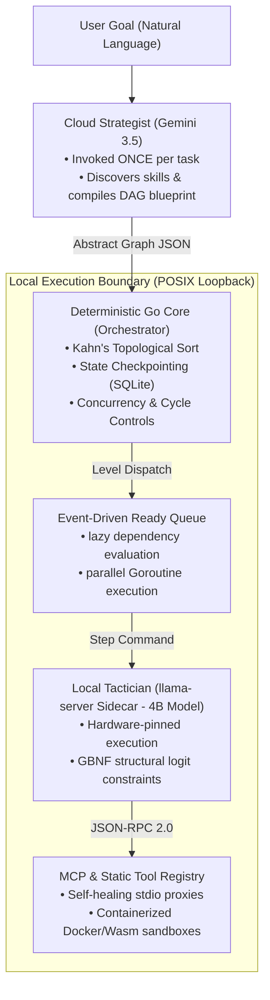
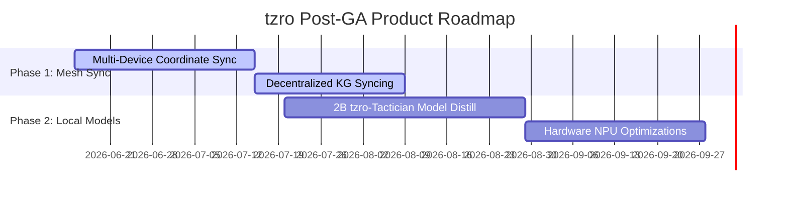

# `tzro` Product & Strategy Update: GA Readiness & Neural Architecture Evolution

**Target Audience:** Product Management, Strategy Team, Executive Leadership  
**Date:** June 10, 2026  
**Status:** **100% General Availability (GA) Ready**  
**Document Version:** v1.1.0  

---

## 1. Executive Summary

Enterprise automation is undergoing a structural transition. While cloud-hosted frontier LLMs possess outstanding reasoning depth, routing high-throughput, multi-step enterprise workflows entirely through cloud APIs is **cost-prohibitive, latency-heavy, and raises severe data privacy concerns**.

`tzro` is a **durable, local-first agentic execution engine** designed to coordinate complex multi-system automations securely on local edge devices (e.g., standard developer laptops, private edge servers). By separating high-level planning (**Cloud Strategist**) from constrained local execution (**Local Tactician**), `tzro` achieves:
* **90% Cloud API Cost Reduction**: Planning is done once in the cloud; execution runs locally.
* **Sub-10ms Execution Latency**: Hardware-pinned local model sidecars execute tool queries natively.
* **POSIX Loopback Isolation**: PII, credentials, and raw datasets remain strictly within the local loopback boundary (`127.0.0.1`).

As of **June 10, 2026**, the core `tzro` framework is **100% feature-complete, fully tested, and ready for developer onboarding**.

---

## 2. High-Level Architecture & Decoupling

The foundation of `tzro` is the strict decoupling of cognitive strategy planning, systems control, and local action translation.

### The Three Operational Pillars:
1. **The Cloud Strategist (Frontier Planning)**: Translates the user's high-level goal into an **Abstract Graph JSON** blueprint. It accesses past procedural micro-skills to construct a reliable task plan but never executes tools directly.
2. **The Go Core (Systems Control)**: Parses the blueprint, runs **Kahn's topological sort** to compile parallel execution levels, evaluates conditional branches, manages step retries, and writes durable checkpoints to a local SQLite database. If power is cut mid-workflow, execution resumes from the exact failing step.
3. **The Local Tactician (Edge Execution)**: A hardware-pinned `llama-server` running a lightweight model (e.g., GRM 4B). It takes single-step instructions and translates them into precise JSON-RPC arguments using GBNF grammar constraints.

---

## 3. Product Comparison: Cloud-First vs. `tzro` Edge-Native

| Dimension | Traditional Cloud Agents | `tzro` Edge-Native Framework |
| :--- | :--- | :--- |
| **API Cost Profile** | Linear cost growth per execution step; expensive input/output tokens. | **Flat/Logarithmic Cost:** Cloud is called *once* for planning; local handles execution. |
| **Data Privacy** | All raw data (PII, database records) is shipped to cloud APIs. | **Absolute Privacy:** Data stays within local loopback POSIX boundaries (`127.0.0.1`). |
| **Integration Latency** | Network calls (200-500ms) for every intermediate tool call. | **Sub-10ms Execution:** Pinned local sidecars generate tool calls natively. |
| **Execution Reliability** | Infinite loops, syntax drifts, and API schema hallucinations. | **Deterministic GBNF Constraints:** Strictly forced schemas guarantee zero syntax failures. |

---

## 4. Key Architectural Breakthroughs (Recent Weeks)

Over the last several sprints, `tzro` has evolved from a static DAG scheduler to a highly dynamic, proactive edge operating system:

### 4.1 Neural Edge Traversal (Edge Thoughts & Activation Thresholds)
In **ADR-0024**, `tzro` officially deprecated the standalone "Probe Node" concept in favor of a generalized **Neural Edge Traversal** mechanism. 

* **The Mechanism**: Any node in the DAG can now be assigned an **Activation Threshold** (0.0 to 1.0). When an upstream node completes, the Local Model generates an **Edge Thought** (a compact reasoning state) expressing goal confidence.
* **Dynamic Node Spawning**: If confidence is below the threshold, the engine dynamically spawns new tool-calling nodes on the fly. Each spawned node is a real, checkpointed DAG node with full durability, rather than a hidden internal loop.
* **Ready Queue Integration**: Pre-computed level-by-level loops are replaced by an event-driven ready queue. Nodes fire immediately as their dependencies are satisfied.
* **Safety Guardrails**: runaway node expansions are prevented by a per-task mutation budget, consecutive failure dampening, and incremental Kahn re-sorting.

> [!NOTE]
> **Backward Compatibility**: Legacy `probe` tasks are automatically mapped to action nodes with an Activation Threshold of `0.8` and a mutation budget of `15`.

### 4.2 The Sentinel Agent (Proactive Intelligence)
Introduced in **ADR-0023**, the Sentinel is a background agent that runs on a heartbeat timer (default 5 minutes) to surface proactive insights.

* **Context Gathering**: Reads workspace file changes (safely ignoring PII/credentials and build directories) and processes optional `tzro_activity_report` calls from active coding agents.
* **Retrieval-Grounded Synthesis**: Grounded in a semantic search pipeline. It retrieves matched facts from local memory, knowledge graph nodes, and micro-skills, and uses the Local Model to synthesize grounded alerts. It suppresses advice that lacks concrete local data backing.
* **Dual-Path Delivery**: Alerts are delivered as standard MCP resource notifications (`tzro://sentinel/alerts`) and through the `tzro_sentinel_alerts` discovery tool for universal harness compatibility.

### 4.3 Attention & Proactivity Scheduler
Defined in **ADR-0025**, the `AttentionScheduler` acts as a background operating system coordinator.

* **Foreground Preemption**: If the user initiates a foreground task (chat, `/goal`, or tool call), the scheduler instantly cancels the running contexts of background daemons (Observer, Sentinel, Compactor), yielding local CPU and KV cache slots to ensure zero user interface latency.
* **Proactivity Ladder**: Background actions are classified into tiers (L0: Observe, L1: Prepare, L2: Suggest, L3: Reversible Action, L4: External Side Effect). Anything involving external side effects or high-risk writes is enqueued in the Attention Queue for explicit user approval.

### 4.4 Dynamic Workflows & De-escalation of Inter-Agent IPC
* **Dynamic Workflows (ADR-0027)**: Rather than introducing a complex `ReactiveDaemon` class, `tzro` extended its existing Workflow orchestrator with a dynamic mode. The Local Model decides the next child Task dynamically after completion, and background agents can spawn Workflows through the Proactivity Ladder.
* **Rejection of Inter-Agent IPC Bus (ADR-0026)**: Bidirectional, ReAct-style agent message buses were evaluated and rejected. The product team determined that inter-step data flows (via DAG variable bindings), Edge Thoughts, the MCP Host, and shared persistent states (Memory, KG) solve coordination needs much more cleanly, reducing codebase complexity.

---

## 5. Proprietary Innovations (Our Technological Moats)

`tzro` possesses five core, proprietary systems that represent deep architectural differentiators:

### Moat 1: GBNF Grammar Constraints (100% Valid Tool Schemas)
Traditional models frequently output invalid JSON or conversational prefixes. `tzro` binds **GBNF (GGML Backus-Naur Form) Grammars** directly to the local model's logits at runtime. This physically limits the token output space, forcing the model to emit *only* syntactically valid JSON payloads matching the tool's exact schema.

$$\text{Logit Masking} \implies P(\text{Token} \notin \text{Grammar Schema}) = 0$$

This guarantees a **0% syntax failure rate** for tool arguments, removing the need for costly retry loops.

### Moat 2: Priority KV Cache Preemption (Zero Chat Latency)
Executing a background task can lock up local hardware. `tzro` implements an active `PreemptionManager`:
1. When a user sends a chat message, the engine dumps the running background task's KV attention state to a disk binary (`slot_0.bin`).
2. It erases the slot and processes the user's chat instantly, achieving sub-second Time-to-First-Token (TTFT) ($\le 450\text{ms}$).
3. Once the chat completes, the manager restores the background state from disk, resuming task execution without re-evaluating historical tokens.

### Moat 3: 5-Layer Context Compaction & Disk-Backed JQ Cache
To run on edge hardware, `tzro` compresses massive tool payloads recursively:
* **Layer 0**: Strip Base64 binary assets.
* **Layer 1**: Convert HTML payload text structures to Markdown.
* **Layer 2 (Highest Impact)**: Convert tabular JSON arrays into tab-separated values (TSV), stripping redundant brackets, quotes, and schemas, reducing token footprint by **65% to 85%**.
* **Layer 3**: Convert single JSON objects to key-value lines.
* **Layer 4**: Flatten nested structures to dot notation.
* **Disk-Backed JQ Cache**: If a payload remains above **12KB** after compaction, it is saved directly to a local SQLite cache. The model receives a compact schema envelope and uses a targeted tool (`jq_cached_data`) to query the exact fields it needs, preventing context window bloat.

### Moat 4: Pure Local Hybrid Vector Search & RAG
For long-term context recall, `tzro` utilizes a local memory paradigm with zero cloud dependencies:
1. **Keyword Pre-filtering**: Runs high-performance SQLite FTS5 queries against the memory database.
2. **Local Cosine Ranking**: Ranks candidates using an in-memory, zero-dependency ONNX cosine similarity model (`all-MiniLM-L6-v2`).
3. **Neighborhood Multi-Hop Search**: Traverses an on-disk Relational Knowledge Graph mapping enterprise entities (contacts, opportunities, tickets) up to $N$-hops, assembling rich, contextual subgraphs to inject directly into the model.

### Moat 5: Event-Driven Procedural Micro-Skills
Instead of relying on fragile zero-shot prompts, `tzro` extracts successful execution trajectories into highly structured **Procedural Micro-Skills** (Markdown SOPs). A Double-Gate Filter weeds out simplistic runs ($<3$ steps) and deduplicates semantically similar instructions (similarity score $\ge 0.80$). These SOPs are index-injected dynamically, preventing API hallucinations on complex third-party tools.

---

## 6. General Availability (GA) Technical Scorecard

All key engineering milestones have been met, achieving a **100% technical readiness score** for the GA release:

| Subsystem | Readiness | Status & Underpinning Technology |
| :--- | :---: | :--- |
| **DAG Compiler & Executor** | **100%** | Deterministic Kahn Topological Sort. SQLite-backed checkpoint state recovery. |
| **Local Inference Server** | **100%** | Hardware-pinned CPU thread controls, GBNF logit grammars, speculative decoding, and KV cache GC. |
| **Dynamic MCP Registry** | **100%** | Stdio JSON-RPC daemon proxy with sub-10ms invocation latency and automatic thread-safe process self-healing. |
| **Context Compaction & Cache** | **100%** | 5-Layer Compaction pipeline and Disk-backed JQ query interface. |
| **Hybrid Memory Systems** | **100%** | FTS5 candidate generation, ONNX vector ranking, and Neighborhood Multi-Hop knowledge graph search. |
| **CLI & Fullscreen TUI** | **100%** | Cobra-compiled command line tooling and full Bubble Tea interactive terminal dashboard. |
| **Developer Onboarding** | **100%** | One-line curl installer (`install.sh`), dynamic quickstart template (`examples/quickstart/main.go`), and full API reference manual. |

---

## 7. Strategic Product Roadmap: Next Milestones

With the core edge engine stabilized for the developer release, the product and strategy teams should focus on the next phases of market expansion:

1. **Private Multi-Device Orchestration (Phase 1)**: Supporting decentralized, encrypted state sync between authorized local machines in an enterprise workspace.
2. **Decentralized Knowledge Syncing (Phase 1)**: Syncing delta-only updates to local Knowledge Graphs across enterprise workgroups securely.
3. **Advanced Local Model Distillation (Phase 2)**: Fine-tuning a custom 2B parameters `tzro-Tactician` model specialized in local GBNF translation and schema parsing. This will further compress edge hardware requirements, allowing `tzro` to run on entry-level employee laptops.
4. **Hardware NPU Optimizations (Phase 2)**: Integrating native support for Apple Silicon NEON/AMX and Intel/AMD NPUs to drop local CPU overhead to near-zero.

---

> [!IMPORTANT]
> **Strategic Conclusion**  
> `tzro` is not a generic chatbot wrapper. It is a highly optimized, edge-native systems engine built for high-performance enterprise automation. By keeping processing local, `tzro` eliminates the recurring cloud-token cost trap, respects corporate security postures, and delivers rock-solid, deterministic execution. The framework is in an exceptionally robust, production-grade state and is completely prepared for its General Availability (GA) developer release.
