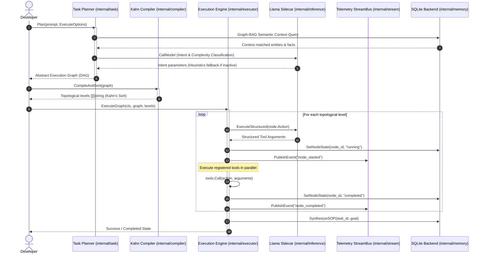

# tzro Public SDK & API Reference

Welcome to the **tzro** Developer SDK & API Reference. `tzro` is a zero-dependency, local-first durable agentic orchestration framework. This document provides technical specifications, code integration blueprints, and API reference guidelines for compiling and executing highly resilient, local-first agentic workflows.

---

## 🗺 System Architecture Flow

The following sequence details how a natural language prompt is planned, compiled into a Directed Acyclic Graph (DAG), executing actions topologically across local and cloud environments, and streaming SSE progress telemetry:



---

## 🛠 Core Go SDK Reference

### 1. Configuration & Delegated Secrets
Manage system operational mode (`cooperative`, `local`, `cloud`), speed floors, and dynamic credential loader boundaries.

```go
import "tzro/internal/config"

// Get retrieves the global engine configuration settings
cfg := config.Get()
fmt.Printf("Model Mode: %s\n", cfg.ModelMode)

// GetCloudAPIKey recursively resolves delegated secrets
// E.g., "$OPENAI_API_KEY" -> OS Environment value, or GEMINI_API_KEY fallback
cloudKey := config.GetCloudAPIKey()
```

### 2. Custom Tool Registration
Extend the runtime capabilities of local worker daemons by registering custom local tools. Any tool implementing the `tools.Tool` interface can be dynamically scheduled in the DAG action space.

```go
import "tzro/internal/tools"

type CustomDiskCleaner struct{}

func (t *CustomDiskCleaner) Name() string {
    return "disk_cleanup"
}

func (t *CustomDiskCleaner) GetSchema() (string, error) {
    return `{
        "type": "object",
        "properties": {
            "path": {"type": "string", "description": "Target folder path"},
            "dryRun": {"type": "boolean"}
        },
        "required": ["path"]
    }`, nil
}

func (t *CustomDiskCleaner) Call(ctx context.Context, args map[string]interface{}) (string, error) {
    path := args["path"].(string)
    // Execute custom cleaning logic here...
    return `{"status": "cleaned", "saved_mb": 420}`, nil
}

// Register the tool globally
tools.Register(&CustomDiskCleaner{})
```

### 3. Kahn topological compilation
Execute dependency verification and parallel levels sorting utilizing Kahn's Topological Sorting algorithm.

```go
import "tzro/internal/compiler"

// Compile and sort abstract nodes into executable levels
levels, err := compiler.CompileAndSort(executionGraph)
if err != nil {
    log.Fatalf("Compilation deadlock or cyclic dependency detected: %v", err)
}

// levels is a slice of slices, e.g., [["node_01"], ["node_02", "node_03"], ["node_04"]]
// where level 2 nodes execute concurrently in parallel goroutines.
```

### 4. SSE Stream telemetry tracking
Track workflow and tool executions in real-time by subscribing to the thread-safe global event stream bus.

```go
import "tzro/internal/stream"

// Subscribe to global telemetry events matching our TaskID
sub := stream.GlobalBus.Subscribe(func(chunk stream.StreamChunk) bool {
    return chunk.TaskID == "t_my_task"
})
defer sub.Unsubscribe()

// Consume streamed chunks asynchronously
go func() {
    for chunk := range sub.Ch {
        fmt.Printf("[Stream Event] Source: %s | Type: %s | Content: %s\n", 
            chunk.Source, chunk.Type, chunk.Content)
    }
}()
```

---

## 📋 JSON Schema Specifications

### 1. Abstract Execution Graph (DAG) Schema
The task planning engine compiles dynamic requests into the following execution graph structure:

```json
{
  "$schema": "http://json-schema.org/draft-07/schema#",
  "title": "ExecutionGraph",
  "type": "object",
  "properties": {
    "taskId": {
      "type": "string",
      "description": "Unique identifier for this task execution instance"
    },
    "maxCycles": {
      "type": "integer",
      "default": 5,
      "description": "Maximum cyclic iterations before forcing halt"
    },
    "nodes": {
      "type": "array",
      "items": {
        "type": "object",
        "properties": {
          "id": {
            "type": "string",
            "description": "Unique node identifier (e.g. node_01)"
          },
          "type": {
            "type": "string",
            "enum": ["action", "conditional", "loop"],
            "description": "Node execution type"
          },
          "action": {
            "type": "string",
            "description": "The exact registered tool name to invoke"
          },
          "instructions": {
            "type": "string",
            "description": "Instruction details. Supports variable interpolation: {{nodes.node_01.output.key}}"
          },
          "allowedTools": {
            "type": "array",
            "items": { "type": "string" },
            "description": "Constrains local action space during model completion generation"
          },
          "suggestedSkillIds": {
            "type": "array",
            "items": { "type": "string" },
            "description": "RAG-suggested procedural SOP skill references"
          },
          "status": {
            "type": "string",
            "enum": ["pending", "running", "completed", "failed"]
          }
        },
        "required": ["id", "type", "action", "instructions"]
      }
    },
    "edges": {
      "type": "array",
      "items": {
        "type": "object",
        "properties": {
          "sourceId": {
            "type": "string",
            "description": "Parent node ID"
          },
          "targetId": {
            "type": "string",
            "description": "Child dependent node ID"
          }
        },
        "required": ["sourceId", "targetId"]
      }
    }
  },
  "required": ["taskId", "nodes", "edges"]
}
```

### 2. StreamChunk SSE Telemetry Schema
Real-time state updates and token delta outputs conform to the following SSE data format:

```json
{
  "streamId": "exec_t_quickstart_demo_node_01",
  "source": "executor",
  "taskId": "t_quickstart_demo",
  "nodeId": "node_01",
  "type": "token",
  "content": "{\"tool_arguments\": {\"a\": 15}}",
  "usage": {
    "prompt_tokens": 100,
    "completion_tokens": 20
  }
}
```

**Common Event Types (`type`):**
- `node_state`: High-level node state boundaries change (`{"status": "running"}`).
- `token`: Live streaming token chunks generated by the local/cloud tactician LLM.
- `done`: LLM generation finished with complete token metrics payload.
- `cache_envelope_created`: Large payload (>12KB) compacted and saved to SQLite/Disk cache.
- `workflow_state`: Workflow level task run promotions (`running`, `completed`, `failed`).

---

## 🔒 Security and Sandboxing Design

`tzro` enforces a local-first strict security posture on developers' workstations:

1. **Dockerized MCP Subprocess Hosts:** MCP subprocesses flagged with `UseDocker` are executed inside isolated, resource-constrained container environments. Only host environment parameters declared in `MCPServerConfig.Env` are resolved and passed securely to the container via `docker run -e` flags.
2. **Loopback POSIX Endpoints:** The REST/SSE local daemon binds strictly to loopback interfaces (`127.0.0.1`) to prevent external exposure.
3. **Ambient Credential Isolation:** native OS keychains are fully deprecated. Secrets are resolved recursively at runtime from the ambient workstation shell environment, aligning perfectly with cloud CI/CD systems, terminal scripts, and multi-tenant headless server pipelines.
