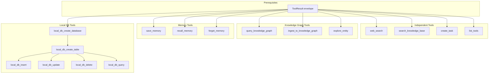

# Standalone Framework — Agentic Tools Implementation Spec

> **Purpose**: This document specifies the 16 agentic tools to be implemented in the standalone Go framework. It provides the exact contracts, struct definitions, architectural patterns, and rationale needed for another agent to implement them without access to the X codebase.

---

## Table of Contents

1. [Architecture Overview](#1-architecture-overview)
2. [Tool Result Envelope](#2-tool-result-envelope)
3. [Tool Specifications](#3-tool-specifications)
   - [3.1 Research & Search](#31-research--search)
   - [3.2 Knowledge Graph](#32-knowledge-graph)
   - [3.3 Persistent Memory](#33-persistent-memory)
   - [3.4 Task Orchestration](#34-task-orchestration)
   - [3.5 Meta / Discovery](#35-meta--discovery)
   - [3.6 Local Database (6 tools)](#36-local-database-6-tools)
4. [Local DB — Extended Rationale](#4-local-db--extended-rationale)
5. [Implementation Order](#5-implementation-order)
6. [Test Strategy](#6-test-strategy)

---

## 1. Architecture Overview

Every tool is a Go struct that implements the `ToolDef` interface. The framework registers tools by name and exposes their JSON schemas to the LLM for function calling.

```go
// ToolDef is the interface every tool must implement.
type ToolDef interface {
    // Name returns the unique tool identifier (e.g. "web_search").
    Name() string
    // Description returns the LLM-facing description of when/how to use this tool.
    Description() string
    // Parameters returns the JSON Schema for the tool's input parameters.
    // This is serialized into the LLM's function-calling schema.
    Parameters() map[string]any
    // Execute runs the tool with the given JSON input and returns a ToolResult.
    Execute(ctx context.Context, input json.RawMessage) (*ToolResult, error)
}
```

### Key Principles

1. **Every tool returns a `*ToolResult`** — `{ Success, Data, Error, Hint, RelatedTools, Meta }`
2. **Tools receive `context.Context`** — for cancellation, timeouts, and request-scoped values (userId, etc.)
3. **Tool results include `Meta`** — timing, tool name, timestamp, and optional record count (injected via the `WithToolMeta` middleware)
4. **Error handling includes navigational hints** — on failure, include `Hint` (what to try next) and `RelatedTools` (alternatives)
5. **Tools are registered in a `map[string]ToolDef`** — the agent loop passes this map to the LLM's `tools` parameter

### Dependency Graph



---

## 2. Tool Result Envelope

Every tool must return this shape. Implement `ToolError()`, `ToolSuccess()`, and `WithToolMeta()` as shared utilities.

```go
// ToolResultMeta holds execution metadata appended to every tool result.
type ToolResultMeta struct {
    Tool        string `json:"tool"`                  // tool name (e.g. "web_search")
    DurationMs  int64  `json:"durationMs"`            // execution time in milliseconds
    Timestamp   string `json:"timestamp"`             // ISO 8601 timestamp
    RecordCount *int   `json:"recordCount,omitempty"` // heuristic count of returned records
}

// ToolResult is the standardised response envelope for all tools.
type ToolResult struct {
    Success      bool            `json:"success"`
    Data         any             `json:"data,omitempty"`
    Error        string          `json:"error,omitempty"`
    Hint         string          `json:"hint,omitempty"`         // what the agent should try next
    RelatedTools []string        `json:"relatedTools,omitempty"` // alternative tools to try
    Meta         *ToolResultMeta `json:"_meta,omitempty"`
}
```

### Helper functions

| Function | Signature | Purpose |
|----------|-----------|---------|
| `ToolError` | `(msg string, opts ...ErrorOption) *ToolResult` | Create a standardised error with optional hint and related tools |
| `ToolSuccess` | `(data any, opts ...SuccessOption) *ToolResult` | Create a standardised success result |
| `WithToolMeta` | `(toolName string, fn ExecuteFn) ExecuteFn` | Middleware that wraps an Execute function to inject `_meta` timing |

```go
// ErrorOption configures optional fields on an error result.
type ErrorOption func(*ToolResult)

func WithHint(hint string) ErrorOption { ... }
func WithRelatedTools(tools ...string) ErrorOption { ... }

// ToolError creates a standardised error result with navigational hints.
func ToolError(msg string, opts ...ErrorOption) *ToolResult {
    r := &ToolResult{Success: false, Error: msg}
    for _, opt := range opts {
        opt(r)
    }
    return r
}

// ToolSuccess creates a standardised success result.
func ToolSuccess(data any) *ToolResult {
    return &ToolResult{Success: true, Data: data}
}

// WithToolMeta wraps an Execute function to inject timing metadata.
func WithToolMeta(toolName string, fn ExecuteFn) ExecuteFn {
    return func(ctx context.Context, input json.RawMessage) (*ToolResult, error) {
        start := time.Now()
        result, err := fn(ctx, input)
        if err != nil {
            return nil, err
        }
        result.Meta = &ToolResultMeta{
            Tool:      toolName,
            DurationMs: time.Since(start).Milliseconds(),
            Timestamp: time.Now().UTC().Format(time.RFC3339),
        }
        // Heuristic record count from Data
        if slice, ok := result.Data.([]any); ok {
            n := len(slice)
            result.Meta.RecordCount = &n
        }
        return result, nil
    }
}
```

---

## 3. Tool Specifications

### 3.1 Research & Search

---

#### `web_search`

**Purpose**: Search the web for current information not in the LLM's training data.

**When the LLM should call this**: When the user asks for up-to-date information, news, current prices, recent events, or anything that requires live web data.

**Input struct**:
```go
type WebSearchInput struct {
    Query      string `json:"query"`                // required — the search query
    MaxResults *int   `json:"maxResults,omitempty"`  // optional — max results (default: 5)
}
```

**Execute contract**:
1. Call a backend search API (multi-engine: Google → Brave → Bing → DDG fallback chain)
2. Return `ToolSuccess(WebSearchResult{...})` on success
3. On failure: return `ToolError(msg)` — never return a Go `error`; always wrap in ToolResult

**Return data shape**:
```go
type WebSearchResult struct {
    Results []SearchResult `json:"results"`
    Query   string         `json:"query"`
    Source  string         `json:"source"` // "adapter" or "data-service"
}

type SearchResult struct {
    Title   string `json:"title"`
    URL     string `json:"url"`
    Snippet string `json:"snippet"`
}
```

---

#### `search_knowledge_base`

**Purpose**: Semantic search over user-uploaded internal documents (policies, handbooks, SOPs, product docs).

**When the LLM should call this**: When the user asks about internal company information that should be in uploaded documents. NOT for live CRM or integration data.

**Input struct**:
```go
type SearchKBInput struct {
    Query string `json:"query" validate:"required,min=1"` // natural-language search query
    Limit *int   `json:"limit,omitempty"`                 // max excerpts (default 5, max 10)
}
```

**Execute contract**:
1. `POST /kb/search` with `{ userId, query, limit }`
2. Return formatted excerpts with document names and relevance scores
3. HTTP 503 = no embedding model configured (return specific error message)

**Return data shape**:
```go
type KBSearchResult struct {
    Results []KBExcerpt `json:"results"`
    Message string      `json:"message"`
}

type KBExcerpt struct {
    Document  string `json:"document"`   // source document name
    Excerpt   string `json:"excerpt"`    // relevant text chunk
    Relevance string `json:"relevance"`  // e.g. "87%"
    ChunkIdx  int    `json:"chunkIndex"`
}
```

---

### 3.2 Knowledge Graph

Three tools that give the agent a **persistent relational memory** — a graph of entities (people, companies, deals, events, topics, news) and their relationships.

---

#### `query_knowledge_graph`

**Purpose**: Natural-language relational query over the knowledge graph. Answers "How does X affect Y?" and "Who is connected to Z?" questions.

**Input struct**:
```go
type QueryKGInput struct {
    Query     string   `json:"query"`               // required — natural-language question
    NodeTypes []string `json:"nodeTypes,omitempty"`  // restrict to: person, company, deal, document, event, topic, news, account
    MaxHops   *int     `json:"maxHops,omitempty"`    // relationship hops (default 2, max 5)
    TopK      *int     `json:"topK,omitempty"`       // max results (default 10, max 50)
}
```

**Execute contract**: `GET /knowledge-graph/query?q=...&nodeTypes=...&maxHops=...&topK=...`

**Return data shape**:
```go
type KGQueryResult struct {
    NodeCount int      `json:"nodeCount"`
    EdgeCount int      `json:"edgeCount"`
    Nodes     []KGNode `json:"nodes"`
    Edges     []KGEdge `json:"edges"`
    Summary   string   `json:"summary"`
}
```

---

#### `ingest_to_knowledge_graph`

**Purpose**: Add entities and relationships from new information (chat, research, integrations).

**Input struct**:
```go
type IngestKGInput struct {
    Source    string       `json:"source"`             // "salesforce", "research", "chat", "web_search"
    Entities []KGEntity   `json:"entities"`            // required — at least one
    Relations []KGRelation `json:"relations,omitempty"` // optional
}

type KGEntity struct {
    ID       string         `json:"id"`
    Type     string         `json:"type"`     // person, company, deal, document, event, topic, news, account
    Name     string         `json:"name"`
    Metadata map[string]any `json:"metadata,omitempty"`
}

type KGRelation struct {
    SourceID string         `json:"sourceId"`
    TargetID string         `json:"targetId"`
    Type     string         `json:"type"`     // works_at, owns_deal, related_to, mentions, attended_by, impacts, derived_from
    Metadata map[string]any `json:"metadata,omitempty"`
}
```

**Execute contract**: `POST /knowledge-graph/ingest` with `{ source, entities, relations }`

**Return data shape**: `{ success, nodesAdded int, edgesAdded int, message string }`

---

#### `explore_entity`

**Purpose**: Retrieve the neighbourhood of a known entity — all connected entities within N hops.

**Input struct**:
```go
type ExploreEntityInput struct {
    EntityID string `json:"entityId"`            // required — entity ID from a previous query
    MaxHops  *int   `json:"maxHops,omitempty"`   // hop depth (default 2, max 4)
}
```

**Execute contract**: `GET /knowledge-graph/entity/{id}/neighborhood?hops=N`

**Return data shape**:
```go
type ExploreEntityResult struct {
    EntityID  string   `json:"entityId"`
    MaxHops   int      `json:"maxHops"`
    NodeCount int      `json:"nodeCount"`
    EdgeCount int      `json:"edgeCount"`
    Nodes     []KGNode `json:"nodes"`
    Edges     []KGEdge `json:"edges"`
}
```

---

### 3.3 Persistent Memory

Three tools for **explicit long-term memory** — the agent can save, search, and delete knowledge across conversations.

> [!IMPORTANT]
> Memory is distinct from the Knowledge Graph. **Memory** stores learned _behavioral_ knowledge (corrections, preferences, strategies, anti-patterns). **Knowledge Graph** stores _relational entity data_ (people, companies, deals, and their connections). Both persist across conversations, but they serve fundamentally different purposes.

---

#### `save_memory`

**Purpose**: Persist a piece of reusable knowledge for future conversations.

**Input struct**:
```go
type SaveMemoryInput struct {
    // Type classifies the memory:
    //   "correction"   = user corrected your output
    //   "preference"   = user style/format preferences
    //   "insight"      = domain knowledge learned
    //   "strategy"     = approach that worked well
    //   "anti_pattern" = something to avoid
    //   "fact"         = objective fact about user/company
    Type       string   `json:"type" validate:"required,oneof=correction preference insight strategy anti_pattern fact"`
    Content    string   `json:"content" validate:"required,min=5"` // self-contained statement
    Context    string   `json:"context,omitempty"`                 // when/why this was created
    Confidence *float64 `json:"confidence,omitempty"`              // 0.0–1.0 (default 0.7)
    // Source describes how this was learned:
    //   "user_correction", "auto_reflection", "feedback", "manual", "tool_observation"
    Source     string   `json:"source,omitempty"`
}
```

**Execute contract**: `POST /memory/items` with `{ userId, type, content, context, confidence, source }`

---

#### `recall_memory`

**Purpose**: Search persistent memory at the start of tasks to check for prior learnings.

**When to call**: Proactively at the start of tasks to check if anything relevant was learned before.

**Input struct**:
```go
type RecallMemoryInput struct {
    Query         string   `json:"query" validate:"required"`       // natural-language search
    Type          string   `json:"type,omitempty"`                  // filter by memory type
    MinConfidence *float64 `json:"minConfidence,omitempty"`         // min threshold (default 0.5)
    Limit         *int     `json:"limit,omitempty"`                 // max results (default 10, max 20)
}
```

**Execute contract**: `GET /memory/items?userId=...&q=...&type=...&minConfidence=...&limit=...`

**Side effect**: Bumps `accessCount` for each recalled memory (fire-and-forget `POST /memory/items/{id}/access` in a goroutine).

---

#### `forget_memory`

**Purpose**: Delete an outdated or incorrect memory by ID.

**Input struct**:
```go
type ForgetMemoryInput struct {
    MemoryID string `json:"memoryId" validate:"required"` // memory item ID
    Reason   string `json:"reason,omitempty"`              // why this is being deleted
}
```

**Execute contract**: `DELETE /memory/items/{id}`

---

### 3.4 Task Orchestration

---

#### `create_task`

**Purpose**: Launch a multi-agent Task that works on a complex goal autonomously. An Orchestrator agent coordinates the work and spawns specialist sub-agents as needed.

**When to call**: For complex, multi-step operations: parallel investigations, background research across multiple sources, automated operations.

**Input struct**:
```go
type CreateTaskInput struct {
    Name      string `json:"name" validate:"required"`    // display name
    Goal      string `json:"goal" validate:"required"`    // high-level goal
    Objective string `json:"objective,omitempty"`          // detailed success criteria
    Model     string `json:"model,omitempty"`              // LLM model for the Orchestrator
    MaxCycles *int   `json:"maxCycles,omitempty"`          // max reasoning cycles (default 20, max 50)
    AutoStart *bool  `json:"autoStart,omitempty"`          // start immediately (default false)
    ProjectID string `json:"projectId,omitempty"`          // group under a project
}
```

**Execute contract**: `POST /tasks` → returns `{ id, name, goal, queenId, status }`

---

### 3.5 Meta / Discovery

---

#### `list_tools`

**Purpose**: Let the agent **introspect** its own tool registry — discover available tools, filter by namespace, and optionally retrieve full parameter schemas.

**Why this exists**: With many tools, including all schemas in the system prompt would consume too many tokens. Instead, extended-tier tools have collapsed schemas and the agent calls `list_tools` to discover details on demand.

**Input struct**:
```go
type ListToolsInput struct {
    Namespace         string `json:"namespace,omitempty"`         // filter by namespace (e.g. "salesforce")
    IncludeParameters *bool  `json:"includeParameters,omitempty"` // include full JSON schemas (default false)
}
```

**Execute contract**:
1. Receive the tool registry (`map[string]ToolDef`) via the tool's constructor (dependency injection)
2. Iterate tool entries, filter by namespace (match namespace metadata OR tool name prefix)
3. Exclude `list_tools` itself from the output
4. If `IncludeParameters` is true, call each tool's `Parameters()` method and include the JSON schema

**Return data shape**:
```go
type ListToolsResult struct {
    TotalCount int            `json:"totalCount"`
    Namespace  string         `json:"namespace,omitempty"`
    Tools      []ToolSummary  `json:"tools"`
}

type ToolSummary struct {
    Name        string         `json:"name"`
    Description string         `json:"description"`
    Namespace   string         `json:"namespace,omitempty"`
    Tier        string         `json:"tier,omitempty"`        // "core" or "extended"
    Parameters  map[string]any `json:"parameters,omitempty"` // JSON Schema if requested
}
```

---

### 3.6 Local Database (6 tools)

> [!IMPORTANT]
> **See [Section 4](#4-local-db--extended-rationale) for the full rationale.** The Local DB is the agent's structured working memory — a critical capability that lets the agent build, query, and manage relational datasets without touching external systems.

All 6 tools share a common dispatch pattern: they call the backend via `POST /api/tools/execute` with `{ tool: toolName, args, context: { userId } }`.

---

#### `local_db_create_database`

**Purpose**: Provision a new named local SQLite database file.

**Input struct**:
```go
type CreateDatabaseInput struct {
    Name        string `json:"name" validate:"required,min=1,max=64"`  // human-readable name
    Description string `json:"description,omitempty" validate:"max=255"` // what this database stores
}
```

**Return data shape**:
```go
type CreateDatabaseResult struct {
    ID   int    `json:"id"`
    Name string `json:"name"`
    Path string `json:"path"`
}
```

---

#### `local_db_create_table`

**Purpose**: Add a table with typed columns to an existing local database.

**Automatic columns**: `id INTEGER PRIMARY KEY`, `created_at`, `updated_at` are added automatically — the agent should only specify domain-specific columns.

**Input struct**:
```go
type CreateTableInput struct {
    DbID      int         `json:"dbId" validate:"required,gt=0"`       // database ID from create_database
    TableName string      `json:"tableName" validate:"required,min=1,max=64"`
    Columns   []ColumnDef `json:"columns" validate:"required,min=1"`   // domain-specific columns only
}

type ColumnDef struct {
    Name         string `json:"name" validate:"required"`                      // column name
    Type         string `json:"type" validate:"required,oneof=TEXT INTEGER REAL BLOB"` // SQLite storage type
    PrimaryKey   *bool  `json:"primaryKey,omitempty"`
    NotNull      *bool  `json:"notNull,omitempty"`
    Unique       *bool  `json:"unique,omitempty"`
    DefaultValue any    `json:"defaultValue,omitempty"` // string or number; SQL expressions as strings
}
```

---

#### `local_db_insert`

**Purpose**: Insert a single row. Do not include `id`, `created_at`, or `updated_at`.

**Input struct**:
```go
type InsertInput struct {
    DbID      int            `json:"dbId" validate:"required,gt=0"`
    TableName string         `json:"tableName" validate:"required,min=1"`
    Data      map[string]any `json:"data" validate:"required"` // column → value pairs
}
```

---

#### `local_db_update`

**Purpose**: Update rows matching an equality filter. `updated_at` is set automatically.

**Input struct**:
```go
type UpdateInput struct {
    DbID      int            `json:"dbId" validate:"required,gt=0"`
    TableName string         `json:"tableName" validate:"required,min=1"`
    Data      map[string]any `json:"data" validate:"required"`  // fields to update
    Where     map[string]any `json:"where" validate:"required"` // equality filter (AND); at least one condition
}
```

> [!WARNING]
> The `Where` field must contain at least one condition. An empty `Where` must be rejected to prevent full-table updates.

---

#### `local_db_delete`

**Purpose**: Delete rows matching an equality filter. At least one WHERE condition is always required.

**Input struct**:
```go
type DeleteInput struct {
    DbID      int            `json:"dbId" validate:"required,gt=0"`
    TableName string         `json:"tableName" validate:"required,min=1"`
    Where     map[string]any `json:"where" validate:"required"` // equality filter (AND); at least one condition
}
```

> [!WARNING]
> The `Where` field must contain at least one condition. An empty `Where` must be rejected to prevent full-table deletes.

---

#### `local_db_query`

**Purpose**: Execute a read-only `SELECT` statement. Only `SELECT` (and `WITH...SELECT` CTEs) are permitted.

**Input struct**:
```go
type QueryInput struct {
    DbID int    `json:"dbId" validate:"required,gt=0"`
    SQL  string `json:"sql" validate:"required,min=1"` // valid SQLite SELECT statement
}
```

> [!CAUTION]
> The implementation **must** validate that the SQL starts with `SELECT` or `WITH` (followed eventually by `SELECT`). Reject any `INSERT`, `UPDATE`, `DELETE`, `DROP`, `ALTER`, `CREATE`, `PRAGMA`, or other mutation statements. Use a simple prefix check or an AST parser.

---

## 4. Local DB — Extended Rationale

> [!NOTE]
> This section explains **why** the Local DB is critical and how it transforms the agent from a stateless question-answerer into a persistent data workspace.

### The Problem: LLMs Have No Working Memory

LLMs can reason about data within a single conversation, but they have fundamental limitations:

1. **Context window is finite** — A user pastes 5,000 rows of CSV data, the agent processes it, and the next message evicts it from context. The data is gone.
2. **Cross-conversation amnesia** — "Yesterday we built a prospect list of 200 contacts" means nothing in a new session. The agent has no way to retrieve that list.
3. **No structured storage** — Even with memory tools (`save_memory`), the agent can only store key-value notes, not relational datasets with queryable schemas.
4. **External writes are dangerous** — Writing to Salesforce or HubSpot requires careful proposal → approval flows. The agent needs a safe workspace to manipulate data without touching production systems.

### The Solution: Agent-Owned SQLite Databases

The Local DB gives the agent a **private, persistent, relational workspace** that is:

| Property | What it means |
|----------|---------------|
| **Persistent** | Databases survive across conversations. The agent can build a dataset in session A and query it in session B. |
| **Relational** | Full SQL schema — tables, columns, types, constraints. Not just key-value blobs. |
| **Safe** | Completely isolated from external integrations. No risk of corrupting Salesforce data. |
| **Queryable** | Full SQLite SELECT support including JOINs, CTEs, aggregations, window functions. |
| **User-owned** | Each user has their own database namespace. Databases are visible and manageable in the UI. |
| **Zero-config** | No connection strings, no credentials, no Docker containers. SQLite files on disk. Uses `modernc.org/sqlite` (pure Go, no CGO). |

### Use Cases This Unlocks

#### 1. Data Pipeline Staging
The agent queries Salesforce for pipeline data, queries HubSpot for marketing attribution, and needs to **join them**. With Local DB, it:
- Creates a `pipeline_analysis` database
- Creates `sf_opportunities` and `hs_attribution` tables
- Inserts data from both sources
- Runs a `JOIN` query to produce the combined analysis
- The dataset persists for follow-up questions

#### 2. Progressive List Building
"Help me build a list of prospects that match these criteria." Over multiple conversations:
- Session 1: Create `prospect_db` → `prospects` table → insert 50 from Salesforce
- Session 2: "Add the LinkedIn contacts I found" → insert 30 more
- Session 3: "Remove anyone who hasn't been active in 6 months" → `DELETE WHERE ...`
- Session 4: "Export the final list" → `SELECT * FROM prospects ORDER BY score DESC`

#### 3. Computation Without Context Overflow
User uploads a 10,000-row CSV. Instead of keeping it all in context:
- Agent creates a table, inserts all rows
- Runs analytical `SELECT` queries (GROUP BY, aggregations)
- Context only holds the query results, not the raw data
- Data is available for follow-up analysis in future sessions

#### 4. Safe Experimentation Before Integration Writes
Before proposing a bulk update to Salesforce:
- Agent stages the changes in a local table
- User can review the staged data via `local_db_query`
- Once approved, agent creates proposals from the local table
- Audit trail is preserved locally

#### 5. Agent-Curated Knowledge
The agent discovers patterns while analyzing data:
- "These 15 accounts share a common buying pattern"
- Creates `insights` database → `buying_patterns` table
- Future conversations can query these patterns for proactive recommendations

### Design Decisions

| Decision | Rationale |
|----------|-----------|
| **SQLite via `modernc.org/sqlite`** | Pure Go, no CGO required. Zero-config, embedded, file-based. No server process needed. |
| **Audit columns auto-added** | `id`, `created_at`, `updated_at` on every table ensures traceability without agent overhead |
| **SELECT-only in `local_db_query`** | Mutations go through dedicated insert/update/delete tools so the agent can't accidentally `DROP TABLE` via freeform SQL |
| **Equality-only WHERE in update/delete** | Prevents accidental mass mutations. Complex filtering should use query first, then targeted updates. |
| **`Where` filter is required** | No tool allows a full-table UPDATE or DELETE. This is a safety rail. |
| **Column types are SQLite-native** | `TEXT`, `INTEGER`, `REAL`, `BLOB` — no abstraction layer, maximum compatibility |
| **Always available** | Unlike integration skills that require OAuth, Local DB needs zero external connections |

### Relationship to Other Memory Systems

```
┌─────────────────────────────────────────────────────────────┐
│                     Agent Memory Layers                      │
├──────────────────┬──────────────────┬────────────────────────┤
│   save_memory    │ Knowledge Graph  │    Local Database      │
│   recall_memory  │ query/ingest/    │    6 CRUD tools        │
│   forget_memory  │ explore          │                        │
├──────────────────┼──────────────────┼────────────────────────┤
│ Key-value notes  │ Entity-relation  │ Full relational SQL    │
│ Behavioral       │ graph            │ Structured datasets    │
│ knowledge        │                  │                        │
├──────────────────┼──────────────────┼────────────────────────┤
│ "User prefers    │ "Alice works at  │ SELECT COUNT(*) FROM   │
│  bullet-point    │  Acme Corp which │  prospects WHERE       │
│  format"         │  owns Deal #42"  │  score > 80 AND        │
│                  │                  │  status = 'active'     │
├──────────────────┼──────────────────┼────────────────────────┤
│ Small, sparse    │ Medium, graph    │ Large, tabular         │
│ ~100s of items   │ ~1000s of nodes  │ ~10,000s of rows       │
└──────────────────┴──────────────────┴────────────────────────┘
```

---

## 5. Implementation Order

Implement in this order to satisfy dependencies:

### Phase 1 — Foundations
1. `ToolResult` envelope + `ToolError` / `ToolSuccess` / `WithToolMeta`
2. `ToolDef` interface + tool registry (`map[string]ToolDef`)
3. JSON Schema generation from Go struct tags (for `Parameters()` method)

### Phase 2 — Independent Tools
4. `web_search`
5. `search_knowledge_base`
6. `create_task`
7. `list_tools`

### Phase 3 — Memory & Knowledge
8. `save_memory`
9. `recall_memory`
10. `forget_memory`
11. `query_knowledge_graph`
12. `ingest_to_knowledge_graph`
13. `explore_entity`

### Phase 4 — Local Database
14. `local_db_create_database`
15. `local_db_create_table`
16. `local_db_insert`
17. `local_db_update`
18. `local_db_delete`
19. `local_db_query`

---

## 6. Test Strategy

### Unit Tests (per tool)

Use Go's `testing` package. Every tool should have table-driven tests covering:

| Scenario | What to test |
|----------|--------------|
| **Happy path** | Valid input → expected `ToolResult{Success: true, ...}` |
| **Missing required fields** | Validation rejects → `ToolResult{Success: false, Error: "..."}` |
| **Backend error** | Mock HTTP 500 → `ToolResult{Success: false, Error: ..., Hint: ..., RelatedTools: [...]}` |
| **Not found** | Mock HTTP 404 → tool-specific "not found" message |
| **Network failure** | HTTP client error → graceful ToolResult error (never panic) |
| **`Meta` injection** | `WithToolMeta` wrapper adds timing, tool name, timestamp |
| **Context cancellation** | `ctx.Done()` → immediate return with cancellation error |

```go
func TestWebSearch_HappyPath(t *testing.T) {
    // Setup mock HTTP server
    srv := httptest.NewServer(http.HandlerFunc(func(w http.ResponseWriter, r *http.Request) {
        json.NewEncoder(w).Encode(map[string]any{"results": [...]})
    }))
    defer srv.Close()

    tool := NewWebSearchTool(srv.URL)
    input := `{"query": "Go testing best practices"}`

    result, err := tool.Execute(context.Background(), json.RawMessage(input))
    require.NoError(t, err)
    assert.True(t, result.Success)
    // ... assert result.Data shape
}
```

### Local DB Specific Tests

| Scenario | What to test |
|----------|--------------|
| Create → Table → Insert → Query round-trip | Full lifecycle works end-to-end |
| SELECT-only enforcement | `local_db_query` rejects `INSERT`, `UPDATE`, `DELETE`, `DROP` |
| WHERE required for update/delete | Empty `Where` map → `ToolResult{Success: false}` |
| Auto-columns | `id`, `created_at`, `updated_at` are present without being specified |
| Column type validation | Only `TEXT`, `INTEGER`, `REAL`, `BLOB` accepted |
| Concurrent access | Multiple goroutines reading/writing the same DB safely (SQLite WAL mode) |
