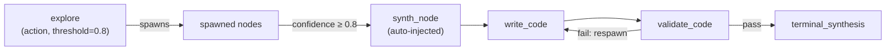
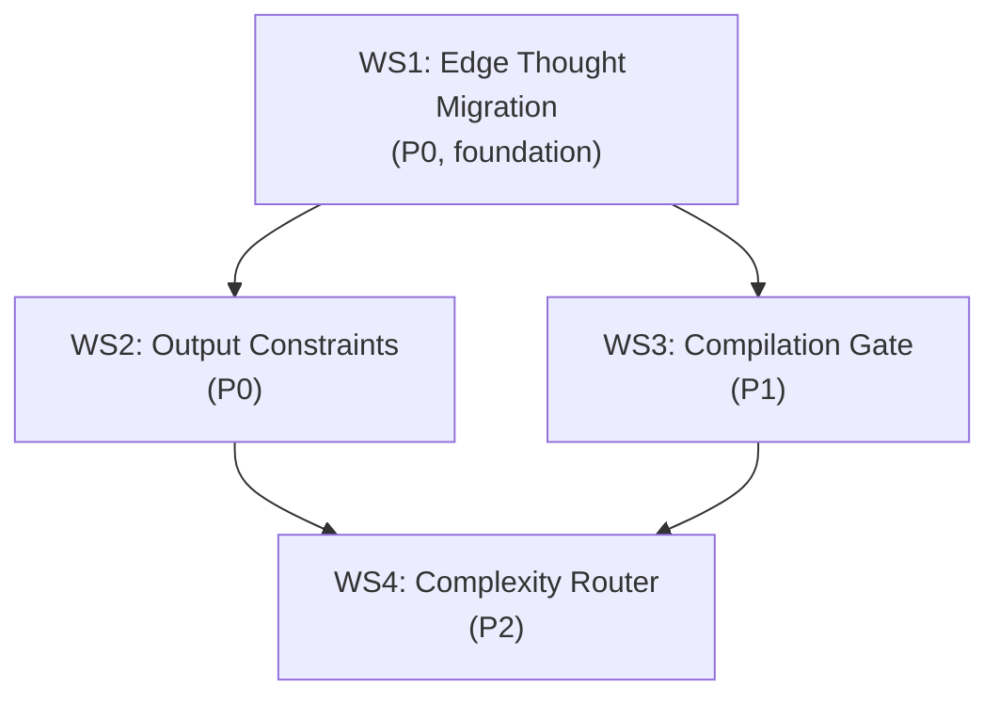

# Codegen Quality Pipeline — Design Spec

**ADR:** [0035](../adr/0035-complete-edge-thought-migration-and-codegen-quality-pipeline.md)
**Date:** 2026-06-29
**Derived from:** Benchmark Run 9 Analysis

---

## Problem Statement

Benchmark run 9 shows the codegen pipeline averages **2.12/5.0 quality** with a 56% failure rate. Root causes cluster into three gaps: no post-generation validation (9/28 failures), probe synthesis outputs docs instead of code (14/28), and language/complexity mismatch (5/28).

Separately, **ADR-0024 (Edge Thought and Activation Threshold)** was fully implemented at the infrastructure layer on 2026-06-07 but never wired into production. The `GlobalEngine` has no `EdgeThoughtInference`, `task.go` still calls `ExecuteGraph` (level-based) instead of `ExecuteGraphReactive` (ready queue), and `RunProbe` (the deprecated Thought Chain loop) remains the only exploration mechanism.

**This spec completes the ADR-0024 migration and builds the codegen quality improvements on top of it.**

---

## Design Decisions

> Resolved in a grill-with-docs session on 2026-06-29.

| # | Question | Decision |
|---|----------|----------|
| 1 | Build on legacy Probe or Edge Thoughts? | **Edge Thoughts** — complete the migration |
| 2 | Phased cutover or big-bang? | **Big-bang** — rollback via one-line revert in `task.go` |
| 3 | How do spawned nodes carry context? | **Rolling compaction** — spawn chain accumulates compacted Edge Thoughts |
| 4 | Where does synthesis happen? | **Auto-injected synthesis node** — inserted when activation gate fires Continue |
| 5 | Where do OutputFormat/OutputLanguage live? | **On `GraphNode`** — static task property, not runtime |
| 6 | Compilation gate: DAG node or post-processing? | **DAG node** — validation command set by **Cloud Planner** |
| 7 | Does `tzro_code` T1–T2 change? | **No** — single-node `reason_code` stays as-is |
| 8 | Backward compat for `type: "probe"`? | **Shim rewrite** — probe → action + threshold 0.8 + budget 15 |
| 9 | Delete `ExecuteGraph`? | **Keep as dead code** — rollback path, delete after benchmark validation |
| 10 | Who decides `tzro_code` complexity? | **Local Model classification** via `tzro_classification` |

---

## Workstreams

### Workstream 1: Complete Edge Thought Migration

**Impact:** Foundation for all other workstreams | **Priority:** P0

Completes ADR-0024 by wiring the existing Edge Thought infrastructure into production.

#### 1.1 Switch executor entry point

**[MODIFY] `internal/task/task.go`**

Change all three production callers from `ExecuteGraph` → `ExecuteGraphReactive`:

```diff
 // ExecuteStatic (L136)
-err = executor.GlobalEngine.ExecuteGraph(ctx, graph, levels)
+err = executor.GlobalEngine.ExecuteGraphReactive(ctx, graph)

 // ExecuteWithGraph (L118)
-err = executor.GlobalEngine.ExecuteGraph(ctx, graph, levels)
+err = executor.GlobalEngine.ExecuteGraphReactive(ctx, graph)

 // Execute (L72)
-err = executor.GlobalEngine.ExecuteGraph(ctx, expanded, levels)
+err = executor.GlobalEngine.ExecuteGraphReactive(ctx, expanded)
```

`CompileAndSort` calls remain for early cycle detection.

#### 1.2 Wire real EdgeThoughtInference

**[NEW] `internal/executor/edge_thought_impl.go`**

Implement the `EdgeThoughtInference` interface using the Local Model:

```go
type DefaultEdgeThoughtInference struct{}

func (d *DefaultEdgeThoughtInference) GenerateEdgeThought(
    ctx context.Context,
    taskID string,
    sourceNode, targetNode *compiler.GraphNode,
    sourceOutput string,
    stepIndex int,
) (*memory.EdgeThought, error) {
    // System prompt: evaluate whether sourceOutput provides sufficient
    // context for targetNode to achieve the task goal.
    // GBNF schema constrains output to: {thought, goalConfidence, goalAchieved}
    // Uses Local Model — zero cloud cost.
}
```

**[MODIFY] `internal/executor/executor.go`**

```diff
-var GlobalEngine = &ExecutionEngine{}
+var GlobalEngine = &ExecutionEngine{
+    EdgeThoughtGen: &DefaultEdgeThoughtInference{},
+}
```

#### 1.3 Rolling compaction for spawn chains

When `evaluateActivationThreshold` returns `ActivationSpawn`, the spawned node receives accumulated context from the spawn chain.

**[MODIFY] `internal/executor/ready_queue.go`**

Enhance the spawn block to build rolling compacted context:

```go
case ActivationSpawn:
    chainContext := buildSpawnChainContext(graph, nID, targetNode.ID)
    
    spawnedNode := compiler.GraphNode{
        ID:           spawnedID,
        Type:         "action",
        Action:       sourceNode.Action,
        AllowedTools: sourceNode.AllowedTools,
        Instructions: fmt.Sprintf(
            "Goal: %s\n\nAccumulated Context:\n%s\n\nPrevious step result: %s\n\nContinue working toward the goal.",
            graph.GoalPrompt, chainContext, et.Thought),
        Status:              "pending",
        ActivationThreshold: 0.0,
        OutputFormat:        targetNode.OutputFormat,
        OutputLanguage:      targetNode.OutputLanguage,
    }
```

`buildSpawnChainContext` collects outputs from all completed spawned nodes in the chain and applies `TruncateSynthesisContext` for rolling compaction.

#### 1.4 Automatic synthesis node injection

When `evaluateActivationThreshold` returns `ActivationContinue` after spawns have occurred, inject a synthesis node between the last spawn and the target.

**[MODIFY] `internal/executor/ready_queue.go`**

```go
case ActivationContinue:
    spawnedNodes := findSpawnedNodesInChain(graph, nID, targetNode.ID)
    if len(spawnedNodes) > 0 {
        synthID := fmt.Sprintf("synth_%s_%s", nID, targetNode.ID)
        synthNode := compiler.GraphNode{
            ID:             synthID,
            Type:           "synthesis",
            Instructions:   buildSynthesisInstructions(graph, targetNode),
            Status:         "pending",
            OutputFormat:   targetNode.OutputFormat,
            OutputLanguage: targetNode.OutputLanguage,
        }
        injectSynthesisNode(graph, nID, targetNode.ID, synthNode)
    }
```

The synthesis node's instructions include `OutputFormat`/`OutputLanguage` constraints from Workstream 2.

#### 1.5 Probe backward compatibility shim

**[MODIFY] `internal/executor/executor.go` — `executeNode`**

Replace the `if node.Type == "probe"` block with a shim rewrite:

```go
if node.Type == "probe" {
    fmt.Fprintf(os.Stderr, "[Executor] DEPRECATION: Rewriting probe node %s as action node with ActivationThreshold 0.8\n", node.ID)
    node.Type = "action"
    node.ActivationThreshold = 0.8
    if graph.MutationBudget == nil {
        graph.MutationBudget = &compiler.MutationBudget{MaxSpawns: 15, RemainingSpawns: 15}
    }
    // Fall through to normal action node execution
}
```

---

### Workstream 2: Codegen Output Constraints

**Impact:** Fixes 14/28 failures | **Priority:** P0

#### 2.1 Add fields to GraphNode

**[MODIFY] `internal/compiler/compiler.go`**

```diff
 type GraphNode struct {
     // ... existing fields ...
+    OutputFormat    string `json:"outputFormat,omitempty"`    // "source_code" | ""
+    OutputLanguage  string `json:"outputLanguage,omitempty"` // e.g., "go", "typescript"
 }
```

#### 2.2 Format-constrained synthesis

The auto-injected synthesis node reads `OutputFormat`/`OutputLanguage` and constrains its prompt:

```go
func buildSynthesisInstructions(graph *compiler.ExecutionGraph, targetNode *compiler.GraphNode) string {
    base := fmt.Sprintf("Synthesize all exploration findings for: %s", graph.GoalPrompt)
    
    switch targetNode.OutputFormat {
    case "source_code":
        return fmt.Sprintf(`%s

CRITICAL: Output ONLY compilable %s source code.
No markdown, no explanations, no summaries. Complete file content only.`, base, targetNode.OutputLanguage)
    default:
        return base + "\nProduce a comprehensive, structured final answer."
    }
}
```

#### 2.3 Planner prompt update

Add rules to the Strategic Planner system prompt:

```
When a task involves code generation:
1. Set outputFormat: "source_code" on the target write node
2. Set outputLanguage to the detected language
3. Set a validationCommand on a downstream validation node
4. Do NOT emit type: "probe" — use action nodes with activationThreshold: 0.7-0.8
```

---

### Workstream 3: Compilation Gate

**Impact:** Fixes 9/28 failures | **Priority:** P1

#### 3.1 validate_code tool

**[NEW] `internal/tools/validate.go`**

```go
func ValidateCode(command, targetFile string) (*ValidationResult, error) {
    // Shell out to planner-specified command (with timeout)
    // Parse stderr for errors
    // Return: {passed: bool, errors: string, errorCount: int}
}
```

#### 3.2 Retry via activation threshold

The validation node's output feeds back through an Edge Thought. Failed validation triggers a spawn that re-generates code with compiler errors as context. `MutationBudget` caps retries naturally.



---

### Workstream 4: Complexity Router for `tzro_code`

**Impact:** Quality optimization | **Priority:** P2

#### 4.1 Local Model classification

**[MODIFY] `cmd/tzro-mcp/tools.go` — `handleTzroCode`**

```go
tier := classifyComplexity(spec, codeCtx) // calls tzro_classification

switch tier {
case "simple":
    graph = codegen.BuildCodeDAG(...)      // existing single-node path
case "moderate", "complex":
    graph = codegen.BuildCodeDAGWithExploration(...)  // Edge Thought DAG
}
```

#### 4.2 Edge Thought DAG for complex codegen

**[NEW] `codegen.BuildCodeDAGWithExploration`**

Builds a DAG with an exploration action node (with activation threshold), a write node, and a validation node. The exploration node spawns tool-calling nodes via Edge Thoughts, which are synthesized into code via the auto-injected synthesis node.

---

## Dependency Graph



**Implementation order:** W1 → W2 → W3 → W4

---

## Files Changed Summary

| Workstream | Action | File | Change |
|-----------|--------|------|--------|
| WS1 | MODIFY | `internal/task/task.go` | Switch to `ExecuteGraphReactive` (3 sites) |
| WS1 | NEW | `internal/executor/edge_thought_impl.go` | Real `EdgeThoughtInference` |
| WS1 | MODIFY | `internal/executor/executor.go` | Wire `GlobalEngine`, probe compat shim |
| WS1 | MODIFY | `internal/executor/ready_queue.go` | Rolling compaction, synthesis injection |
| WS2 | MODIFY | `internal/compiler/compiler.go` | `OutputFormat`, `OutputLanguage` on `GraphNode` |
| WS2 | MODIFY | Planner system prompt | Output format rules, stop emitting `probe` |
| WS3 | NEW | `internal/tools/validate.go` | `validate_code` tool |
| WS4 | MODIFY | `cmd/tzro-mcp/tools.go` | Classification in `handleTzroCode` |
| WS4 | NEW/MODIFY | `internal/codegen/codegen.go` | `BuildCodeDAGWithExploration` |

## Verification

```bash
go test ./... -count=1          # All existing tests pass
go build ./...                  # Build check
go test ./internal/benchmark/ -run TestComparison -v -timeout 45m  # Benchmark
```

**Success criteria:** Overall quality ≥ 3.0, `tzro_code` T1-T2 ≥ 2.83, cooperative ≥ 2.5.

**Rollback:** One-line revert in `task.go`: `ExecuteGraphReactive` → `ExecuteGraph`.
