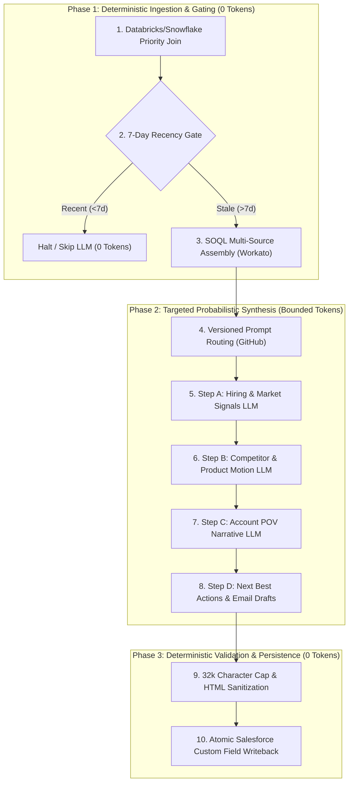

# The Pragmatist’s Blueprint: Why Token Optimization is the Decisive Factor in Enterprise AI Deployment

**Subtitle:** Moving Beyond the Agent Mirage to High-Yield, Bounded Production Systems  
**Author:** PixelTag Consulting (Certified Salesforce Consulting Partner & Enterprise AI Advisory)  
**Target Audience:** Chief Information Officers (CIOs), Chief Technology Officers (CTOs), Chief AI Officers (CAIOs), VPs of Engineering, and VPs of RevOps  
**Venue:** Dreamforce Executive Roundtable & C-Suite Briefing Sessions  
**Publication Date:** September 2026  

---

## Executive Abstract

Enterprise technology leaders attending Dreamforce 2026 face relentless pressure to demonstrate measurable business value from generative AI. Yet across the Global 2000, an uncomfortable consensus has emerged behind closed doors: **over 80% of enterprise AI proofs-of-concept (POCs) fail to transition into sustainable production.**

This failure is rarely attributable to foundation model intelligence. Rather, it is the direct consequence of an architectural blind spot: the absence of an intentional **Token Optimization Strategy**.

When enterprises deploy naive AI architectures—frequently characterized by unconstrained "autonomous agent" loops and unstructured context stuffing—they hit a triple-headed operational barrier:
1. **The Quadratic Cost Cliff:** Multi-turn conversational loops accumulate conversational history exponentially, driving routine task costs from pennies to \$15–\$25 per run.
2. **The Latency and Reliability Tax:** Unbounded, probabilistic tool-calling sequences introduce 30–90 seconds of network latency and compound error rates, leading to schema drift, hallucinated database writes, and broken customer workflows.
3. **The Data Perimeter Dilemma:** Shipping raw customer records, proprietary schemas, and call transcripts across third-party cloud boundaries creates severe compliance, GDPR, and SOC 2 vulnerabilities.

This executive whitepaper establishes that token optimization is not a post-launch FinOps cleanup task or a collection of prompt-engineering tips. It is an **end-to-end systems architecture discipline**. 

Drawing on production deployments from PixelTag Consulting—including **`Appear`** (our Salesforce-native sales intelligence engine), **`Simple Analytics`** (our native AppExchange AI analytics package), and **`tzro`** (our open reference architecture for runtime token shielding)—we present the **Two-Pillar Token Optimization Framework**:
* **Pillar 1: Design-Time Governance (Functional Requirements & Architectural Fitness):** Mandating structural discipline before code is written, replacing fragile autonomous agents with deterministic Directed Acyclic Graphs (DAGs) and multi-pass pipelines wherever inputs and outputs are bounded.
* **Pillar 2: Runtime Shielding (Systems & Infrastructure Defense):** Deploying an on-device systems perimeter that enforces byte-level KV-cache prefix stability (avoiding the 12.5x cache miss penalty), structural syntax skeletonization (70–90% token reduction), sub-millisecond local discovery, and zero-cloud Data Loss Prevention (DLP).

Finally, we equip technology executives with the **Dreamforce Diagnostic Rubric**—five diagnostic questions to audit production readiness on Monday morning—and outline a **Bounded Pilot Program** to transition struggling AI initiatives into lean, high-yield enterprise assets.

---

## 1. The Enterprise AI Production Cliff

```
NAIVE CLOUD AGENT ARCHITECTURE (Quadratic Token Burn & Failure Drift)
┌─────────────────────────────────────────────────────────────────────────────┐
│ Turn 1 (Prompt + All Data)  --> 15k tokens ($)                              │
│ Turn 2 (Accumulated History) --> 32k tokens ($$)                            │
│ Turn 3 (Tool Output + History) --> 68k tokens ($$$)                         │
│ ...                                                                         │
│ Turn 15 (Hallucination / Timeout) --> 210k tokens ($$$$) -> RUNTIME CRASH   │
└─────────────────────────────────────────────────────────────────────────────┘

OPTIMIZED TWO-PILLAR ARCHITECTURE (Bounded, Deterministic, Shielded)
┌─────────────────────────────────────────────────────────────────────────────┐
│ [Pillar 1: Design-Time Governance]                                          │
│ • Appear: Ingestion (0 tok) -> 7d Gate (0 tok) -> Targeted LLM -> Write    │
│ • Simple Analytics: Compact Index (500 tok) -> Scoped Describe -> SQL (0 tok)│
│                                                                             │
│ [Pillar 2: Runtime Shielding]                                               │
│ KV-Cache Lock (12.5x Savings) + AST Skeletons (80% Pruning) + Loopback DLP  │
└─────────────────────────────────────────────────────────────────────────────┘
```

Throughout 2024 and 2025, enterprise IT budgets were dominated by exploration. Organizations funded dozens of generative AI pilots: customer service bots, automated RevOps assistants, code-refactoring agents, and strategic intelligence synthesizers. 

In controlled demonstration environments with static test datasets, these systems appeared revolutionary. However, as organizations attempt to operationalize these solutions at enterprise scale in 2026, engineering teams are encountering the **Production Cliff**.

### The Three Structural Bottlenecks of Naive AI

The underlying cause of production failure is the naive adoption of the "chat-with-your-data" and "unconstrained autonomous agent" paradigms. When applied to structured enterprise workflows, this approach triggers three systemic crises:

#### 1. The Quadratic Cost Inflation (The "Agent Tax")
In a standard autonomous agent pattern (such as ReAct or AutoGPT variants), the model is placed in an iterative execution loop. At each step, the model receives its initial instructions, the complete conversation history, all tool schema definitions, and the raw outputs of previous tool calls. 

Because context accumulates monotonically with each turn, token consumption scales quadratically with task complexity:
$$\text{Tokens}_{\text{total}} = \sum_{k=1}^{N} \left( \text{Base Prompt} + \sum_{j=1}^{k} \text{Tool Output}_j \right) \propto \mathcal{O}(N^2)$$

A task requiring 15 tool executions does not consume $15 \times \text{cost}$; it frequently burns between 150,000 and 400,000 tokens. When multiplied across thousands of accounts, leads, or support tickets per day, the resulting cloud API bill destroys project unit economics.

#### 2. Probabilistic Latency Cascades and Schema Drift
In enterprise software engineering, deterministic reliability is paramount. A database transaction or CRM status update must either succeed completely or roll back cleanly. 

Autonomous agents introduce probabilistic drift at every step. If an agent has a 95% step-level parameter extraction accuracy, the end-to-end reliability of a 10-step autonomous sequence drops precipitously:
$$\text{Reliability} = 0.95^{10} \approx 59.8\%$$

More than 40% of multi-turn agent runs fail due to hallucinated tool arguments, syntax errors, or circular exploration loops. Furthermore, chaining 10 sequential round-trips to cloud LLMs across external networks introduces 20 to 60 seconds of cumulative latency, rendering real-time or interactive use cases non-viable.

#### 3. Data Perimeter and Compliance Exposure
Enterprise systems of record—most notably Salesforce, SAP, and Snowflake—house highly confidential data: customer PII, contract pricing, executive contact notes, and proprietary database schemas.

Naive AI deployments often pipe raw database tables and unstructured logs directly into cloud LLM prompts. This practice creates severe security and regulatory exposure:
* **PII Leakage:** Customer contact information and proprietary financial terms are transmitted over third-party APIs without audit trails.
* **Schema Egress:** Internal table structures and metadata are exposed to external model logs, violating enterprise threat-modeling standards.
* **Compliance Invalidation:** Regulated enterprises in life sciences, financial services, and healthcare risk non-compliance with GDPR, HIPAA, and SOC 2 Trust Principles.

---

## 2. Pillar 1: Design-Time Governance (Functional Requirements & Architectural Fitness)

The first line of defense against the Token Production Cliff occurs before a single prompt is written or an API key is provisioned. **Design-Time Governance** enforces that engineering and product teams match the functional requirements of a use case to the most deterministic, token-efficient architectural pattern capable of fulfilling it.

### The Architectural Fitness Spectrum

Enterprise architects must evaluate every proposed AI initiative against a four-tier hierarchy of execution models:

| Tier | Architectural Pattern | Execution Model | Token Cost Profile | Reliability SLA | Ideal Enterprise Fit |
| :--- | :--- | :--- | :--- | :--- | :--- |
| **Tier 1** | **Deterministic Code & SQL** | Rule-based, algorithmic | **0 Tokens** | 100% Deterministic | Data extraction, joins, arithmetic scoring, schema validation, CRUD operations. |
| **Tier 2** | **Hybrid Directed Acyclic Graphs (DAGs)** | Structured, linear/parallel dependency graph | **Bounded & Linear** | 99%+ with structured fallbacks | Multi-source data synthesis, automated account briefs, batch CRM enrichment, document parsing. |
| **Tier 3** | **Finite State Machines (FSMs)** | Governed transitions with retry limits | **Bounded with retry caps** | High, governed loops | Interactive customer support, multi-tier approval routing, escalation trees. |
| **Tier 4** | **Autonomous Agent Loops (ReAct)** | Open-ended cognitive loops with dynamic tool choice | **Unbounded & Quadratic** | Low (probabilistic drift) | Open-ended exploratory research, novel anomaly diagnosis (never routine operations). |

### The Core Anti-Pattern: "Agent Hype" in Enterprise Operations

The predominant architectural mistake of the current AI cycle is using Tier 4 (Autonomous Agents) to solve Tier 2 (Hybrid DAG) problems. 

When a team is asked to automate an enterprise workflow—such as preparing an account intelligence summary for a sales rep—the naive instinct is to provision an LLM with five tool definitions (Salesforce API, ZoomInfo API, 6sense API, Snowflake connector, Chorus transcript search) and instruct it: *"Research this account and update Salesforce."*

This approach fails systematically:
* The model wastes multiple cognitive turns discovering which APIs to call, often querying irrelevant tables.
* Output formats drift across runs, breaking downstream integrations.
* Costs skyrocket to \$15.00–\$25.00 per account run.

Enterprise operational workflows are inherently structured. The data sources are known in advance; the business logic is definable; the destination schema is fixed. Deploying an unconstrained agent for these tasks represents architectural negligence.

---

### Enterprise Case Study: `Appear` (Salesforce-Native Sales Intelligence)

To demonstrate the transformative power of Design-Time Governance, PixelTag developed **`Appear`**—an AI sales intelligence platform operating natively within Salesforce.

#### The Business Objective
Enterprise sales reps at high-growth and pre-IPO SaaS organizations spend an average of 4–6 hours per week manually researching accounts. They scour LinkedIn, recent news, ZoomInfo firmographics, 6sense buyer intent signals, and historical CRM activity to build an **Account Point of View (Account POV)** and determine their **Next Best Actions**.

The objective of `Appear` is to automate this process end-to-end, delivering a comprehensive, board-level intelligence brief directly into native Salesforce custom fields (`AccountPOV__c`, `Next_Best_Actions__c`) and generating personalized outreach sequences for every prioritized account each week.

#### The Architecture: A 10+ Step Hybrid DAG
Rather than deploying an open-ended conversational agent, PixelTag structured `Appear` as a high-precision, 10+ step hybrid DAG that strictly segregates deterministic systems work from targeted probabilistic reasoning:



1. **Step 1: Deterministic Scoring & Priority Joins (0 Tokens):** Databricks or Snowflake joins raw Salesforce account records with machine learning propensities, 6sense intent spikes, and ZoomInfo updates to rank accounts by priority score (0–100). Zero tokens consumed.
2. **Step 2: Deterministic Recency Gating (0 Tokens):** Before any generative task is initiated, the orchestrator checks `POV_Last_Generated__c`. If an account brief was generated within the preceding 7 days and no major stage change has occurred, the pipeline terminates immediately. This single deterministic rule eliminates over 40% of redundant inference costs.
3. **Step 3: Deterministic Data Assembly (0 Tokens):** A dedicated integration helper executes optimized SOQL queries across nine enterprise sources: CRM fields, Chorus call summaries, ZoomInfo corporate data, email activity metrics, case histories, and trial engagement logs.
4. **Step 4: Version-Controlled Content Routing (0 Tokens):** Prompts are pulled from version-controlled GitHub repositories. The orchestrator determines the correct enterprise motion (e.g., Enterprise Expansion vs. Greenfield Acquisition) and injects targeted product messaging.
5. **Steps 5–8: Targeted Probabilistic Synthesis (Bounded Tokens):** The pipeline executes sequential, single-hop LLM inferences with strict schemas:
   * *Inference A:* Extract and synthesize hiring trends and executive leadership shifts.
   * *Inference B:* Analyze competitive positioning against incumbent tooling.
   * *Inference C:* Synthesize the core Account POV executive narrative.
   * *Inference D:* Generate five personalized email drafts and channel scripts.
6. **Step 9: Deterministic Formatting & Bounds Validation (0 Tokens):** Output strings are validated against Salesforce rich-text limits (32,000 characters), sanitized for valid HTML rendering, and verified against forbidden terminology lists.
7. **Step 10: Atomic Salesforce Persistence (0 Tokens):** Results are written atomically into custom Salesforce objects (`AccountPOV__c`, `Prospect_POV_HTML__c`, `Next_Best_Actions__c`), triggering rep notification badges without external UI navigation.

#### Business & Operational Impact
By replacing a naive agent loop with a governed hybrid DAG, `Appear` achieved:
* **Cost Predictability:** Execution costs dropped from an estimated \$15.00–\$20.00 per account to an optimized target **benchmarked at sub-dollar per account** (under \$0.50 per account using modern high-efficiency foundation models).
* **Guaranteed Latency SLA:** End-to-end execution completed consistently within **60–90 seconds**, compared to unpredictable 3- to 5-minute agent timeouts.
* **100% Schema Consistency:** Exactly zero broken database writes or malformed JSON payloads across tens of thousands of account runs.

---

### Enterprise Case Study 2: `Simple Analytics` (Bridging Tier 2 Structured Pipelining to Tier 1 SQL)

While `Appear` demonstrates how a Tier 2 Hybrid DAG synthesizes complex multi-source narrative intelligence, PixelTag's **`Simple Analytics`** (`ptdash`) demonstrates an equally vital design-time pattern: **using a Tier 2 structured pipeline to produce Tier 1 deterministic SQL/SOQL, solving the "Enterprise Schema Bloat" crisis in Text-to-Analytics.**

#### The Challenge: The Enterprise Schema Bloat Trap
A common enterprise objective is enabling business users to generate real-time analytics from natural language (e.g., *"Show me our sales pipeline by stage, product line, and rep this quarter"*).

However, an enterprise Salesforce environment routinely contains **500+ standard and custom objects, tens of thousands of fields**, complex lookup hierarchies, and system audit tables.

When teams attempt to build Text-to-Dashboard systems naively, they fall into the **Monolithic Schema Dump Anti-Pattern**:
* They serialize the org's complete schema into a single prompt.
* **The Consequences:** Input context balloons to **100,000–500,000+ tokens per request**, costing **\$0.50 to \$3.00+ per query**, inducing 15–30 seconds of latency, and causing massive hallucinations (such as joining against deprecated custom objects or system audit tables) due to overwhelming schema noise.

#### The Solution: The Two-Pass Chained Queueable Architecture
`Simple Analytics` solves this by introducing an asynchronous, two-pass pipeline (implemented in native Apex chained Queueables) that enforces structural gating before any analytical queries are generated:

```
User Natural Language Prompt
             │
             ▼
┌─────────────────────────────────────────────────────────────┐
│ Pass 1: ObjectSelectionQueueable (Q1 - High-Speed Router)    │
│ • Deterministic Pruning: Strips ~50 system prefixes & pkgs  │
│ • Input: User Prompt + Compact Object Index (~500 tokens)   │
│ • Task: Select 3–8 primary and join-target objects          │
│ • Cost: ~$0.001 (Temp 0.1, max 512 tokens)                  │
└──────────────────────────────┬──────────────────────────────┘
                               │ Persists SelectedObjects__c
                               ▼
┌─────────────────────────────────────────────────────────────┐
│ Pass 2: SpecGenerationQueueable (Q2 - Scoped Describe)       │
│ • On-Demand Describe: Depth-2 traversal on 3–8 objects only │
│ • Input: Targeted Pseudo-Markdown Schema (~1.5k–4k tokens)  │
│ • Task: Generate Dashboard Spec & Strict SOQL Queries       │
│ • Cost: ~$0.01 – $0.025 (Temp 0.2, max 4,096 tokens)        │
└──────────────────────────────┬──────────────────────────────┘
                               │
                               ▼
┌─────────────────────────────────────────────────────────────┐
│ Tier 1 Deterministic Execution & Zero-Token Interactions    │
│ • Apex runs SOQL in USER_MODE (0 tokens)                    │
│ • In-Browser Web Worker handles crossfiltering (0 tokens)   │
│ • Scheduled / Manual Refreshes re-execute SOQL (0 tokens)   │
└─────────────────────────────────────────────────────────────┘
```

1. **Pass 1: Lightweight Object Selection (`ObjectSelectionQueueable` / Q1):**
   * *Deterministic Pruning:* Before the model is called, an Apex service automatically strips system tables (~50 prefixes like `AsyncApexJob`, `SetupAuditTrail`), managed package namespaces (`FinServ`, `SBQQ`), and audit suffixes (`*Share`, `*History`, `*ChangeEvent`).
   * *Compact Index:* The model receives a lean text list of accessible queryable object labels (~2KB, **~400–600 tokens**).
   * *High-Speed Routing:* Constrained by low temperature (0.1) and strict JSON schema, the model selects **3 to 8 relevant objects** (e.g., `["Opportunity", "Account", "User"]`). Cost: **~$0.001**.
2. **Pass 2: Scoped Spec Generation (`SpecGenerationQueueable` / Q2):**
   * *On-Demand Dynamic Describe:* An Apex describe runs *only* against the 3–8 selected objects, traversing relationships up to depth 2, filtering by Field-Level Security (FLS), and truncating picklists to active values.
   * *Dense Pseudo-Markdown Syntax:* Rather than verbose JSON schemas, fields are formatted in a compact syntax (`Amount : CURRENCY "Amount" (FGS)`), yielding a targeted payload of **~1,500–4,000 tokens** (~5–15KB).
   * *Precise Generation:* The LLM generates the complete dashboard specification, chart definitions, and strict SOQL queries. Cost: **~$0.01–$0.025**.
3. **Tier 1 Deterministic Execution & Zero-Token Downstream Operations:**
   * *Native SOQL Execution:* The generated queries run directly in `USER_MODE` inside Salesforce without further LLM involvement.
   * *Zero-Token Interactive Crossfiltering:* Interactive chart crossfiltering, slicing, and aggregation are offloaded to an in-browser **Web Worker** running client-side. Users can click, filter, and inspect metrics all day at **0 tokens and \$0.00 compute cost**.
   * *Zero-Token Board Refreshes:* Daily, weekly, or manual refreshes re-execute the stored SOQL queries directly in Apex at **0 tokens**, calling the LLM only when business users request new visualizations or alter semantic questions.

#### Architectural Comparison: Monolithic vs. Two-Pass Pipeline

| Metric | Monolithic Schema Approach | `Simple Analytics` Two-Pass Pipeline |
| :--- | :--- | :--- |
| **Input Token Context** | 100,000 – 500,000+ tokens (Full Org) | **Pass 1:** ~500 tokens \| **Pass 2:** 1,500 – 4,000 tokens |
| **Schema Scope** | Every object, field, and package in org | 3–8 selected objects + 1-2 hop relationships |
| **Inference Cost / Build** | **\$0.50 – \$3.00+** | **~\$0.01 – \$0.03** *(95%+ cost reduction)* |
| **Hallucination Risk** | High (overwhelmed by unneeded fields) | Near-Zero (strictly bounded schema context) |
| **Interactive Slicing** | Requires repeated LLM calls / server hits | **\$0.00 / 0 tokens** (In-browser Web Worker) |
| **Dashboard Refreshes** | Re-runs full LLM generation pipeline | **\$0.00 / 0 tokens** (Native Apex SOQL re-execution) |

#### The Strategic Takeaway
`Simple Analytics` exemplifies a fundamental rule of Design-Time Governance: **Even when the ultimate execution target is deterministic code (Tier 1 SQL/SOQL), you must not attempt to jump from natural language to SQL in a single unconstrained leap.** 

By inserting a Tier 2 structured two-pass pipeline, organizations eliminate schema noise, protect context budgets, and ensure that all downstream operational usage (filtering, slicing, dashboard refreshes) runs at **zero token cost**.

---

## 3. Pillar 2: Runtime Shielding (Systems & Infrastructure Defense)

While Design-Time Governance ensures that use cases are structured appropriately, enterprise applications still require high-volume interaction with frontier LLMs. 

Without an infrastructure-level defense layer, governed applications remain vulnerable to runtime inefficiencies: prompt cache invalidation, context bloat during document/code retrieval, and data leakage.

**Runtime Shielding** introduces a lightweight, native systems boundary (such as the open reference architecture implemented in **`tzro`**) that intercepts outbound and inbound inference traffic on the local loopback network (`127.0.0.1`), operating at sub-millisecond latencies with negligible resource overhead (<50 MB RAM).

```
ENTERPRISE APP (Appear / Agent / Pipeline)
       │
       ▼  [POSIX Loopback / Zero Network Hop]
┌─────────────────────────────────────────────────────────────────────────────┐
│ tzro RUNTIME TOKEN SHIELD (Compiled Native Go Layer, <50 MB RAM)            │
│  ├─ 1. KV-Cache Prefix Lock Guard    --> Pins system prompt & tool order   │
│  ├─ 2. Tree-Sitter AST Skeletonizer  --> Slashes code context by 70–90%    │
│  ├─ 3. Deterministic Local Discovery --> Replaces cloud turns (<5ms / 0 tok)│
│  └─ 4. Zero-Cloud DLP Engine         --> Masks PII/secrets before egress   │
└─────────────────────────────────────────────────────────────────────────────┘
       │
       ▼  [Sanitized, Cache-Optimized Egress]
FRONTIER MODEL APIS (Anthropic Claude, OpenAI, Google Gemini)
```

### 1. The 12.5x KV-Cache Economic Multiplier

The most under-leveraged cost optimization in enterprise AI today is prompt caching. Frontier model providers (Anthropic, OpenAI, Google) heavily discount prompt tokens that hit their Key-Value (KV) cache, while assessing a steep penalty on cache misses:

$$\text{Cached Token Cost} \approx 0.10 \times P_{\text{base}}$$
$$\text{Uncached / Write Token Cost} \approx 1.25 \times P_{\text{base}}$$
$$\text{The Cache Miss Economic Penalty} = \frac{1.25}{0.10} = \mathbf{12.5\times}$$

**A single cache miss costs twelve and a half times more than a cache read.**

In standard enterprise development, prompt caches are routinely broken due to naive engineering practices:
* Injecting dynamic timestamps (e.g., `Current Time: 2026-09-10 12:04:11`) into the system prompt.
* Changing the serialization order of tool definitions between requests.
* Inserting dynamic user session IDs or authentication tokens at the beginning of the message array.

Because prompt caches rely on exact byte-for-byte prefix matching, altering even a single character at the start of a 20,000-token prompt invalidates the entire cache, forcing the enterprise to pay the 12.5x penalty on every single turn.

**The Shielding Solution:**  
`tzro` incorporates a native **KV-Cache Prefix Lock Guard** (`pkg/kvlock`). The engine intercepts outgoing HTTP request payloads and normalizes message arrays:
* System prompts, enterprise policies, and tool schemas are pinned in deterministic byte order at the head of the payload.
* Volatile metadata (timestamps, session keys, request IDs) are automatically isolated to trailing messages.
* **Empirical Result:** Production benchmarks demonstrate **70% to 99% prompt cache read hit rates** across eight major LLM providers via OpenRouter, delivering immediate 80%+ cost reductions on multi-turn traffic.

---

### 2. AST Structural Skeletons vs. Naive File Truncation

When AI pipelines interact with codebases, API specifications, or structured configuration files, naive implementations commit one of two errors:
1. **Context Dumping:** Stuffing thousands of lines of raw source code or JSON into context, exceeding budget limits and diluting model attention.
2. **Arbitrary Truncation:** Blindly chopping files at line 100 or 200, which severs class definitions, truncates function signatures, and causes the model to hallucinate missing parameters.

**The Shielding Solution:**  
`tzro` incorporates a syntax-aware **Tree-Sitter AST Skeletonizer** (`pkg/ast`) across 10 programming languages (Go, TypeScript, Python, Java, Rust, C#, C/C++, Ruby, PHP, JavaScript).

Instead of treating source text as raw strings, the engine parses the Concrete Syntax Tree (CST). It extracts and preserves all imports, interface contracts, type declarations, struct definitions, and exported function signatures with their accompanying docstrings. Crucially, it replaces the internal implementation bodies of functions with deterministic cryptographic hash tags:

```go
// [Original Code]
func ProcessAccountBilling(ctx context.Context, accountID string, amount float64) (*BillingReceipt, error) {
    // 85 lines of complex SQL transactions, ledger balance checks, 
    // tax calculations, retry loops, and webhook dispatches...
    return receipt, nil
}

// [tzro AST Skeletonized Output]
func ProcessAccountBilling(ctx context.Context, accountID string, amount float64) (*BillingReceipt, error) // [body elided: #f4c2e1]
```

* **Token Reduction:** Reduces code and specification payloads by **70% to 90%** while retaining 100% syntactic coherence.
* **On-Demand Expansion:** The elided function bodies are indexed in a local SQLite FTS5 content-hash store. If the model genuinely needs to inspect the implementation of `ProcessAccountBilling`, it issues a lightweight command (`tzro expand #f4c2e1`), retrieving only the required 20 lines rather than re-reading the entire file.

---

### 3. Deterministic Local Discovery (`tzro probe`)

When developer-facing coding agents or technical support workflows attempt to locate relevant logic in enterprise repositories, they routinely execute open-ended exploratory loops: calling `list_dir`, `grep_search`, and `view_file` over 10 to 15 sequential turns. This exploratory wandering frequently burns 250,000+ cloud tokens before the agent writes a single line of code.

**The Shielding Solution:**  
`tzro probe` replaces cloud exploration with sub-millisecond, on-device discovery. Combining embedded ripgrep scanning with AST scope resolution on the local machine:
* A query for an enterprise symbol or business logic returns the exact file path, enclosing method signature, line numbers, and content hash in **<5 milliseconds**.
* An operation that previously consumed 15 cloud round-trips and 250,000 tokens is collapsed into **a single on-device turn consuming <500 tokens**.

---

### 4. Zero-Cloud Data Loss Prevention (DLP)

Enterprise security teams frequently veto AI rollouts because commercial LLM gateways create external egress paths for sensitive corporate IP, customer PII, and credentials.

**The Shielding Solution:**  
Operating within the local POSIX loopback boundary, `tzro` enforces **Zero-Cloud DLP** before any packet leaves the host machine:
* Outbound payloads are scanned via high-performance regex engines and Shannon entropy analyzers for API keys (`sk-`, `ghp_`, `AKIA...`), private cryptographic keys, connection strings, and PII patterns (SSNs, phone numbers, credit cards).
* Sensitive values are redacted into reversible cryptographic surrogate tokens (`[REDACTED_SECRET_#a8f1]`).
* When the foundation model returns its response, the local proxy automatically rehydrates the original tokens, ensuring that cleartext secrets never transit the public internet or enter third-party logging stores.

---

## 4. The Dreamforce Executive Diagnostic Rubric

For technology executives evaluating their organization's AI deployment readiness, PixelTag has codified the following **Five-Point Diagnostic Rubric**. Ask these questions to your engineering leads, system architects, and AI task forces:

```
┌─────────────────────────────────────────────────────────────────────────────┐
│                THE DREAMFORCE AI READINESS SCORECARD                         │
├─────────────────────────┬───────────────────────────────────┬───────────────┤
│ Diagnostic Question     │ Production Failure Indicator      │ Target State  │
├─────────────────────────┼───────────────────────────────────┼───────────────┤
│ 1. Architectural Fit    │ Autonomous agent loop used for    │ Hybrid DAG    │
│                         │ known inputs & predefined schemas │ (Tier 2)      │
├─────────────────────────┼───────────────────────────────────┼───────────────┤
│ 2. Cache Hit Rate       │ Measured KV-cache hit rate < 50%; │ Hit rate >75%;│
│                         │ dynamic timestamps in prompt head │ byte-locked   │
├─────────────────────────┼───────────────────────────────────┼───────────────┤
│ 3. Recency Gating       │ Inferences run unconditionally on │ Deterministic │
│                         │ every record or button click      │ recency gates │
├─────────────────────────┼───────────────────────────────────┼───────────────┤
│ 4. Context Pruning      │ Whole files or raw tables dumped  │ AST skeletons │
│                         │ into prompts (>50k tokens)        │ (<10k tokens) │
├─────────────────────────┼───────────────────────────────────┼───────────────┤
│ 5. Loopback DLP         │ PII and database schemas sent to  │ On-device     │
│                         │ external cloud model unmasked     │ auto-masking  │
└─────────────────────────┴───────────────────────────────────┴───────────────┘
```

### 1. The Architectural Fitness Audit
* **Executive Question:** *"Are we deploying an unconstrained autonomous agent loop for any workflow where the data sources, business logic, and end schemas are already known?"*
* **Red Flag:** Engineering teams boasting about an agent that "autonomously navigates our CRM and data warehouse to figure out what to do."
* **Remediation:** Mandate a transition to a Tier 2 Hybrid DAG. Restrict agentic autonomy strictly to unstructured research and anomaly investigation.

### 2. The KV-Cache Economic Audit
* **Executive Question:** *"What is our measured prompt cache hit rate across production LLM endpoints, and are our prompt prefixes locked byte-for-byte?"*
* **Red Flag:** Architecture diagrams that prepend dynamic user IDs, current timestamps, or ad-hoc system instructions at the head of prompt arrays.
* **Remediation:** Deploy prefix-locking proxy middleware (`pkg/kvlock`). Guarantee that static instructions and tool definitions are byte-locked, targeting a >75% cache read hit rate.

### 3. The Recency and Redundancy Audit
* **Executive Question:** *"Do our AI pipelines enforce deterministic recency gating to avoid re-generating identical intelligence on unchanged data?"*
* **Red Flag:** Cloud inference bills that scale directly with total user clicks or batch job frequency rather than actual underlying data mutations.
* **Remediation:** Implement deterministic time-based gates (e.g., `Appear`'s 7-day rule) or cryptographic hash comparisons across source records prior to invoking foundation models.

### 4. The Context Pruning & Structural Compaction Audit
* **Executive Question:** *"Are our applications passing raw source files, verbose runtime logs, or wide database tables directly into prompt payloads?"*
* **Red Flag:** Average prompt sizes exceeding 50,000 tokens for simple analytical or code-generation tasks.
* **Remediation:** Enforce structural compaction: AST skeletonization for code, tabular compaction for relational data, and stack-trace elision for error logs.

### 5. The Data Perimeter & On-Device DLP Audit
* **Executive Question:** *"Do we have an automated, on-device mechanism that redacts customer PII, internal schemas, and credentials prior to cloud egress?"*
* **Red Flag:** Relying on developer guidelines or cloud vendor "zero data retention" promises without verifiable client-side masking.
* **Remediation:** Mandate loopback proxy redaction with local rehydration to maintain compliance boundaries under GDPR, HIPAA, and SOC 2.

---

## 5. The Bounded Pilot Program

For enterprise leaders at Dreamforce who recognize that their current AI initiatives are hitting the Token Production Cliff, PixelTag Consulting offers a structured, outcome-driven engagement model.

Rather than conducting open-ended management consulting assessments, PixelTag’s **enterprise architects and consultants** embed directly with your engineering and RevOps teams to execute a **Bounded Pilot Sprint (2 to 4 Weeks)**.

```
┌─────────────────────────────────────────────────────────────────────────────┐
│                    PIXELTAG BOUNDED PILOT ENGAGEMENT                        │
│                                                                             │
│  Week 1: Architecture & Token Audit                                         │
│  • Instrument existing pipelines with token telemetry & cache tracking     │
│  • Classify use cases against the Architectural Fitness Spectrum            │
│                                                                             │
│  Week 2–3: Pilot Implementation & Hardening                                 │
│  • Track 1: Deploy `Appear` natively in Salesforce org as Design Partner    │
│  • Track 2: Re-architect failing agent into a Bounded Hybrid DAG            │
│  • Integrate `tzro` Runtime Shield (KV-locking, AST pruning, loopback DLP)  │
│                                                                             │
│  Week 4: Benchmark Validation & Production Handoff                          │
│  • Measure token reduction (targeting 80%+ drop in token burn)              │
│  • Verify sub-minute latency SLAs and 100% schema integrity                 │
│  • Deliver runbooks, architectural governance specs, and team enablement    │
└─────────────────────────────────────────────────────────────────────────────┘
```

### Pilot Track 1: The `Appear` Design Partnership (Salesforce-Native Intelligence)
* **Target Audience:** CIOs, VPs of Sales Operations, and Chief Commercial Officers seeking to equip revenue teams with automated, high-precision account intelligence.
* **Deliverable:** Deploy `Appear` into your enterprise Salesforce sandbox or production environment as an early design partner.
* **Scope:**
  * Configure custom product motion templates reflecting your unique GTM strategy.
  * Establish deterministic data pipelines connecting Salesforce, Databricks/Snowflake, and enrichment providers (6sense, ZoomInfo).
  * Activate automated Account POVs, Prospect POVs, Next Best Actions, and email generation for your top priority accounts.
  * Achieve optimized unit economic targets (benchmarked at sub-dollar per account depending on foundation model selection).

### Pilot Track 2: Production Pipeline Hardening Pilot
* **Target Audience:** CTOs and Heads of AI Engineering with an existing high-cost, high-latency, or fragile generative AI prototype.
* **Deliverable:** PixelTag consultants re-architect one mission-critical AI pipeline into a bounded, production-grade system.
* **Target Metrics:**
  * **80%+ Reduction in Token Spend:** Eliminating quadratic agent loops and maximizing KV-cache read hits.
  * **Sub-Minute Latency SLA:** Eliminating multi-turn network hops.
  * **100% Schema Consistency:** Eradicating hallucinated writes and format failures.
  * **Full Data Governance:** Enforcing POSIX loopback DLP prior to cloud egress.

---

## 6. Conclusion: The Path Forward

The initial wave of generative AI was characterized by experimentation, unconstrained prompts, and autonomous agent fascination. That phase has reached its economic and operational limits.

The next era of enterprise AI belongs to the pragmatists. The enterprises that win in 2026 and beyond will not be those that run the largest models or execute the most agent turns. They will be the organizations that master **Token Optimization**—combining disciplined Design-Time Governance with resilient Runtime Shielding.

By replacing autonomous sprawl with bounded DAGs, locking prompt cache prefixes, and pruning context with structural precision, enterprise leaders can permanently bridge the gap between prototype promise and production profitability.

***

### About PixelTag Consulting
PixelTag Consulting is an elite enterprise systems advisory and Certified Salesforce Consulting Partner founded by alumni of IBM, Accenture, and Slalom. Operating across offices in San Francisco, Los Angeles, Austin, and Las Vegas, PixelTag’s enterprise architects and consultants design, scale, and harden mission-critical CRM platforms, revenue operations, and production AI architectures for pre-IPO and Fortune 500 enterprises.

* **Website:** [www.getpixeltag.com](https://www.getpixeltag.com)  
* **Salesforce AppExchange:** Listed Consulting Partner  
* **Inquiries & Pilot Registration:** [contact@getpixeltag.com](mailto:contact@getpixeltag.com)
